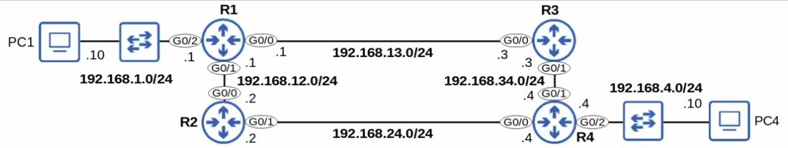
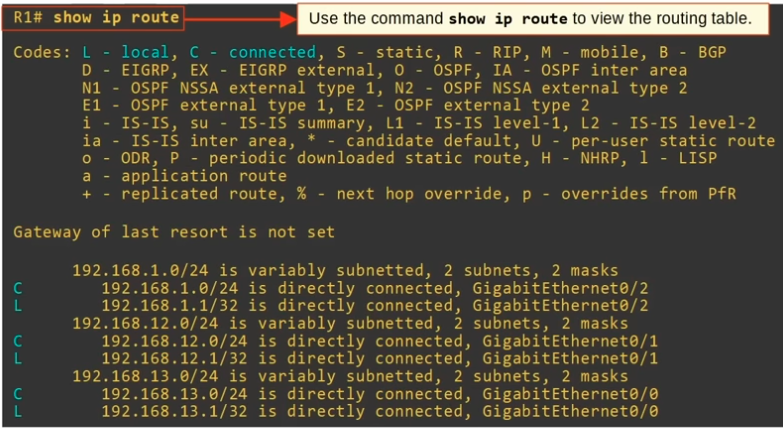
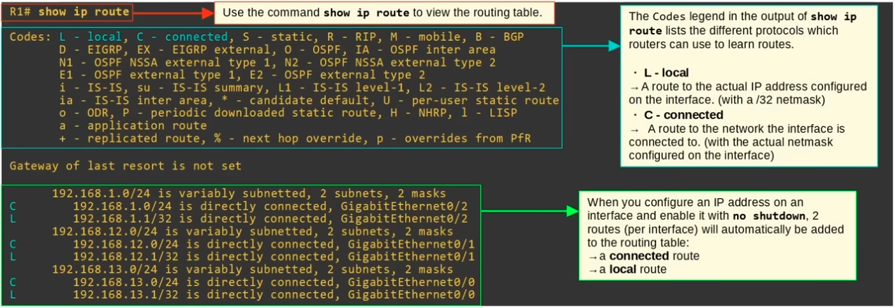
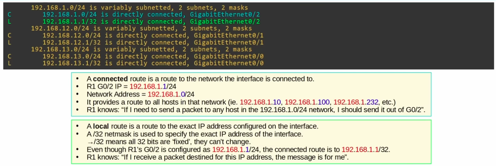

|  |
|-|

### For R1 in the topology shown above, issuing the 'show ip route' command provide its routing table as follows:

|  |
|-|

Take note of L-local & C-connected routes:

|  |
|-|

|  |
|-|

