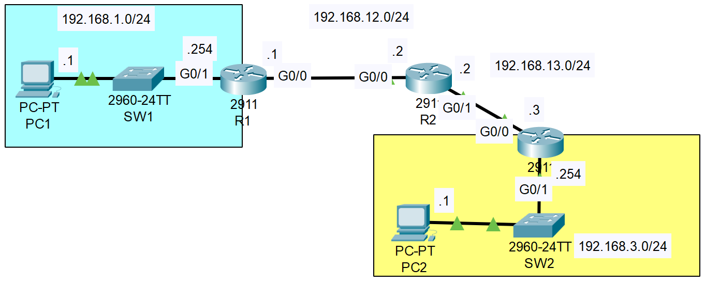

### The topology:

|  |
|-|

1. Configure the PCs and routers according to the network diagram (hostnames, IP addresses, etc.). Remember to configure the gateway on the PCs. (You don't have to configure the switches)
```CLI
Router>en
Router#conf t
Router(config)#hostname R1
R1(config)#interface g0/1
R1(config-if)#ip address 192.168.1.254 255.255.255.0
R1(config-if)#no shutdown

R1(config-if)#interface g0/0
R1(config-if)#ip address 192.168.12.1 255.255.255.0
R1(config-if)#no shutdown

Router>en
Router#conf t
Router(config)#hostname R2
R2(config)#interface g0/0
R2(config-if)#ip address 192.168.12.2 255.255.255.0
R2(config-if)#no shutdown

R2(config-if)#interface g0/1
R2(config-if)#ip address 192.168.13.2 255.255.255.0
R2(config-if)#no shutdown

Router>en
Router#conf t
Router(config)#hostname R3
R3(config)#interface g0/0
R3(config-if)#ip address 192.168.13.3 255.255.255.0
R3(config-if)#no shutdown

R3(config-if)#interface g0/1
R3(config-if)#ip address 192.168.3.254 255.255.255.0
R3(config-if)#no shutdown
```

2. Configure static routes on the routers to enable PC1 to successfully ping PC2.
```CLI
R1(config)#ip route 192.168.3.0 255.255.255.0 192.168.12.2

R2(config)#ip route 192.168.3.0 255.255.255.0 192.168.13.3
R2(config)#ip route 192.168.1.0 255.255.255.0 192.168.12.1

R3(config)#ip route 192.168.1.0 255.255.255.0 192.168.13.2
```