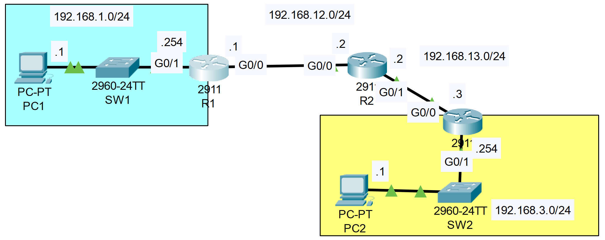
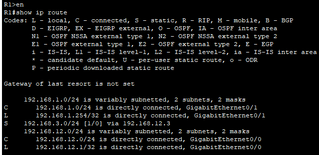
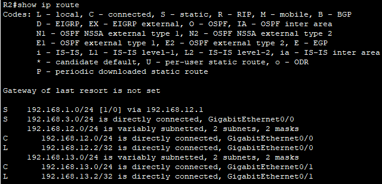
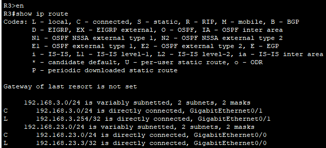

### The topology:


|  |
|-|

### Identified mistakes in configuration of .pkt file:
1. R1: Incorrect/non-existent next-hop address for route to the 192.168.3.0/24 network (it should be 192.168.12.2)
```CLI
S    192.168.3.0/24 [1/0] via 192.168.12.3
```

|  |
|-|

2. R2: Incorrect exit interface for routing to the 192.168.3.0/24 network (it should be GigabitEthernet0/1)
```CLI
S    192.168.3.0/24 is directly connected, GigabitEthernet0/0
```

|  |
|-|

3. R3: Mistyped/incorrect IP address on interface GigabitEthernet0/0 (it should be 192.168.13.0/24)
```CLI
     192.168.23.0/24 is variably subnetted, 2 subnets, 2 masks
C       192.168.23.0/24 is directly connected, GigabitEthernet0/0
L       192.168.23.3/32 is directly connected, GigabitEthernet0/0
```

|  |
|-|

### Correction commands:
1. R1
```CLI
R1(config)#no ip route 192.168.3.0 255.255.255.0 192.168.12.3
R1(config)#ip route 192.168.3.0 255.255.255.0 192.168.12.2
```
1. R2
```CLI
R2(config)#no ip route 192.168.3.0 255.255.255.0 g0/0
R2(config)#ip route 192.168.3.0 255.255.255.0 g0/1
%Default route without gateway, if not a point-to-point interface, may impact performance
```

1. R3
```CLI
R3(config)#interface g0/0
R3(config-if)#ip address 192.168.13.3 255.255.255.0
R3(config-if)#no shutdown
```