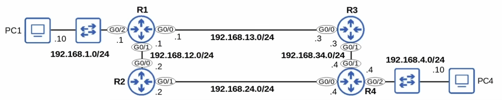
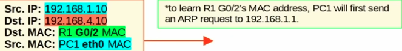
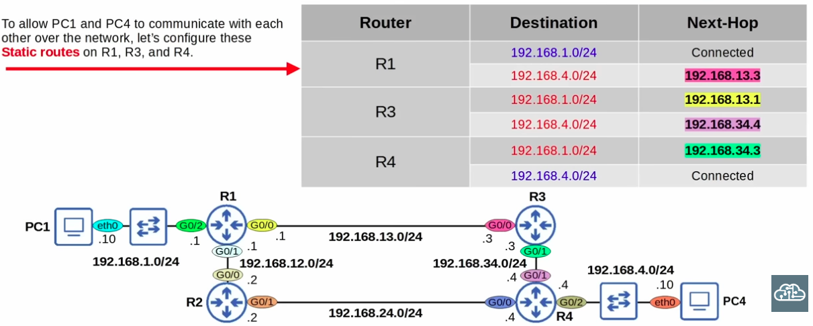
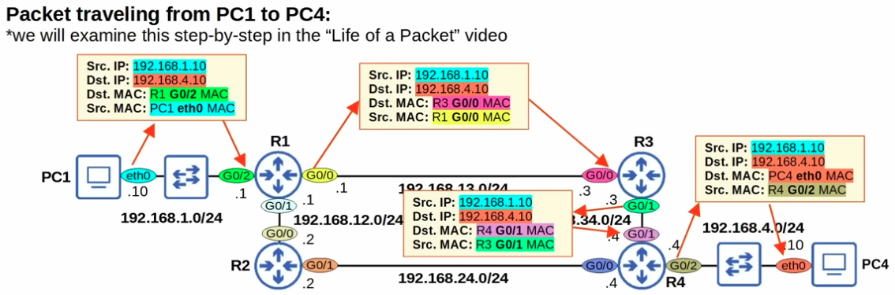

### Default Routing and Next-Hop

Topology diagram for reference:

IP Header from PC1 showing the MAC Address of R1 (its default gateway) in use:

### Planning out next-hop addresses for a topology, to ensure two-way reachability

### Diagram showing packet traversing different routers in the network on its way to the destination, and how the IP Header changes at each router:
