### The topology:
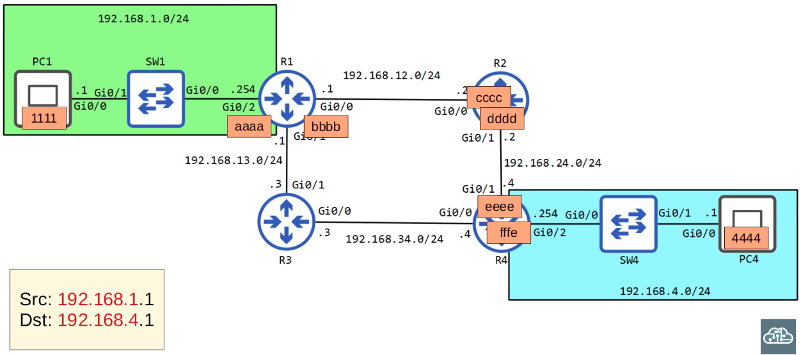

### A sub-view of the IP Header of the PC1 packet, showing the Source and Destination IP addresses:
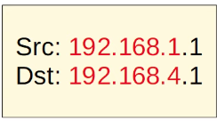

### Because PC1 hasn't yet sent a packet, it first has to send out an ARP request:
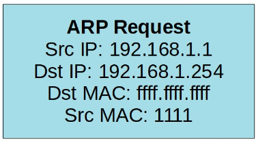
Recall: 'Dst MAC' of FFFF.FFFF.FFFF means Broadcast Message
SWI receives the ARP Request and broadcasts it out of all its interfaces, except the one it was received on.

### R1 notices that the Dst IP in the ARP Request was its own, so it sends back an ARP reply (unicast):
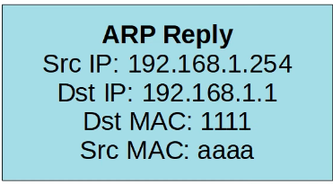

### Now that PC1 has learned the MAC address of its default gateway, it encapsulates the packet with the following Ethernet Header:
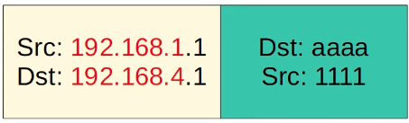

### Once R1 receives the packet, it drops the Ethernet Header, looks at the destination IP address, and compares it to what it has in its routing table:
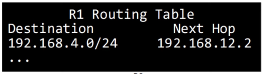
R1 will have to encapsulate this packet within an Ethernet Frame with the appropriate MAC address for the next-hop (R2), but it first has to KNOW the MAC address of the next-hop, which is why it sends an ARP request
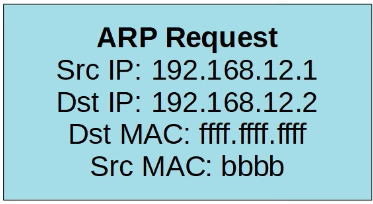

### R2 notices that the Dst IP in the ARP Request was its own, so it sends back an ARP reply (unicast):
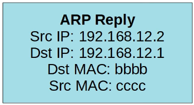

### Now that R1 has learned the MAC address of its next-hop (R2), it encapsulates the packet with the following Ethernet Header:
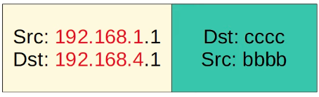

### Once R2 receives the packet from R1, it drops the Ethernet Header, looks at the destination IP address, and compares it to what it has in its routing table:
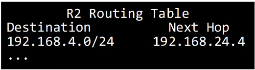
R2 will have to encapsulate this packet within an Ethernet Frame with the appropriate MAC address for the next-hop (R4), but it first has to KNOW the MAC address of the next-hop, which is why it sends an ARP request
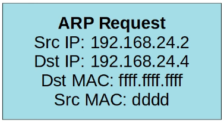

### R4 notices that the Dst IP in the ARP Request was its own, so it sends back an ARP reply (unicast):
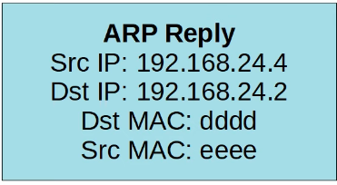?

### Now that R2 has learned the MAC address of its next-hop (R4), it encapsulates the packet with the following Ethernet Header:
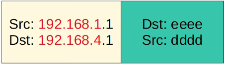

### Once R4 receives the packet from R2, it drops the Ethernet Header, looks at the destination IP address, and compares it to what it has in its routing table:
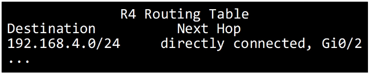
R4 will have to encapsulate this packet within an Ethernet Frame with the appropriate MAC address for the next-hop (PC4), but it first has to KNOW the MAC address of the next-hop, which is why it sends an ARP request
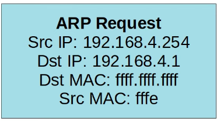

### PC4 notices that the Dst IP in the ARP Request was its own, so it sends back an ARP reply (unicast):
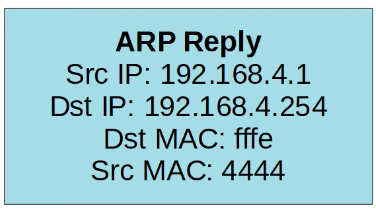

### Now that R4 has learned the MAC address of its next-hop (PC4), it encapsulates the packet with the following Ethernet Header:
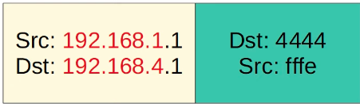

Throughout the whole process, the Switches learned about the MAC Addresses, and forwarded the frames, but DID NOT de-encapsulate & re-encapsulate the packets with new Ethernet Headers

### Let's Look at How PC4 now sends a reply to PC1
1. No ARP messages will be involved
2. The packet is simply forwarded from device to device, as it is de-encapsulated & re-encapsulated as it is received and forwarded by each router.