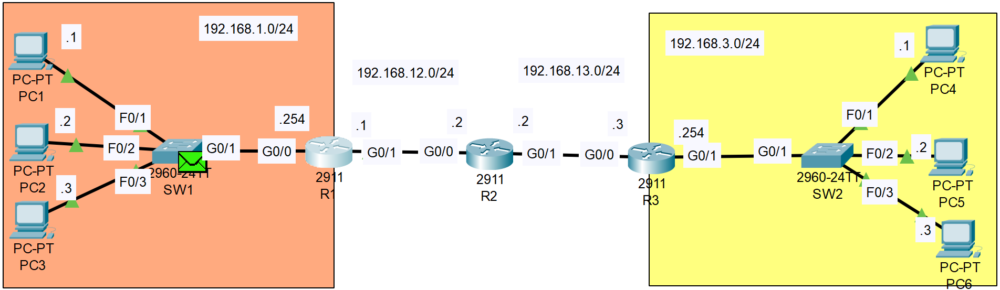
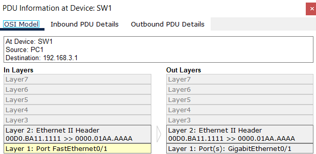
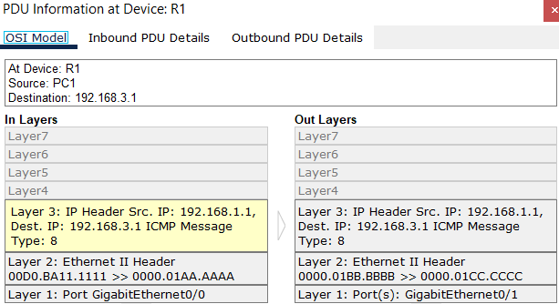
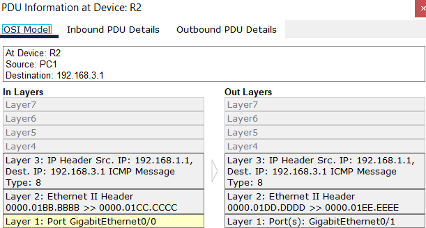
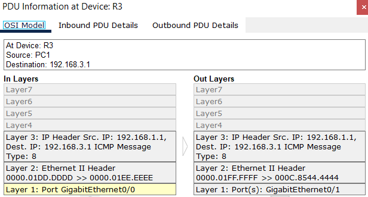
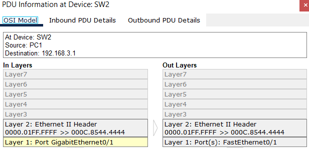
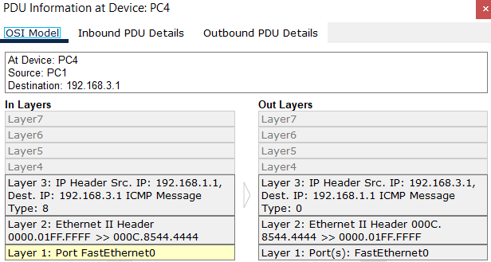
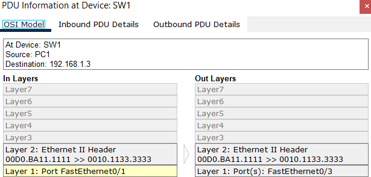
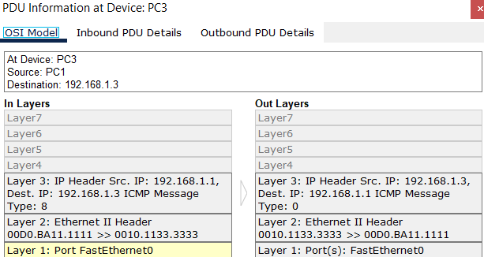

**Link to** [**Packet Tracer Solution File**](./Day%2012%20Lab%20-%20Life%20of%20a%20Packet.pkt)

### The topology:

|  |
|-|

### PC1 pings PC4: Identify the src/dst MAC address at each specified point in the route to PC4. Identify the MAC address by the device and interface (ie. the MAC of R1 G0/0)

- Source/Destination MAC at PC1 → SW1 segment (Compare the 'In Layers' & 'Out Layers' - the Switch does not modify anything)
- 
|  |
|-|
- Source MAC Address: 00D0.BA11.1111 (PC1's Ethernet Interface)
- Destination MAC Address: 0000.01AA.AAAA (R1's G0/0 interface)
---
- Source/Destination MAC at SW1 → R1 segment
- 
|  |
|-|
- Source MAC Address: 00D0.BA11.1111 (PC1's Ethernet Interface)
- Destination MAC Address: 0000.01AA.AAAA (R1's G0/0 interface)
---
- Source/Destination MAC at R1 → R2 segment
- 
|  |
|-|
- Source MAC Address: 0000.01BB.BBBB (R1's G0/1 interface)
- Destination MAC Address: 0000.01CCC.CCCC (R2's G0/0 interface)
---
- Source/Destination MAC at R2 → R3 segment
- 
|  |
|-|
- Source MAC Address: 0000.01DD.DDDD (R2's G0/1 interface)
- Destination MAC Address: 0000.01EE.EEEE (R3's G0/0 interface)

- Source/Destination MAC at R3 → SW2 segment
- 
|  |
|-|
- Source MAC Address: 0000.01FF.FFFF (R3's G0/1 interface)
- Destination MAC Address: 000C.8544.4444 (PC4's Ethernet Interface)
---
- Source/Destination MAC at SW2 → PC4 segment
- 
|  |
|-|
- Source MAC Address: 0000.01FF.FFFF (R3's G0/1 interface)
- Destination MAC Address: 000C.8544.4444 (PC4's Ethernet Interface)
---
### PC1 pings PC3: Identify the src/dst MAC address at each specified point in the route to PC3. Identify the MAC address by the device and interface (ie. the MAC of R1 G0/0)

- Source/Destination MAC at PC1 → SW1
- 
|  |
|-|
- Source MAC Address: 00D0.BA11.1111 (PC1's Ethernet Interface)
- Destination MAC Address: 0010.1133.3333 (PC3's Ethernet Interface)
---
- Source/Destination MAC at SW1 → PC3
- 
|  |
|-|
- Source MAC Address: 00D0.BA11.1111 (PC1's Ethernet Interface)
- Destination MAC Address: 0010.1133.3333 (PC3's Ethernet Interface)
