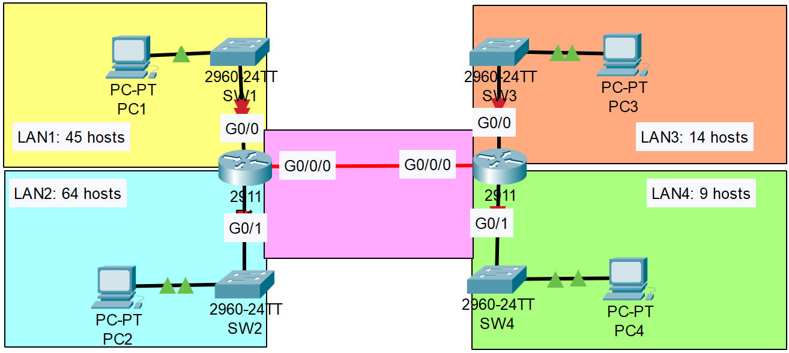

**Link to** [**Packet Tracer Solution File**](./Day%2015%20Lab%20-%20VLSM.pkt)

### The topology:


|  |
|-|

Subnet the 192.168.5.0/24 network to provide sufficient addressing for each LAN.
(Also, the point-to-point connection between R1 and R2).


1. LAN2 (64 Hosts)
```CLI
Network Address: 192.168.5.0/25
Broadcast Address: 192.168.5.127/25
First Usable Address: 192.168.5.1/25
Last Usable Address: 192.168.5.126/25
Number of Usable Addresses: 126
```
---

2. LAN1 (45 Hosts)
```CLI
Network Address: 192.168.5.128/26
Broadcast Address: 192.168.5.191/26
First Usable Address: 192.168.5.129/26
Last Usable Address: 192.168.5.190/26
Number of Usable Addresses: 62
```
---

3. LAN3 (14 Hosts)
```CLI
Network Address: 192.168.5.192/28
Broadcast Address: 192.168.5.207/28
First Usable Address: 192.168.5.193/28
Last Usable Address: 192.168.5.206/28
Number of Usable Addresses: 14
```
---

4. LAN4 (9 Hosts)
```CLI
Network Address: 192.168.5.208/28
Broadcast Address: 192.168.5.223/28
First Usable Address: 192.168.5.209/28
Last Usable Address: 192.168.5.222/28
Number of Usable Addresses: 14
```
---

5. Point-to-Point Connection (2 Routers)
Assign the first usable address to the PC in each LAN.
```CLI
Network Address: 192.168.5.224/30
Broadcast Address: 192.168.5.227/30
First Usable Address: 192.168.5.225/30
Last Usable Address: 192.168.5.226/30
Number of Usable Addresses: 2
```
---
Configure static routes on each router so that all PCs can ping eachother.

1. R1
```CLI
R1(config-if)#interface g0/0
R1(config-if)#ip address 192.168.5.190 255.255.255.192
R1(config-if)#no shutdown

R1(config)#int g0/1
R1(config-if)#ip address 192.168.5.126 255.255.255.128
R1(config-if)#no shutdown

R1(config-if)#interface g0/0/0
R1(config-if)#ip address 192.168.5.225 255.255.255.252
R1(config-if)#no shutdown

R2(config)#ip route 192.168.5.0 255.255.255.128 192.168.5.225
R2(config)#ip route 192.168.5.128 255.255.255.192 192.168.5.225
```

2. R2
```CLI
R2(config)#interface g0/0
R2(config-if)#ip address 192.168.5.206 255.255.255.240
R2(config-if)#no shutdown

R2(config-if)#interface g0/1
R2(config-if)#ip address 192.168.5.222 255.255.255.240
R2(config-if)#no shutdown

R2(config-if)#interface g0/0/0
R2(config-if)#ip address 192.168.5.226 255.255.255.252
R2(config-if)#no shutdown

R2(config)#ip route 192.168.5.0 255.255.255.128 192.168.5.225
R2(config)#ip route 192.168.5.128 255.255.255.192 192.168.5.225
```