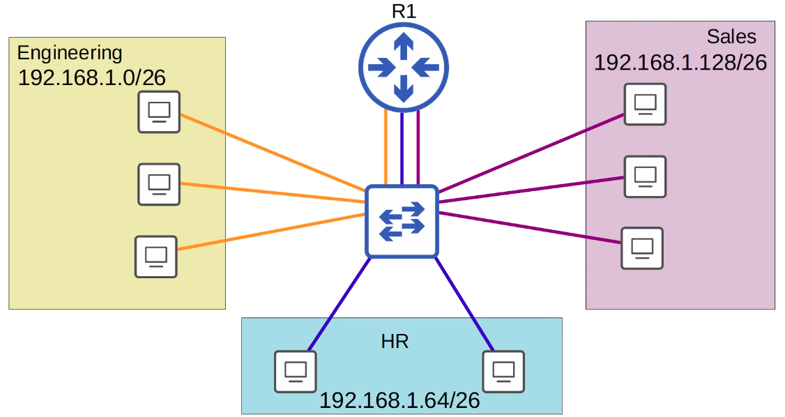
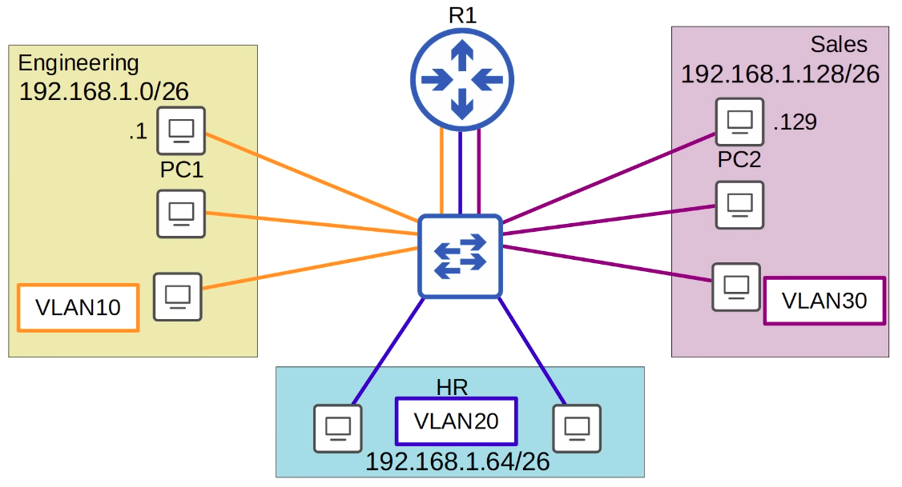
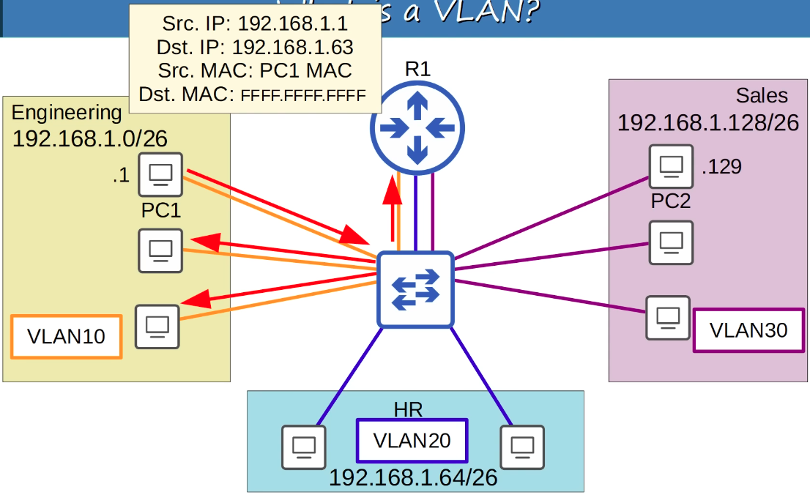
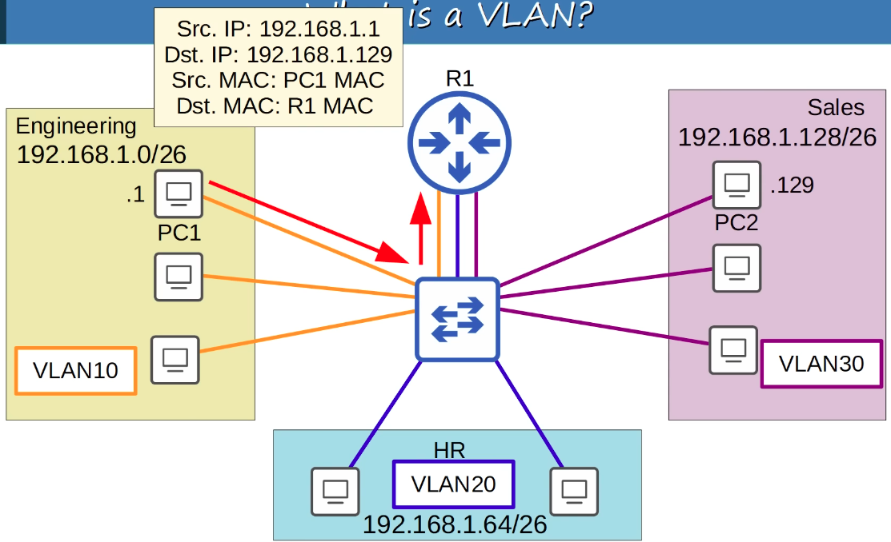
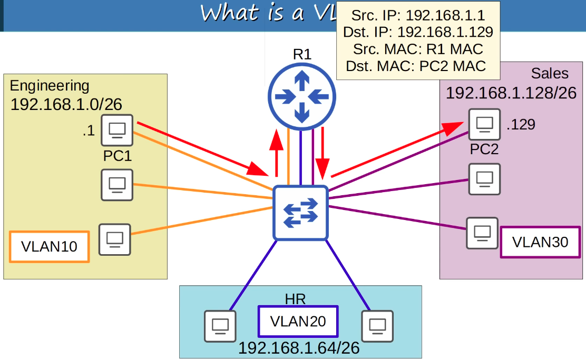
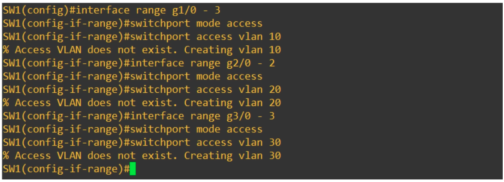

### Consider this VLAN Setup for the different departments of a company:



1. Each department is split into a separate subnet
2. In turn, the Router R1 MUST have an IP address for each subnet, thus one interface in each subnet (represented by the Yellow, Blue, & Purple lines)
3. An extra step to curtail unnecessary broadcast traffic is VLANS (because although we separated the three departments into 3 subnets, they are still in the same broadcast domain). VLANs are a more economically viable solution compared to buying more switches.


---

- We assign hosts to VLANs by configuring them on the switch interfaces. The switch considers each VLAN as its own separate LAN

### Department-specific broadcast (Engineering Dept. broadcasts flooded through yellow interfaces ONLY):


### Inter-VLAN Routing (Perfomed by the Router in this case):



### VLAN Configuration:


```CLI
% Access VLAN does not exist. Creating vlan <vlan>

##^^to avoid the above message, although harmless, we can pre-configure the VLANs as follows##

SW1(config)#vlan 10
SW1(config-vlan)#name ENGINEERING
SW1(config-vlan)#vlan 20
SW1(config-vlan)#name HR
SW1(config-vlan)#vlan 30
SW1(config-vlan)#name SALES
```