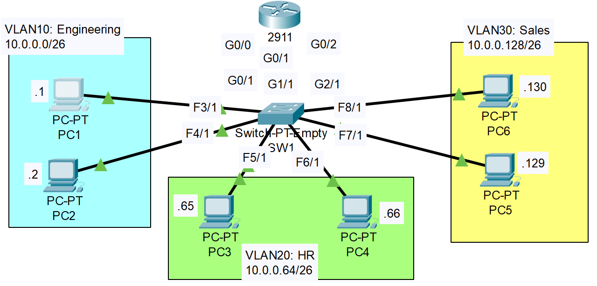

### The topology:


1. Configure the correct IP address/subnet mask on each PC. Set the gateway address as the LAST USABLE address of the subnet.

**PC1**
```CLI
IP Address: 10.0.0.1
Subnet Mask: 255.255.255.192
Default Gateway: 10.0.0.62
Subnet: 10.0.0.0/26
```

**PC2**
```CLI
IP Address: 10.0.0.2
Subnet Mask: 255.255.255.192
Default Gateway: 10.0.0.62
Subnet: 10.0.0.0/26
```

**PC3**
```CLI
IP Address: 10.0.0.65
Subnet Mask: 255.255.255.192
Default Gateway: 10.0.0.126
Subnet: 10.0.0.64/26
```

**PC4**
```CLI
IP Address: 10.0.0.66
Subnet Mask: 255.255.255.192
Default Gateway: 10.0.0.126
Subnet: 10.0.0.64/26
```

**PC5**
```CLI
IP Address: 10.0.0.129
Subnet Mask: 255.255.255.192
Default Gateway: 10.0.0.190
Subnet: 10.0.0.128/26
```

**PC6**
```CLI
IP Address: 10.0.0.130
Subnet Mask: 255.255.255.192
Default Gateway: 10.0.0.190
Subnet: 10.0.0.128/26
```

**Router**
```CLI
R1>en
R1#conf t
R1(config)#interface g0/0
R1(config-if)#ip address 10.0.0.62
% Incomplete command.
R1(config-if)#ip address 10.0.0.62 255.255.255.192
R1(config-if)#no shutdown

R1(config-if)#interface g0/1
R1(config-if)#ip address 10.0.0.126 255.255.255.192
R1(config-if)#no shutdown

R1(config-if)#interface g0/2
R1(config-if)#ip address 10.0.0.190 255.255.255.192
R1(config-if)#no shutdown
```

2. Make three connections between R1 and SW1. Configure one interface on R1 for each VLAN. Make sure the IP addresses are the gateway address you configured on the PCs.

3. Configure SW1's interfaces in the proper VLANs. Remember the interfaces that connect to R1! Name the VLANs (Engeering, HR, Sales)

4. Ping between the PCs to check connectivity. Send a broadcast ping from a PC (ping the subnet broadcast address), and see which PCs devices receive the broadcast (use Packet Tracer's 'Simulation Mode')