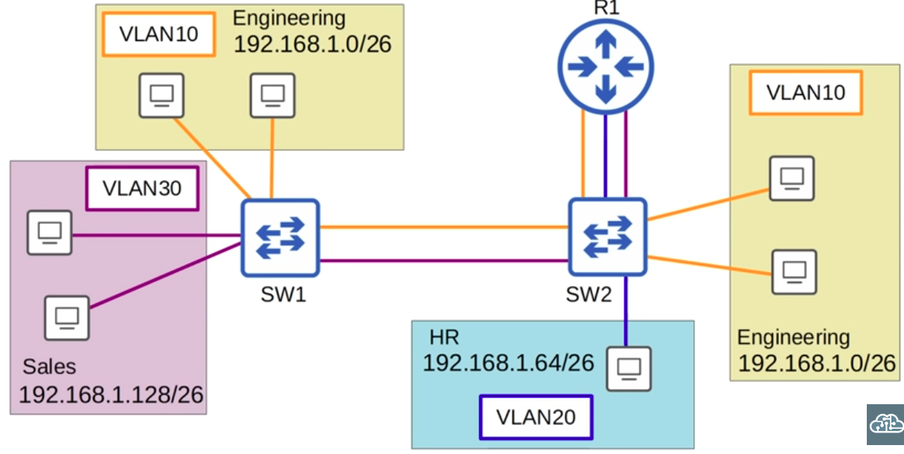
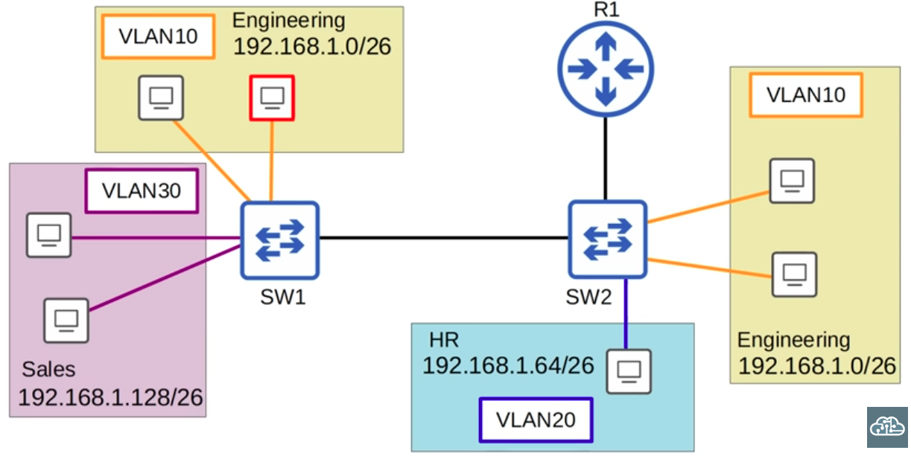
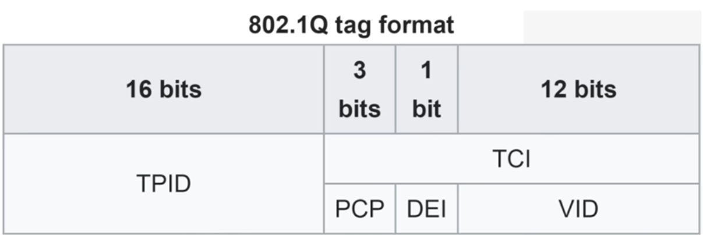
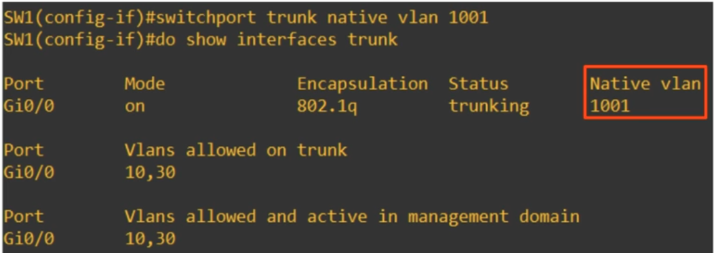

### Multiple Access Ports (wasteful of interfaces):


### Fewer Trunk Ports:


- Notice How VLAN10 (Engineering Department) is split across 2 switches



- 802.1Q is the main Trunking Protocol used in the present day
- The 802.1Q tag is inserted between the SOURCE and TYPE/LENGTH fields of an Ethernet Header. It is 32 bits in length.
- **The NATIVE VLAN:** Switches do not add 802.1Q tags to frames belonging to the NATIVE VLAN (usually VLAN 1, but can be manually configured), therefore, when another switch receives an untagged frame on a trunk port, it assumes the frames belongs to the Native VLAN, and forwards it accordingly.

### Trunk Configuration
**SW1**
```CLI
SW1(config)#interface g0/0

##On older switches that still support ISL as well, MUST specify dot1q##

SW1(config-if)#switchport trunk encapsulation dot1q

##^^On older switches that still support ISL as well, MUST specify dot1q^^##

SW1(config-if)#switchport mode trunk

SW1(config-if)#switchport trunk allowed vlan 10,30

SW1(config-if)#switchport trunk allowed vlan add 20

SW1(config-if)#switchport trunk allowed vlan remove 20
```

**SW2**
```CLI
SW2(config)#interface g0/0
SW2(config-if)#switchport trunk encapsulation dot1q
SW2(config-if)#switchport mode trunk
SW2(config-if)#switchport trunk allowed vlan 10,30
SW2(config-if)#switchport trunk native vlan 1001

SW2(config-if)#interface g0/1
SW2(config-if)#switchport trunk encapsulation dot1q
SW2(config-if)#switchport mode trunk
SW1(config-if)#switchport trunk allowed vlan 10,20,30
SW1(config-if)#switchport trunk native vlan 1001
```

**Router R1  (ROUTER ON A STICK)** 
Sub-interfaces MUST be configured on the router, because each VLAN must have its unique default gateway

```CLI
Router(config-if)#interface <subif>
Router(config-subif)#encapsulation dot1q <vlan>
Router(config-subif)#ip address <ip_add> <subnet_mask>

R1(config-if)#interface g0/0.10
R1(config-subif)#encapsulation dot1q 10
R1(config-subif)#ip address 192.168.1.62 255.255.255.192<subnet_mask>

R1(config-if)#interface g0/0.20
R1(config-subif)#encapsulation dot1q 20
R1(config-subif)#ip address 192.168.1.126 255.255.255.192

R1(config-if)#interface g0/0.30
R1(config-subif)#encapsulation dot1q 30
R1(config-subif)#ip address 192.168.1.190 255.255.255.192
```

### Security Consideration: It is a best practice to set the Native VLAN on switches to an unused VLAN. Also, we have to make sure that the native VLAN matches between switches.
```CLI
SW1(config-if)#switchport trunk native vlan 1001
```

