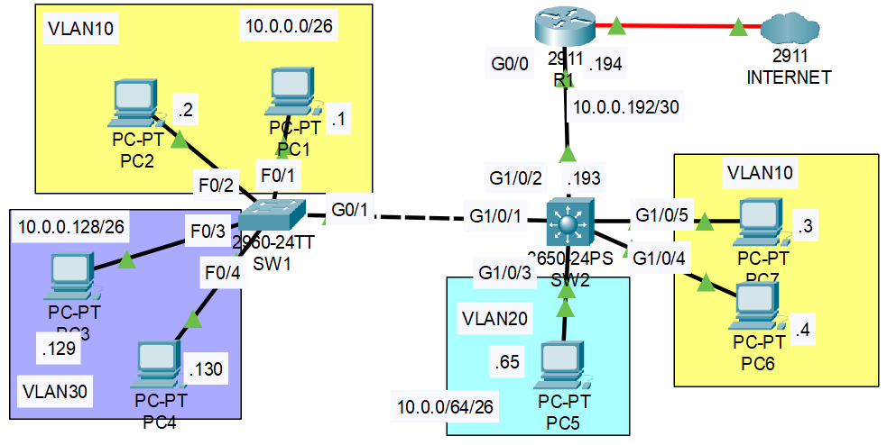

### The topology:

### Initial Conditions:
SW1-SW2 are connected via trunk.
R1-SW2 are connected via ROAS.

1. Replace the ROAS configuration on R1-SW2 with a point-to-point Layer 3 connection. Use the IP addresses given in the network diagram. Configure a default route on SW2, with R1's G0/0 interface as the next hop.

2. Configure SVIs on SW2, one for each VLAN. Assign the last usable IP address of each subnet to the appropriate SVI.

3. Test inter-VLAN connectivity by pinging between VLANs.

4. Test connectivity to the Internet by pinging 1.1.1.1 (Routes have already been configured on R1 and the Internet router)