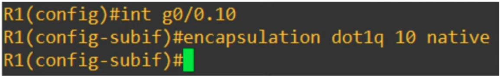
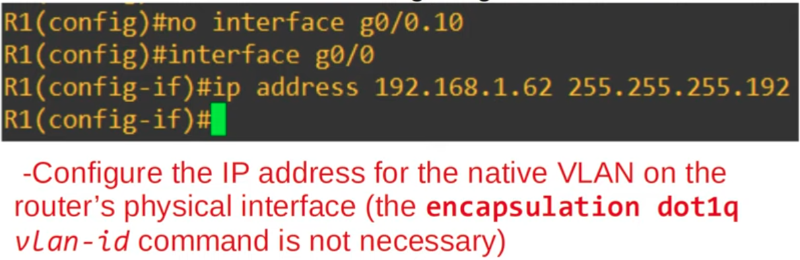
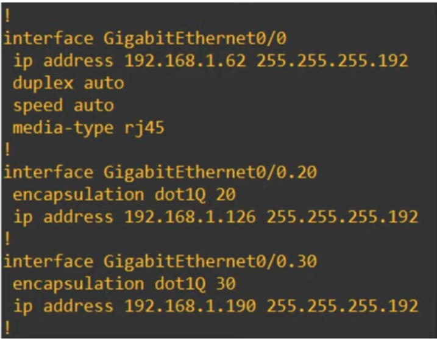
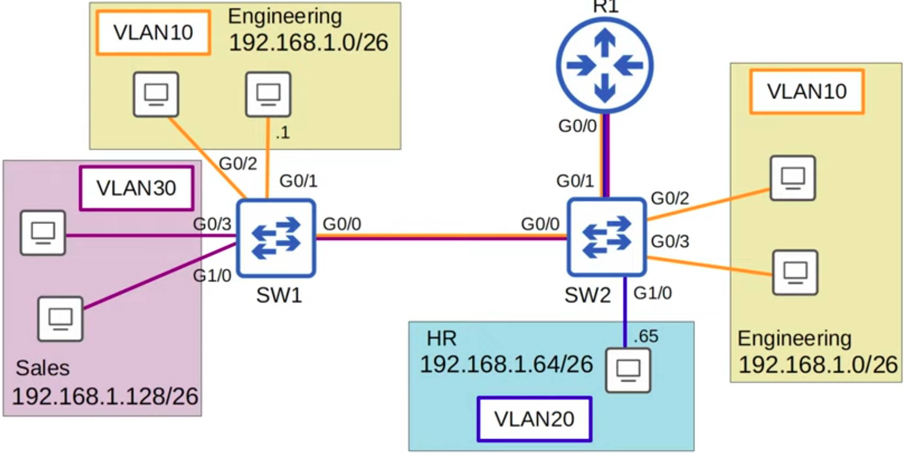
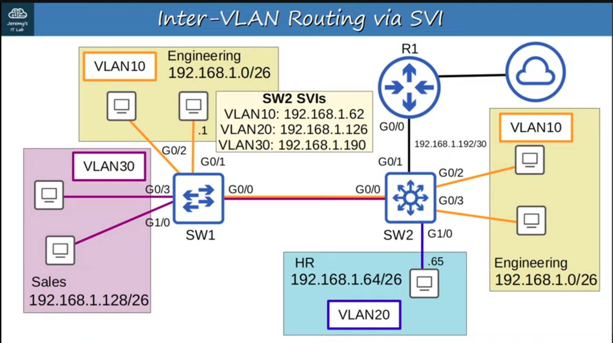

### Method 1 of configuring Native VLAN on a router:

- Note that the IP address is already configured

### Method 2 of configuring Native VLAN on a router:
- This method avoids using a sub-interface

### Layer 3 (Multilayer) Switches, with SVIs (Switch Virtual Interfaces):
- Notice the non-trunk Point to Point connection between the Layer 3 switch and Router R1. With a L3 switch, it can handle all routing between the VLANs independently, so the Point to Point connection connection with RI is reserved for a Static Default Route that points to the internet.

