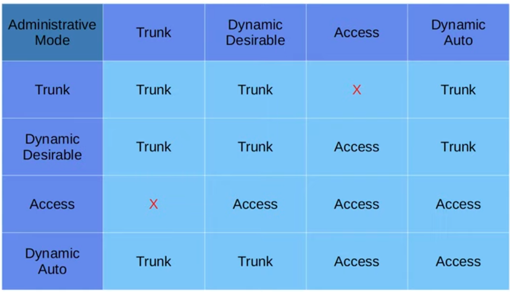

- DTP (Dynamic Trunking Protocol) allows switches to negotiate the status of their switchports (whether access or trunk) dynamically (no manual configuration needed).

- VTP (VLAN Trunking Protocol) allows you to configure VLANs on a central switch, which then acts as a server that other switches can synchronise to, so that you don't have to configure VLANs on every single switch in the network.