### Example of a redundant network: 

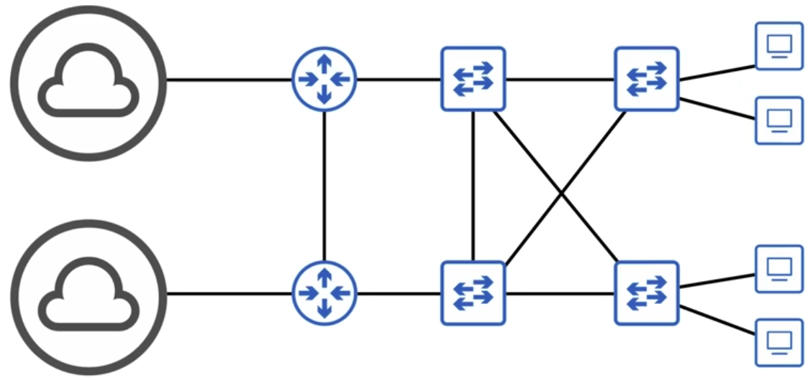

- However, we should try and avoid having loops in the network in order to avoid Broadcast Storms, which may paralyse the network (notice the problematic link between SW3 & SW2).
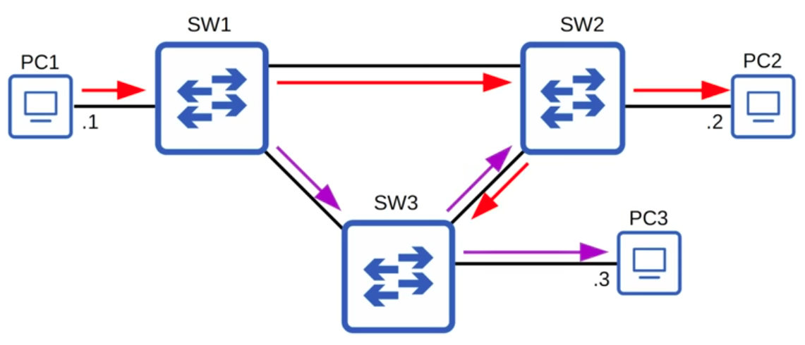

- To solve the loop, we should place the redundant connection between SW3 & SW2 (the interface on SW3) in a blocking state. This essentially sets the connection as a backup that will only be activated if the SW1 - SW2 connection fails.

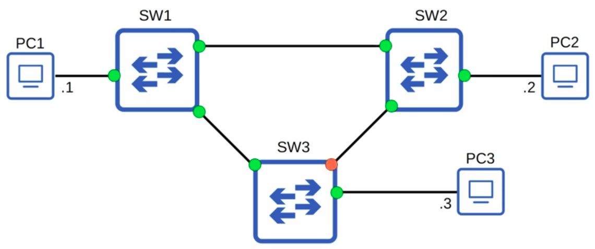

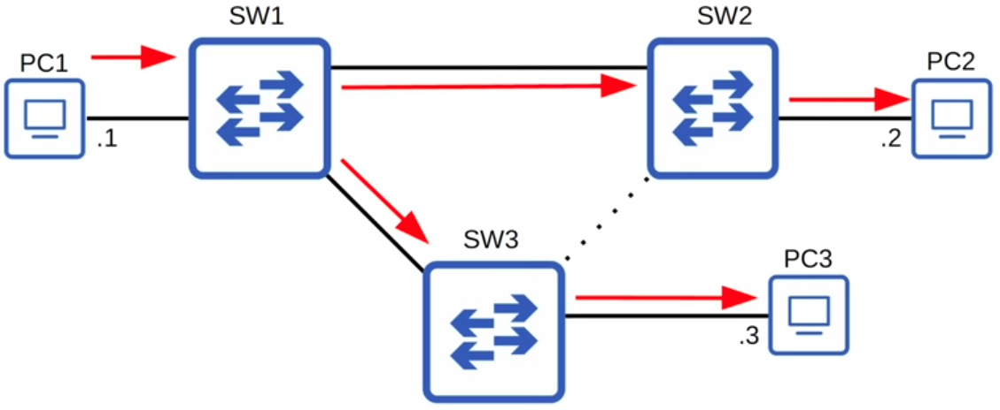

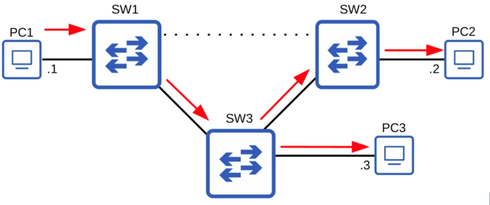

### Root Costs for Root Ports in STP:
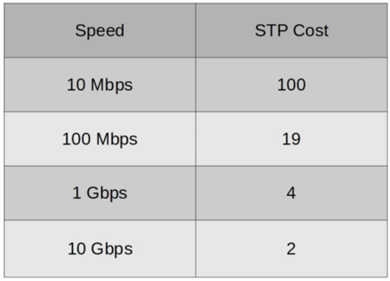

- Root Bridge Determination:
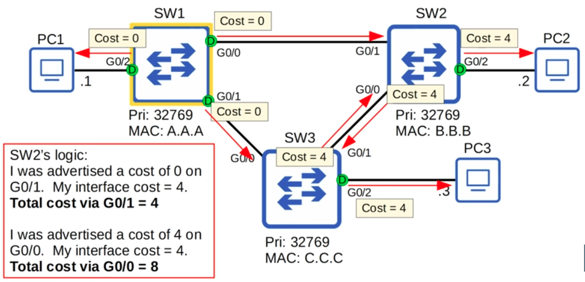

- Non-designated Port Determination:
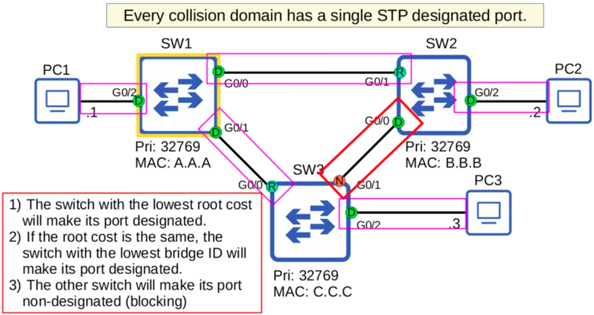

### QUIZ: Identifying all the Designated Ports, Root Ports, & Non-designated ports:

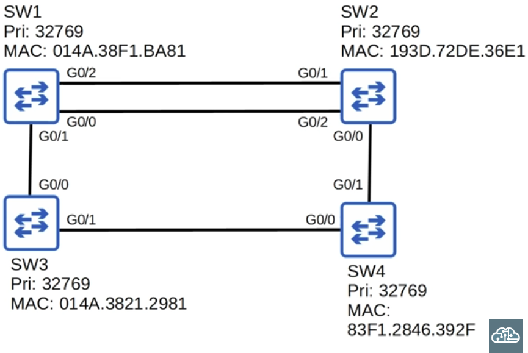

**Criteria:**
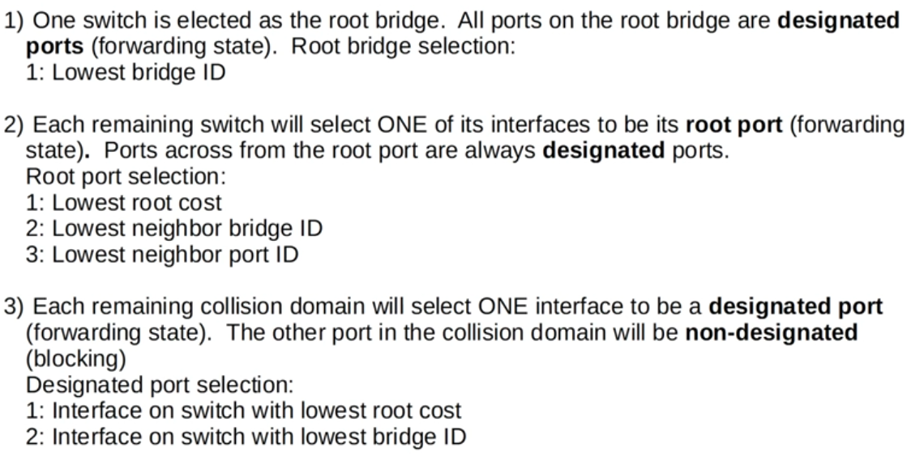

```CLI
1. SW3 is the root bridge because it is the switch with the lowest bridge ID, therefore all it sports are designated ports (in forwarding state).

2a. To form Designated-Root interface pairs with SW3, SW4's GO/O interface and SW1's G0/1 interface will be Root ports (Ports from accross the root ports are always designated ports).

2b. Next, we have to determine the correct Designated-Root interface pair between SW2 and its adjacent routers. All three ports have a cost of 8 to the root bridge, so we analyse by the next criteria, the neighbor with the lowest bridge id, which is SW1. After that, we have to determine which of the two ports connected to SW1 will be Root - it is G0/2 because the ports across from it(G0/0) has the lower Port ID.

3. For the 2 remaining connection pairs, we need to determine the non-designated ports, which are deduced by analysing the port with the highest root cost (Sum of STP costs on outbound interfaces back to the Root bridge) - automatically, we can see that it would be both of SW2's ports, because the Root Cost is 8, higher than that of SW1 or SW4 (4)

Note: There must always be a Designated port for each collision domain
```
### QUIZ: Identifying all the Designated Ports, Root Ports, & Non-designated ports:
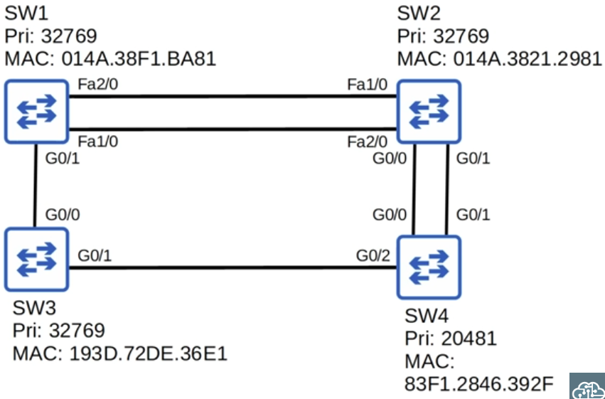