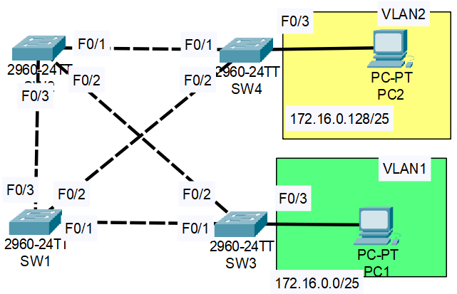

**Link to** [**Packet Tracer Solution File**](./Day%2020%20Lab%20-%20Analyzing%20STP.pkt)

### Lab 1: Identifying the Root Bridge, as well as the Root Ports, Designated Ports and Non-designated Ports of the Packet Tracer topology:

- Can be confirmd by issuing the "show spanning-tree" command on all switches (Note 'Altn' (Alternate) is used in the output instead of Non-designated).


SW1
```CLI
SW1#show spanning-tree
VLAN0001
  Spanning tree enabled protocol ieee
  Root ID    Priority    24577
             Address     00E0.F9E6.44A5
             Cost        19
             Port        4(FastEthernet0/4)
             Hello Time  2 sec  Max Age 20 sec  Forward Delay 15 sec

  Bridge ID  Priority    32769  (priority 32768 sys-id-ext 1)
             Address     0001.4338.79D8
             Hello Time  2 sec  Max Age 20 sec  Forward Delay 15 sec
             Aging Time  20

Interface        Role Sts Cost      Prio.Nbr Type
---------------- ---- --- --------- -------- --------------------------------
Fa0/1            Altn BLK 19        128.1    P2p
Fa0/2            Altn BLK 19        128.2    P2p
Fa0/3            Altn BLK 19        128.3    P2p
Fa0/4            Root FWD 19        128.4    P2p
```

SW2
```CLI
SW2>en
SW2#show spanning-tree
VLAN0001
  Spanning tree enabled protocol ieee
  Root ID    Priority    24577
             Address     00E0.F9E6.44A5
             Cost        8
             Port        25(GigabitEthernet0/1)
             Hello Time  2 sec  Max Age 20 sec  Forward Delay 15 sec

  Bridge ID  Priority    28673  (priority 28672 sys-id-ext 1)
             Address     0002.16D6.D0B8
             Hello Time  2 sec  Max Age 20 sec  Forward Delay 15 sec
             Aging Time  20

Interface        Role Sts Cost      Prio.Nbr Type
---------------- ---- --- --------- -------- --------------------------------
Fa0/1            Desg FWD 19        128.1    P2p
Fa0/3            Altn BLK 19        128.3    P2p
Fa0/2            Desg FWD 19        128.2    P2p
Gi0/1            Root FWD 4         128.25   P2p
```

SW3
```CLI
SW3#show spanning-tree
VLAN0001
  Spanning tree enabled protocol ieee
  Root ID    Priority    24577
             Address     00E0.F9E6.44A5
             This bridge is the root
             Hello Time  2 sec  Max Age 20 sec  Forward Delay 15 sec

  Bridge ID  Priority    24577  (priority 24576 sys-id-ext 1)
             Address     00E0.F9E6.44A5
             Hello Time  2 sec  Max Age 20 sec  Forward Delay 15 sec
             Aging Time  20

Interface        Role Sts Cost      Prio.Nbr Type
---------------- ---- --- --------- -------- --------------------------------
Fa0/3            Desg FWD 19        128.3    P2p
Fa0/1            Desg FWD 19        128.1    P2p
Fa0/2            Desg FWD 19        128.2    P2p
Gi0/1            Desg FWD 4         128.25   P2p
```

SW4
```CLI
SW4>en
SW4#show spanning-tree
VLAN0001
  Spanning tree enabled protocol ieee
  Root ID    Priority    24577
             Address     00E0.F9E6.44A5
             Cost        4
             Port        26(GigabitEthernet0/2)
             Hello Time  2 sec  Max Age 20 sec  Forward Delay 15 sec

  Bridge ID  Priority    32769  (priority 32768 sys-id-ext 1)
             Address     0090.0C01.9587
             Hello Time  2 sec  Max Age 20 sec  Forward Delay 15 sec
             Aging Time  20

Interface        Role Sts Cost      Prio.Nbr Type
---------------- ---- --- --------- -------- --------------------------------
Gi0/2            Root FWD 4         128.26   P2p
Gi0/1            Desg FWD 4         128.25   P2p
```

---

### Lab 2: Configuring Spanning Tree


|  |
|-|

1. Use the CLI to check the current STP topology.  What is the current root bridge? What is the STP role/state of each port on each switch?

**SW2 (This bridge is the root)**
```CLI
SW2>en
SW2#show spanning-tree
VLAN0001
  Spanning tree enabled protocol ieee
  Root ID    Priority    32769
             Address     0001.4301.4B81
             This bridge is the root
             Hello Time  2 sec  Max Age 20 sec  Forward Delay 15 sec

  Bridge ID  Priority    32769  (priority 32768 sys-id-ext 1)
             Address     0001.4301.4B81
             Hello Time  2 sec  Max Age 20 sec  Forward Delay 15 sec
             Aging Time  20

Interface        Role Sts Cost      Prio.Nbr Type
---------------- ---- --- --------- -------- --------------------------------
Fa0/2            Desg FWD 19        128.2    P2p
Fa0/1            Desg FWD 19        128.1    P2p
Fa0/3            Desg FWD 19        128.3    P2p

VLAN0002
  Spanning tree enabled protocol ieee
  Root ID    Priority    32770
             Address     0001.4301.4B81
             This bridge is the root
             Hello Time  2 sec  Max Age 20 sec  Forward Delay 15 sec

  Bridge ID  Priority    32770  (priority 32768 sys-id-ext 2)
             Address     0001.4301.4B81
             Hello Time  2 sec  Max Age 20 sec  Forward Delay 15 sec
             Aging Time  20

Interface        Role Sts Cost      Prio.Nbr Type
---------------- ---- --- --------- -------- --------------------------------
Fa0/2            Desg FWD 19        128.2    P2p
Fa0/1            Desg FWD 19        128.1    P2p
Fa0/3            Desg FWD 19        128.3    P2p
```
**SW1**
```CLI
SW1>EN
SW1#show spanning-tree
VLAN0001
  Spanning tree enabled protocol ieee
  Root ID    Priority    32769
             Address     0001.4301.4B81
             Cost        19
             Port        3(FastEthernet0/3)
             Hello Time  2 sec  Max Age 20 sec  Forward Delay 15 sec

  Bridge ID  Priority    32769  (priority 32768 sys-id-ext 1)
             Address     0060.2F90.D14A
             Hello Time  2 sec  Max Age 20 sec  Forward Delay 15 sec
             Aging Time  20

Interface        Role Sts Cost      Prio.Nbr Type
---------------- ---- --- --------- -------- --------------------------------
Fa0/1            Altn BLK 19        128.1    P2p
Fa0/2            Desg FWD 19        128.2    P2p
Fa0/3            Root FWD 19        128.3    P2p

VLAN0002
  Spanning tree enabled protocol ieee
  Root ID    Priority    32770
             Address     0001.4301.4B81
             Cost        19
             Port        3(FastEthernet0/3)
             Hello Time  2 sec  Max Age 20 sec  Forward Delay 15 sec

  Bridge ID  Priority    32770  (priority 32768 sys-id-ext 2)
             Address     0060.2F90.D14A
             Hello Time  2 sec  Max Age 20 sec  Forward Delay 15 sec
             Aging Time  20

Interface        Role Sts Cost      Prio.Nbr Type
---------------- ---- --- --------- -------- --------------------------------
Fa0/1            Altn BLK 19        128.1    P2p
Fa0/2            Desg FWD 19        128.2    P2p
Fa0/3            Root FWD 19        128.3    P2p
```

**SW3**
```CLI
SW3>en
SW3#show spanning-tree
VLAN0001
  Spanning tree enabled protocol ieee
  Root ID    Priority    32769
             Address     0001.4301.4B81
             Cost        19
             Port        2(FastEthernet0/2)
             Hello Time  2 sec  Max Age 20 sec  Forward Delay 15 sec

  Bridge ID  Priority    32769  (priority 32768 sys-id-ext 1)
             Address     0040.0B50.AA56
             Hello Time  2 sec  Max Age 20 sec  Forward Delay 15 sec
             Aging Time  20

Interface        Role Sts Cost      Prio.Nbr Type
---------------- ---- --- --------- -------- --------------------------------
Fa0/1            Desg FWD 19        128.1    P2p
Fa0/2            Root FWD 19        128.2    P2p
Fa0/3            Desg FWD 19        128.3    P2p

VLAN0002
  Spanning tree enabled protocol ieee
  Root ID    Priority    32770
             Address     0001.4301.4B81
             Cost        19
             Port        2(FastEthernet0/2)
             Hello Time  2 sec  Max Age 20 sec  Forward Delay 15 sec

  Bridge ID  Priority    32770  (priority 32768 sys-id-ext 2)
             Address     0040.0B50.AA56
             Hello Time  2 sec  Max Age 20 sec  Forward Delay 15 sec
             Aging Time  20

Interface        Role Sts Cost      Prio.Nbr Type
---------------- ---- --- --------- -------- --------------------------------
Fa0/1            Desg FWD 19        128.1    P2p
Fa0/2            Root FWD 19        128.2    P2p
```

**SW4**
```CLI
SW4>en
SW4#conf t
SW4#show spanning-tree
VLAN0001
  Spanning tree enabled protocol ieee
  Root ID    Priority    32769
             Address     0001.4301.4B81
             Cost        19
             Port        1(FastEthernet0/1)
             Hello Time  2 sec  Max Age 20 sec  Forward Delay 15 sec

  Bridge ID  Priority    32769  (priority 32768 sys-id-ext 1)
             Address     0090.0C03.2D70
             Hello Time  2 sec  Max Age 20 sec  Forward Delay 15 sec
             Aging Time  20

Interface        Role Sts Cost      Prio.Nbr Type
---------------- ---- --- --------- -------- --------------------------------
Fa0/2            Altn BLK 19        128.2    P2p
Fa0/1            Root FWD 19        128.1    P2p

VLAN0002
  Spanning tree enabled protocol ieee
  Root ID    Priority    32770
             Address     0001.4301.4B81
             Cost        19
             Port        1(FastEthernet0/1)
             Hello Time  2 sec  Max Age 20 sec  Forward Delay 15 sec

  Bridge ID  Priority    32770  (priority 32768 sys-id-ext 2)
             Address     0090.0C03.2D70
             Hello Time  2 sec  Max Age 20 sec  Forward Delay 15 sec
             Aging Time  20

Interface        Role Sts Cost      Prio.Nbr Type
---------------- ---- --- --------- -------- --------------------------------
Fa0/2            Altn BLK 19        128.2    P2p
Fa0/3            Desg FWD 19        128.3    P2p
Fa0/1            Root FWD 19        128.1    P2p
```

2. **LOAD BALANCING:** Configure SW1 as the primary root for VLAN1 and the secondary root for VLAN2. Configure SW2 and the primary root for VLAN2 and the secondary root for VLAN1. What is the STP role/state of each port on each switch now?
**SW1**

```CLI
SW1#conf t
Enter configuration commands, one per line.  End with CNTL/Z.
SW1(config)#spanning-tree vlan 1 root primary
SW1(config)#spanning-tree vlan 2 root secondary
SW1(config)#do show spanning-tree
VLAN0001
  Spanning tree enabled protocol ieee
  Root ID    Priority    24577
             Address     0060.2F90.D14A
             This bridge is the root
             Hello Time  2 sec  Max Age 20 sec  Forward Delay 15 sec

  Bridge ID  Priority    24577  (priority 24576 sys-id-ext 1)
             Address     0060.2F90.D14A
             Hello Time  2 sec  Max Age 20 sec  Forward Delay 15 sec
             Aging Time  20

Interface        Role Sts Cost      Prio.Nbr Type
---------------- ---- --- --------- -------- --------------------------------
Fa0/1            Desg FWD 19        128.1    P2p
Fa0/2            Desg FWD 19        128.2    P2p
Fa0/3            Desg FWD 19        128.3    P2p

VLAN0002
  Spanning tree enabled protocol ieee
  Root ID    Priority    24578
             Address     0001.4301.4B81
             Cost        19
             Port        3(FastEthernet0/3)
             Hello Time  2 sec  Max Age 20 sec  Forward Delay 15 sec

  Bridge ID  Priority    28674  (priority 28672 sys-id-ext 2)
             Address     0060.2F90.D14A
             Hello Time  2 sec  Max Age 20 sec  Forward Delay 15 sec
             Aging Time  20

Interface        Role Sts Cost      Prio.Nbr Type
---------------- ---- --- --------- -------- --------------------------------
Fa0/1            Desg FWD 19        128.1    P2p
Fa0/2            Desg FWD 19        128.2    P2p
Fa0/3            Root FWD 19        128.3    P2p
```

**SW2**

```
SW2#conf t
Enter configuration commands, one per line.  End with CNTL/Z.
SW2(config)#spanning-tree vlan 2 root primary
SW2(config)#spanning-tree vlan 1 root secondary
SW2(config)#do show spanning-tree
VLAN0001
  Spanning tree enabled protocol ieee
  Root ID    Priority    24577
             Address     0060.2F90.D14A
             Cost        19
             Port        3(FastEthernet0/3)
             Hello Time  2 sec  Max Age 20 sec  Forward Delay 15 sec

  Bridge ID  Priority    28673  (priority 28672 sys-id-ext 1)
             Address     0001.4301.4B81
             Hello Time  2 sec  Max Age 20 sec  Forward Delay 15 sec
             Aging Time  20

Interface        Role Sts Cost      Prio.Nbr Type
---------------- ---- --- --------- -------- --------------------------------
Fa0/2            Desg FWD 19        128.2    P2p
Fa0/1            Desg FWD 19        128.1    P2p
Fa0/3            Root FWD 19        128.3    P2p

VLAN0002
  Spanning tree enabled protocol ieee
  Root ID    Priority    24578
             Address     0001.4301.4B81
             This bridge is the root
             Hello Time  2 sec  Max Age 20 sec  Forward Delay 15 sec

  Bridge ID  Priority    24578  (priority 24576 sys-id-ext 2)
             Address     0001.4301.4B81
             Hello Time  2 sec  Max Age 20 sec  Forward Delay 15 sec
             Aging Time  20

Interface        Role Sts Cost      Prio.Nbr Type
---------------- ---- --- --------- -------- --------------------------------
Fa0/2            Desg FWD 19        128.2    P2p
Fa0/1            Desg FWD 19        128.1    P2p
Fa0/3            Desg FWD 19        128.3    P2p
```

3. Increase the VLAN1 cost of SW4's F0/2 interface to 100. Does SW4 select a different root port?  Why/why not?
```CLI
SW4(config)#interface f0/2
SW4(config-if)#spanning-tree vlan 1 cost 100
```

**Before**
```CLI
SW4#show spanning-tree
VLAN0001
  Spanning tree enabled protocol ieee
  Root ID    Priority    24577
             Address     0060.2F90.D14A
             Cost        19
             Port        2(FastEthernet0/2)
             Hello Time  2 sec  Max Age 20 sec  Forward Delay 15 sec

  Bridge ID  Priority    32769  (priority 32768 sys-id-ext 1)
             Address     0090.0C03.2D70
             Hello Time  2 sec  Max Age 20 sec  Forward Delay 15 sec
             Aging Time  20

Interface        Role Sts Cost      Prio.Nbr Type
---------------- ---- --- --------- -------- --------------------------------
Fa0/2            Root FWD 19        128.2    P2p
Fa0/1            Altn BLK 19        128.1    P2p
```

**After**
```CLI
SW4#show spanning-tree
VLAN0001
  Spanning tree enabled protocol ieee
  Root ID    Priority    24577
             Address     0060.2F90.D14A
             Cost        38
             Port        1(FastEthernet0/1)
             Hello Time  2 sec  Max Age 20 sec  Forward Delay 15 sec

  Bridge ID  Priority    32769  (priority 32768 sys-id-ext 1)
             Address     0090.0C03.2D70
             Hello Time  2 sec  Max Age 20 sec  Forward Delay 15 sec
             Aging Time  20

Interface        Role Sts Cost      Prio.Nbr Type
---------------- ---- --- --------- -------- --------------------------------
Fa0/2            Altn BLK 100       128.2    P2p
Fa0/1            Root FWD 19        128.1    P2p
```

4. Increase the VLAN1 port priority of SW1's F0/1 to 240. Does SW3 select a different root port?  Why/why not?
```CLI
SW1(config)#interface f0/1
SW1(config-if)#spanning-tree vlan 1 port-priority 240
```

**Before (SW3)**
```CLI
SW3#show spanning-tree
VLAN0001
  Spanning tree enabled protocol ieee
  Root ID    Priority    24577
             Address     0060.2F90.D14A
             Cost        19
             Port        1(FastEthernet0/1)
             Hello Time  2 sec  Max Age 20 sec  Forward Delay 15 sec

  Bridge ID  Priority    32769  (priority 32768 sys-id-ext 1)
             Address     0040.0B50.AA56
             Hello Time  2 sec  Max Age 20 sec  Forward Delay 15 sec
             Aging Time  20

Interface        Role Sts Cost      Prio.Nbr Type
---------------- ---- --- --------- -------- --------------------------------
Fa0/1            Root FWD 19        128.1    P2p
Fa0/2            Altn BLK 19        128.2    P2p
Fa0/3            Desg FWD 19        128.3    P2p
```

**After (SW3)**
```CLI
SW3#show spanning-tree
VLAN0001
  Spanning tree enabled protocol ieee
  Root ID    Priority    24577
             Address     0060.2F90.D14A
             Cost        19
             Port        1(FastEthernet0/1)
             Hello Time  2 sec  Max Age 20 sec  Forward Delay 15 sec

  Bridge ID  Priority    32769  (priority 32768 sys-id-ext 1)
             Address     0040.0B50.AA56
             Hello Time  2 sec  Max Age 20 sec  Forward Delay 15 sec
             Aging Time  20

Interface        Role Sts Cost      Prio.Nbr Type
---------------- ---- --- --------- -------- --------------------------------
Fa0/2            Altn BLK 19        128.2    P2p
Fa0/1            Root FWD 19        128.1    P2p
Fa0/3            Desg FWD 19        128.3    P2p
```

5. Configure PortFast and BPDU Guard on the F0/3 interfaces of SW3/SW4.

**SW3**

```CLI
SW3#conf t
SW3(config)#interface f0/3
SW3(config-if)#spanning-tree portfast

%Warning: portfast should only be enabled on ports connected to a single
host. Connecting hubs, concentrators, switches, bridges, etc... to this
interface  when portfast is enabled, can cause temporary bridging loops.
Use with CAUTION

%Portfast has been configured on FastEthernet0/3 but will only
have effect when the interface is in a non-trunking mode.

SW3(config-if)#spanning-tree bpduguard enable
```
**SW4**

```CLI
SW4#conf t
SW4(config)#interface f0/3
SW4(config-if)#spanning-tree portfast

%Warning: portfast should only be enabled on ports connected to a single
host. Connecting hubs, concentrators, switches, bridges, etc... to this
interface  when portfast is enabled, can cause temporary bridging loops.
Use with CAUTION

%Portfast has been configured on FastEthernet0/3 but will only
have effect when the interface is in a non-trunking mode.

SW4(config-if)#spanning-tree bpduguard enable
```
 