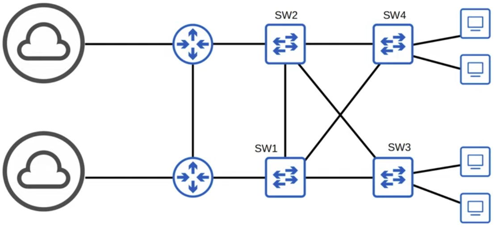
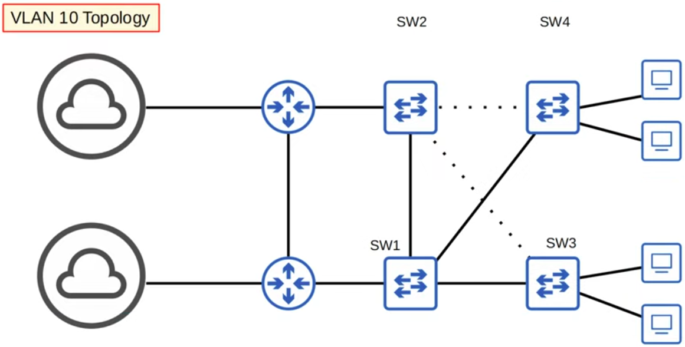
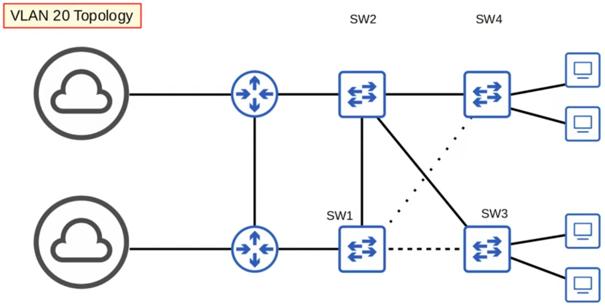
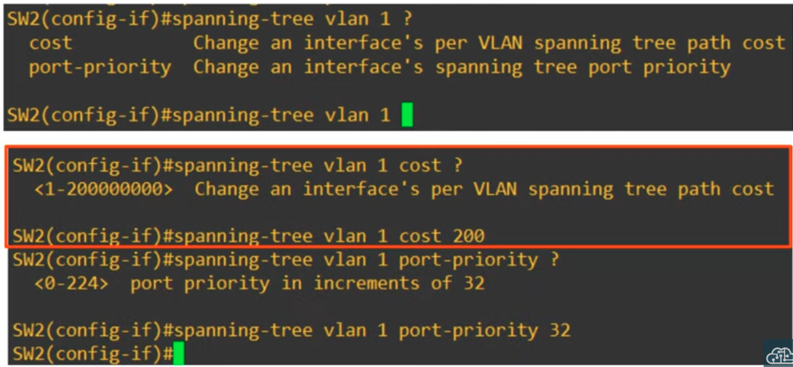
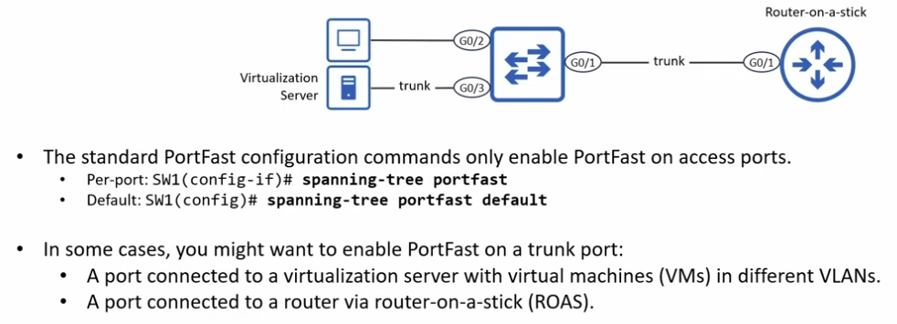
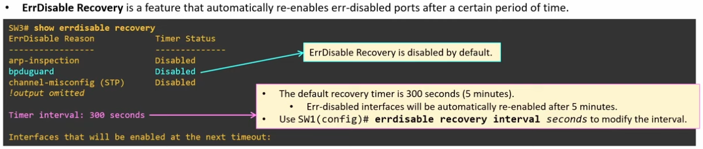
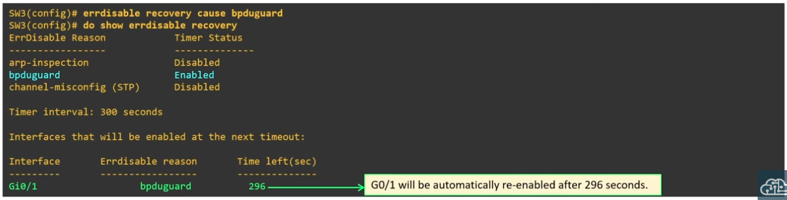
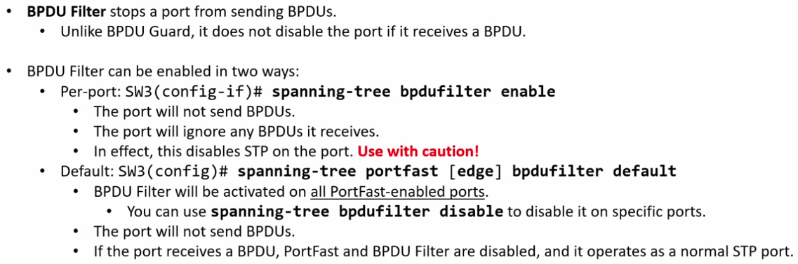
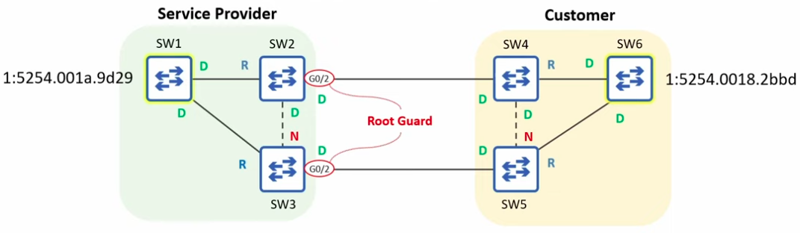
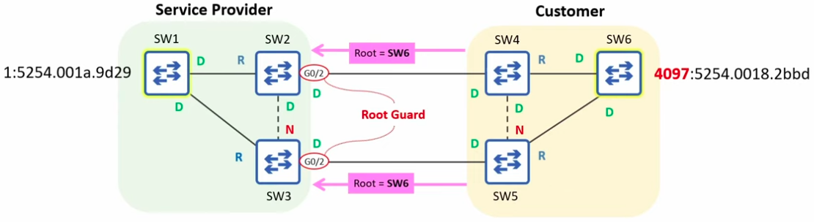

### Spanning Tree Port states:


|  |
|-|

### Spanning Tree Timers:

|  |
|-|

**Details of Max Age Timer**

|  |
|-|

### PORTFAST (Optional Spanning Tree Feature):
```CLI
SW1(config)#interface g0/2
SW1(config-if)#spanning-tree portfast
```

- Should only be enabled on interfaces connected to end hosts (e.g PCs). This is because it speeds up the startup time of interfaces, bypassing both the Listening and Learning states.
- Portfast should NOT be enabled on interfaces connecting two switches, because it causes them to skip the Listening and Learning states, which a crucial timers STP uses to evaluate STP and avoid loops.

---
- Enabling Portfast on all access ports at once:
```CLI
SW1(config)#spanning-tree portfast DEFAULT
```

### BPDU Guard (Optional Spanning Tree Feature):
```CLI
SW1(config)#interface g0/2
SW1(config-if)#spanning-tree bpduguard enable
```

- At once, for ALL interfaces on which Portfast was previously enabled (again, it it recommended to only enable Porfast on interfaces connected to end hosts):
```CLI
SW1(config)#spanning-tree portfast bpduguard default
```

### Configuring Spanning Tree Mode:
```CLI
SW1(config)#spanning-tree mode ?
  pvst        Per-Vlan spanning tree mode
  rapid-pvst  Per-Vlan rapid spanning tree mode
```

- Configuring the Primary & Secondary Root Bridge
```CLI
SW1(config)#spanning-tree vlan 1 root primary
```
- The above command usually sets the STP priority to 24576. If another switch already has a priority lower than 24576, it sets the switch pririty to 4096 less than that
---
- To set the secondary root bridge:
```CLI
SW2(config)#spanning-tree vlan 1 root secondary
```

- The above command sets the STP priority of SW2 as 4096 more than the primary Root Bridge, because STP bridge priorities are in increments of 4096.

### STP, VLANs, and Load Balancing:
- When different Switches are configured as the Root Bridge for different VLANs, STP ensures there is Load Balancing - this is where non-designated switches are alternated between the two VLAN states


|  |
|-|

|  |
|-|

|  |
|-|

### Configuring STP Port Settings:
- When we want to manually change the outcome of Designated and Root ports:


|  |
|-|

### Configuring PortFast on Trunk Port:


|  |
|-|

```CLI
SW1(config-if)#spanning-tree portfast trunk
```

### ErrDisable & ErrDisable Recovery:

- ErrDisable is a CISCO Switch Feature that disables a port under certain conditions, such as a BPDU Guard Violation

- Apart from restarting an interface to re-enable it (manual methos), ErrDisable Recovery is an automatic way of re-enabling err-disabled ports, after a certain period of time


|  |
|-|

```CLI
SW1#errdisable recovery cause <errDisable_Reason>
SW1#errdisable recovery cause bpduguard
```


|  |
|-|

### BPDU Filter:

|  |
|-|

### Root Guard:
- Assume a Scenario where our LAN, with its own STP Root Bridge Switch, is connected to another LAN whose Root Bridge has a superior Bridge Priority. Root Guard protects our LANs Root Bridge from being overrun by the external LAN.


|  |
|-|

- In this case, Root Guard should be enabled on ports connected to external switches. This is only possible on a per-interafce basis.

```CLI
SW2(config)#interface g0/2
SW2(config-if)#spanning-tree guard root

SW3(config)#interface g0/2
SW3(config-if)#spanning-tree guard root
```

If a Root Guard-enabled switch receives a BPDU, it will enter the Broken (Root Inconsistent) state - the port will not be able to forward data frames, and will discard any frames it receives.


|  |
|-|

- The customer needed to increase the priority value of their switch

### Loop Guard:

- Protects the network from loops by disabling a port if it unexpectedly stops receiving BPDUs, ensuring it does not mistakenly enter the forwarding state.

- Loop Guard may come in handy in the case of faulty, unidirectional links between switches, such as the case where on of the pair of fibre optic cables is damaged.

```CLI
SW3(config)#interface g0/1
SW3(config-if)#spanning-tree guard loop
```