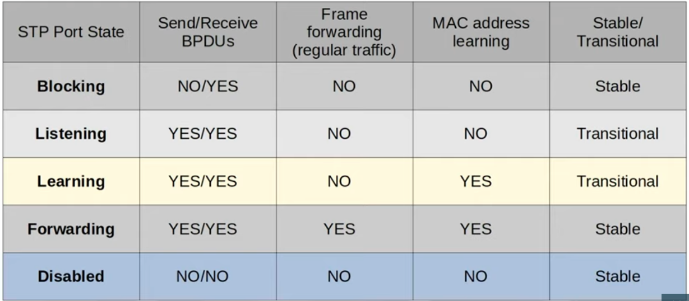
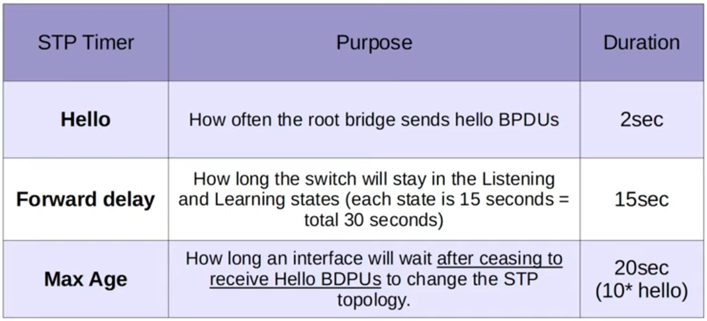
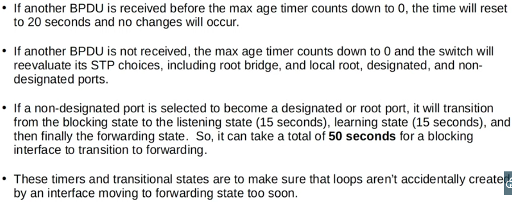

### Spanning Tree Port states:



### Spanning Tree Timers:


**Details of Max Age Timer**


### PORTFAST (Optional Spanning Tree Feature):
```CLI
SW1(config)#interface g0/2
SW1(config-if)#spanning-tree portfast
```

- Should only be enabled on interfaces connected to end hosts (e.g PCs). This is because it speeds up the startup time of interfaces, bypassing both the Listening and Learning states.
- Portfast should NOT be enabled on interfaces connecting two switches, because it causes them to skip the Listening and Learning states, which a crucial timers STP uses to evaluate STP and avoid loops.

---
- Enabling Portfast on all access ports at once:
```CLI
SW1(config)#spanning-tree portfast DEFAULT
```

### BPDU Guard (Optional Spanning Tree Feature):
```CLI
SW1(config)#interface g0/2
SW1(config-if)#spanning-tree bpduguard enable
```

- At once, for ALL interfaces on which Portfast was previously enabled (again, it it recommended to only enable Porfast on interfaces connected to end hosts):
```CLI
SW1(config)#spanning-tree portfast bpduguard default
```

### Configuring Spanning Tree Mode:
```CLI
SW1(config)#spanning-tree mode ?
  pvst        Per-Vlan spanning tree mode
  rapid-pvst  Per-Vlan rapid spanning tree mode
```

- Configuring the Primary & Secondary Root Bridge
```CLI
SW1(config)#spanning-tree vlan 1 root primary
```
- The above command usually sets the STP priority to 24576. If another switch already has a priority lower than 24576, it sets the switch pririty to 4096 less than that
---
- To set the secondary root bridge:
```CLI
SW2(config)#spanning-tree vlan 1 root secondary
```

- The above command sets the STP priority of SW2 as 4096 more than the primary Root Bridge, because STP bridge priorities are in increments of 4096.