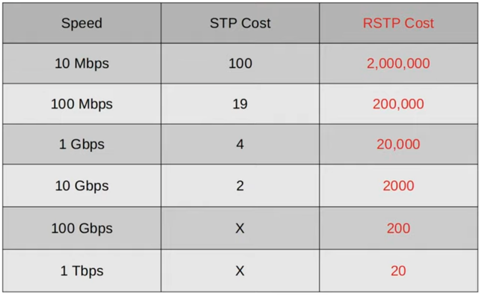
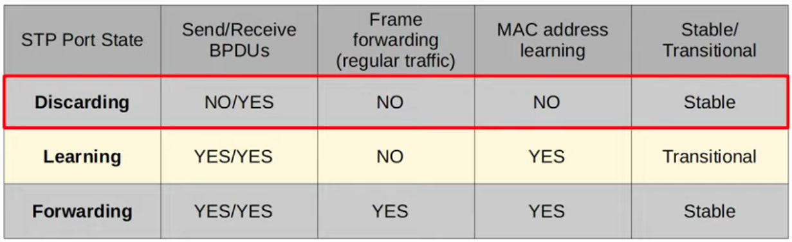
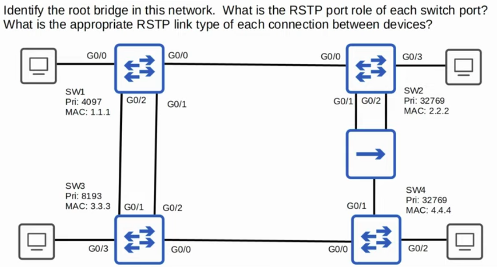

### RSTP Root Costs vs STP:

### RSTP Port States:

### Task:

- The Root Bridge is SW1, because it has the lowest Bridge ID. All its ports are designated.

- The Root Ports on the other non-Root switches:
1. G0/2 on SW3
2. G0/0 on SW2
3. GO/0 on SW4 (beecause SW3 has a lower Bridge ID)

- The designated ports:
1. G0/1 (lower port ID) & G0/3 on SW2
2. G0/0 on SW4
3. G0/0 & G0/3 on SW3

- The Alternate Ports:
1. G0/1 on SW3
2. G0/1 on SW4

- The Backup Port is G0/2 on SW2.

- Edge Links are all the links/ports on Switches that connect to end hosts.
- Point-to-Point Links are all the Switch-to-Switch links.
- Shared links are all the links between a Switch and a Hub.
