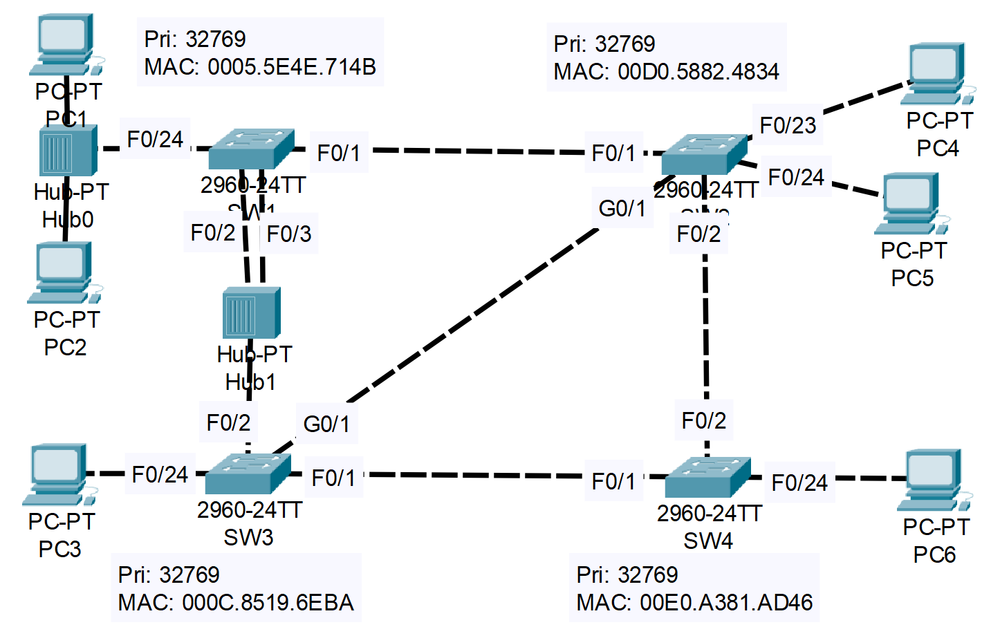

### The topology:


1. Which switch is the root bridge? Use the CLI to examine the port role/state of each interface on the root. What appears different than what you have learned about the root bridge? What is the cause of this?

- SW1 is the Root Bridge (confirmation below)

```CLI
SW1>en
SW1#show spanning-tree
VLAN0001
  Spanning tree enabled protocol rstp
  Root ID    Priority    32769
             Address     0005.5E4E.714B
             This bridge is the root
             Hello Time  2 sec  Max Age 20 sec  Forward Delay 15 sec

  Bridge ID  Priority    32769  (priority 32768 sys-id-ext 1)
             Address     0005.5E4E.714B
             Hello Time  2 sec  Max Age 20 sec  Forward Delay 15 sec
             Aging Time  20

Interface        Role Sts Cost      Prio.Nbr Type
---------------- ---- --- --------- -------- --------------------------------
Fa0/24           Desg FWD 19        128.24   Shr
Fa0/1            Desg FWD 19        128.1    P2p
Fa0/2            Desg FWD 19        128.2    Shr
Fa0/3            Back BLK 19        128.3    Shr
```

2. Without using the CLI, determine the port role/state of each remaining switch interface. Use the CLI to confirm.

**SW1:** F0/1: D | F0/2: D | F0/3: B | F0/24: D

**SW2:** F0/1: R | F0/2: D | F0/23: D | F0/24: D | G0/1: D (this is wrong, it should be A, because SW2 has a higher Bridge ID (MAC))

**SW3:** F0/1: D | F0/2: R | F0/24: D | G0/1: A (this is wrong, it should be D, because SW3 has a lower Bridge ID (MAC)) 

**SW4:** F0/1: R | F0/2: A | F0/24: D

- CLI confirmations below:
**SW1:**

```CLI
SW1>en
SW1#show spanning-tree
VLAN0001
  Spanning tree enabled protocol rstp
  Root ID    Priority    32769
             Address     0005.5E4E.714B
             This bridge is the root
             Hello Time  2 sec  Max Age 20 sec  Forward Delay 15 sec

  Bridge ID  Priority    32769  (priority 32768 sys-id-ext 1)
             Address     0005.5E4E.714B
             Hello Time  2 sec  Max Age 20 sec  Forward Delay 15 sec
             Aging Time  20

Interface        Role Sts Cost      Prio.Nbr Type
---------------- ---- --- --------- -------- --------------------------------
Fa0/24           Desg FWD 19        128.24   Shr
Fa0/1            Desg FWD 19        128.1    P2p
Fa0/2            Desg FWD 19        128.2    Shr
Fa0/3            Back BLK 19        128.3    Shr
```

**SW2:**

```CLI
SW2>en
SW2#show spanning-tree
VLAN0001
  Spanning tree enabled protocol rstp
  Root ID    Priority    32769
             Address     0005.5E4E.714B
             Cost        19
             Port        1(FastEthernet0/1)
             Hello Time  2 sec  Max Age 20 sec  Forward Delay 15 sec

  Bridge ID  Priority    32769  (priority 32768 sys-id-ext 1)
             Address     00D0.5882.4834
             Hello Time  2 sec  Max Age 20 sec  Forward Delay 15 sec
             Aging Time  20

Interface        Role Sts Cost      Prio.Nbr Type
---------------- ---- --- --------- -------- --------------------------------
Fa0/1            Root FWD 19        128.1    P2p
Fa0/2            Desg FWD 19        128.2    P2p
Fa0/24           Desg FWD 19        128.24   P2p
Fa0/23           Desg FWD 19        128.23   P2p
Gi0/1            Altn BLK 4         128.25   P2p
```

**SW3:**

```CLI
SW3>en
SW3#show spanning-tree
VLAN0001
  Spanning tree enabled protocol rstp
  Root ID    Priority    32769
             Address     0005.5E4E.714B
             Cost        19
             Port        2(FastEthernet0/2)
             Hello Time  2 sec  Max Age 20 sec  Forward Delay 15 sec

  Bridge ID  Priority    32769  (priority 32768 sys-id-ext 1)
             Address     000C.8519.6EBA
             Hello Time  2 sec  Max Age 20 sec  Forward Delay 15 sec
             Aging Time  20

Interface        Role Sts Cost      Prio.Nbr Type
---------------- ---- --- --------- -------- --------------------------------
Fa0/2            Root FWD 19        128.2    Shr
Fa0/1            Desg FWD 19        128.1    P2p
Fa0/24           Desg FWD 19        128.24   P2p
Gi0/1            Desg FWD 4         128.25   P2p
```

**SW4:**

```CLI
SW4>en
SW4#show spanning-tree
VLAN0001
  Spanning tree enabled protocol rstp
  Root ID    Priority    32769
             Address     0005.5E4E.714B
             Cost        38
             Port        1(FastEthernet0/1)
             Hello Time  2 sec  Max Age 20 sec  Forward Delay 15 sec

  Bridge ID  Priority    32769  (priority 32768 sys-id-ext 1)
             Address     00E0.A381.AD46
             Hello Time  2 sec  Max Age 20 sec  Forward Delay 15 sec
             Aging Time  20

Interface        Role Sts Cost      Prio.Nbr Type
---------------- ---- --- --------- -------- --------------------------------
Fa0/1            Root FWD 19        128.1    P2p
Fa0/2            Altn BLK 19        128.2    P2p
Fa0/24           Desg FWD 19        128.24   P2p
```

3. Manually configure the appropriate RSTP link type on each interface. What do you think is the correct link type for SW1's F0/24?

**SW1:**
```CLI
SW1>en
SW1#conf t
Enter configuration commands, one per line.  End with CNTL/Z.
SW1(config)#interface f0/24
SW1(config-if)#spanning-tree l?
link-type  
SW1(config-if)#spanning-tree l
SW1(config-if)#spanning-tree link-type ?
  point-to-point  Consider the interface as point-to-point
  shared          Consider the interface as shared
SW1(config-if)#spanning-tree link-type s
SW1(config-if)#spanning-tree link-type shared
```

**Make sure to enable PortFast on all access ports to end hosts, because unlike link-type, PortFast is not enabled by default:**

```CLI
SW1>en
SW1#conf t
SW1(config)#interface f0/24
SW1(config-if)#spanning-tree portfast
```

```CLI
SW2>en
SW2#conf t
SW2(config)#interface range f0/23 - 24
SW2(config-if-range)#spanning-tree portfast
```

```CLI
SW3>en
SW3#conf t
SW3(config)#interface f0/24
SW3(config-if)#spanning-tree portfast
```

```CLI
SW4>en
SW4#conf t
SW4(config)#interface f0/24
SW4(config-if)#spanning-tree portfast
```

