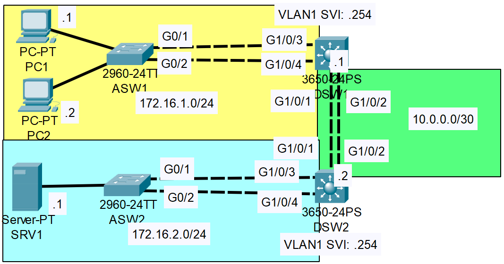

### The topology:



1. Configure Layer 2 EtherChannel between ASW1 and DSW1 using LACP. Configure it as a trunk.

**ASW1**

```CLI
ASW1>en
ASW1#conf t
ASW1(config)#interface range g0/1 - g0/2
ASW1(config-if-range)#channel-group 1 mode active

Creating a port-channel interface Port-channel 1

ASW1(config-if-range)#switchport mode trunk
ASW1(config-if-range)#channel-protocol lacp
ASW1(config-if-range)#exit
ASW1(config)#interface Po1
ASW1(config-if)#switchport mode trunk
```

**DSW1**

```CLI
DSW1>en
DSW1#conf t
DSW1(config)#interface range g1/0/3, g1/0/4
DSW1(config-if-range)#channel-group 1 mode active

Creating a port-channel interface Port-channel 1

DSW1(config-if-range)#switchport mode trunk
DSW1(config-if-range)#channel-protocol lacp
DSW1(config-if-range)#exit
DSW1(config)#interface Po1
DSW1(config-if)#switchport mode trunk
```


2. Configure Layer 2 EtherChannel between ASW2 and DSW2 using PAgP. Configure it as a trunk.

**ASW2**

```CLI
ASW2>en
ASW2#conf t
ASW2(config)#interface range g0/1 - g0/2
ASW2(config-if-range)#channel-group 1 mode desirable

Creating a port-channel interface Port-channel 1

ASW2(config-if-range)#switchport mode trunk
ASW2(config-if-range)#channel-protocol pagp
ASW2(config-if-range)#exit
ASW2(config)#interface Po1
ASW2(config-if)#switchport mode trunk
```

**DSW2**

```CLI
DSW2>en
DSW2#conf t
DSW2(config)#interface range g1/0/3, g1/0/4
DSW2(config-if-range)#channel-group 1 mode desirable

Creating a port-channel interface Port-channel 1

DSW2(config-if-range)#switchport mode trunk
DSW2(config-if-range)#channel-protocol pagp
DSW2(config-if-range)#exit
DSW2(config)#interface Po1
DSW2(config-if)#switchport mode trunk
```


3. Configure Layer 3 EtherChannel between DSW1 and DSW2 using static EtherChannel.

**DSW1**

```CLI
DSW1>EN
DSW1#conf t
DSW1(config)#ip routing
DSW1(config)#interface range g1/0/1, g1/0/2
DSW1(config-if-range)#no switchport
DSW1(config-if-range)#channel-group 2 mode on
DSW1(config-if-range)#exit
DSW1(config)#interface Po2
DSW1(config-if)#ip address 10.0.0.1 255.255.255.252
```

**DSW2**

```CLI
DSW2>EN
DSW2#conf t
DSW2(config)#ip routing
DSW2(config)#interface range g1/0/1, g1/0/2
DSW2(config-if-range)#no switchport
DSW2(config-if-range)#channel-group 2 mode on
DSW2(config-if-range)#exit
DSW2(config)#interface Po2
DSW2(config-if)#ip address 10.0.0.2 255.255.255.252
```
4. Configure routes to allow the PCs to reach SRV1.

**DSW1**

```CLI
DSW1(config)#ip route 172.16.2.0 255.255.255.0 10.0.0.2
```

**DSW2**

```CLI
DSW1(config)#ip route 172.16.1.0 255.255.255.0 10.0.0.1
```

5. What is the default EtherChannel load-balancing method used on each switch?

**ASW1**

```CLI
ASW1#show etherchannel load-balance
EtherChannel Load-Balancing Operational State (src-mac):
Non-IP: Source MAC address
  IPv4: Source MAC address
  IPv6: Source MAC address
```

**ASW2**

```CLI
ASW2#show etherchannel load-balance
EtherChannel Load-Balancing Operational State (src-mac):
Non-IP: Source MAC address
  IPv4: Source MAC address
  IPv6: Source MAC address
```

**DSW1**

```CLI
DSW1#show etherchannel load-balance
EtherChannel Load-Balancing Configuration:
        src-mac

EtherChannel Load-Balancing Addresses Used Per-Protocol:
Non-IP: Source MAC address
  IPv4: Source MAC address
  IPv6: Source MAC address
```

**DSW2**

```CLI
DSW2#show etherchannel load-balance
EtherChannel Load-Balancing Configuration:
        src-mac

EtherChannel Load-Balancing Addresses Used Per-Protocol:
Non-IP: Source MAC address
  IPv4: Source MAC address
  IPv6: Source MAC address
```

6. Configure the switches to load-balance based on source and destination IP addresses.

**ASW1**

```CLI
ASW1(config)#port-channel load-balance src-dst-ip
```

**ASW2**

```CLI
ASW2(config)#port-channel load-balance src-dst-ip
```

**DSW1**

```CLI
DSW1(config)#port-channel load-balance src-dst-ip
```

**DSW2**

```CLI
DSW2(config)#port-channel load-balance src-dst-ip
```

