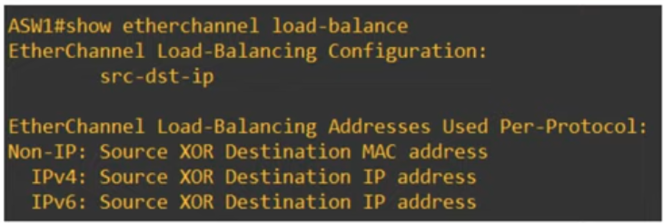
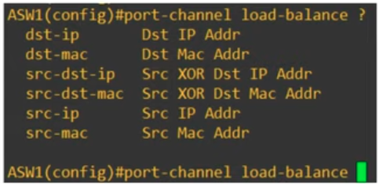

### EtherChannel is a Protocol that allows us to group multiple physical interfaces on a Switch or Router, into a group which operates as a single, logical interface

- It is used to curb **OVERSUBSCRIPTION**, a situation where the total bandwidth of the switchports/switchinterfaces connected to end hosts exceeds the bandwidth of the outbound switchport to the distribution switch.

- EtherChannel may also be referred to as Port Channel or Link Aggregation Group (LAG).

### Load Balancing in EtherChannel
- The command below gives us details on which parameters are used in Switch ASW1 to determine load-balancing on EtherChannel

```CLI
ASW1#show etherchannel load-balance
```



- The command below is how to select the load-balancing parameters:

```CLI
ASW1(config)#port-channel load-balance <parameter>
```

