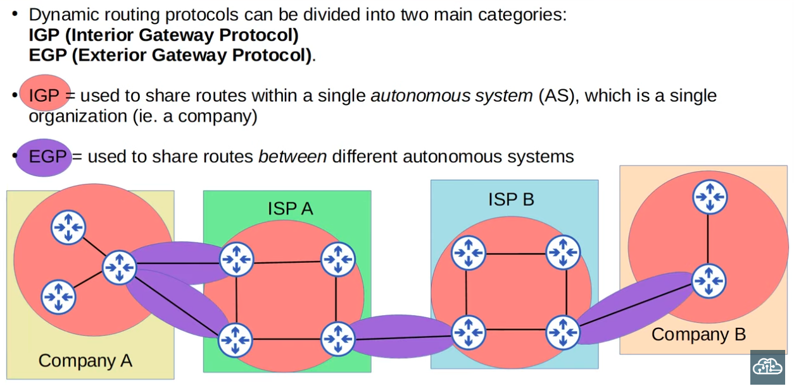
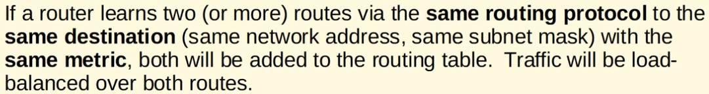
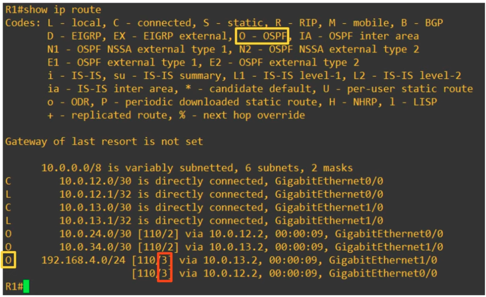
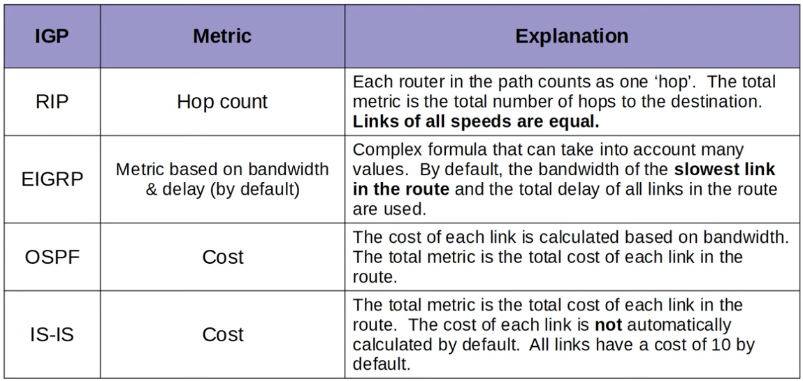
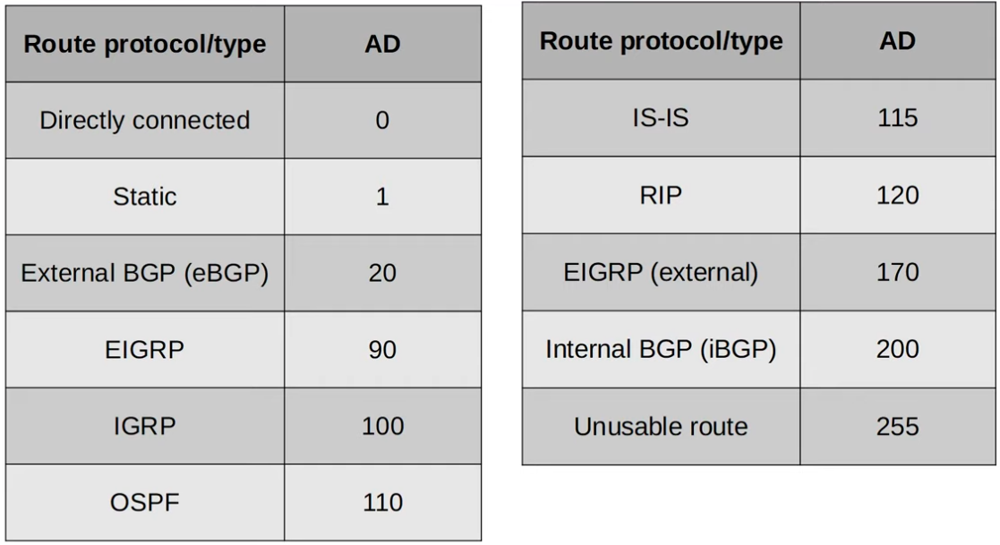

### Types of Dynamic Routing Protocols:


|  |
|-|

### Types of Interior Gateway Protocols:
1. Distance-Vector Protocols: RIP & EIGRP (which isCISCO-Proprietary)
2. Link State: OSPF & IS-IS

- Link State protocols tend to be faster in reacting to changes in the network than Distance Vector protocols.

---

- In Dynamic Routing Protocols, Path Metrics are used to determine the preferred routes (i.e. lower metric = preferred)

**NOTE:**


|  |
|-|

**example of routes with same metric in OSPF (ECMP - Equal Cost Multi-Path):**

|  |
|-|


|  |
|-|

### Administrative Distances:


|  |
|-|

### Configuring Floating Static Routes (static route with higher Administrative Distance) on routers:

```CLI
Router(config)#ip route 10.0.1.0 255.255.255.0 203.0.113.5 <custom_AD>
```