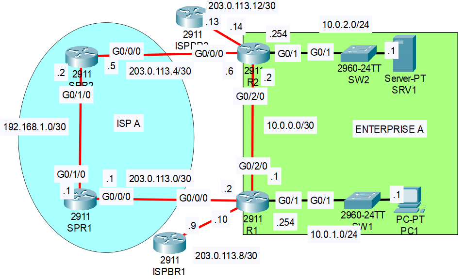
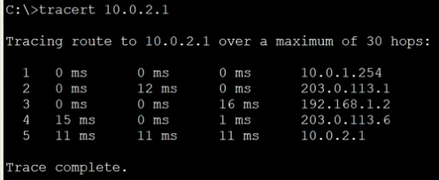

### The topology:


|  |
|-|

1. Check the routing tables of R1 and R2.  
    - Which dynamic routing protocol is Enterprise A using?
    **OSPF**
    - Which route will be used if PC1 tries to access SRV1?
    **PC1 -> R1 -> R2 -> SRV1**
    - Which route will be used if PC1 tries to access remote server 1.1.1.1 over the Internet?Test by pinging SRV1 and 1.1.1.1
    **PC1 -> R1 -> 2911 ISPBR1**

2. Configure floating static routes (**static route with higher Administrative Distance**) on R1 and R2 that allow PC1 to reach SRV1 if the link between R1 and R2 fails.

**For PC1 to ping SRV1 successfully, we have to make sure the routes are configured in both directions, because the ping success depends on the (ICMP Echo) reply**

**R1**

```CLI
R1(config)#ip route 10.0.2.0 255.255.255.0 203.0.113.1 120
```

**SPR1 (route to 10.0.1.0/24 was already statically configured)**
```CLI
SPR1(config)#ip route 10.0.2.0 255.255.255.0 192.168.1.2
```

**SPR2 (route to 10.0.2.0/24 was already statically configured)**
```CLI
SPR2(config)#ip route 10.0.1.0 255.255.255.0 192.168.1.1
```

**R2**
```CLI
R2(config)#ip route 10.0.1.0 255.255.255.0 203.0.113.5 120
```

Do the routes enter the routing tables of R1 and R2?

**No, the routes do not appear yet - they only appeaar after the direct connection between R1 & R2 is disabled**

3. Shut down the G0/2/0 interface of R1 or R2.
    Do the floating static routes enter the routing tables of R1 and R2? Ping from PC1 to SRV1 to confirm.
    Yes!
     
---
### TraceRoute for tracking traffic paths:

- On real windows PCs, 'tracert' is used instead.

```CL1
C:\>traceroute 10.0.2.1
```


|  |
|-|

---
### PC Command Prompt/Terminal commands for network configuration:

**1. Checking the network configurations**

```CLI
C:\>ipconfig /all
```

**2. Configuring the ip address**

```CLI
C:\>ipconfig /IP 192.168.101.2 255.255.255.0
```

**3. Configuring the default gateway**

```CLI
C:\>ipconfig /dg 192.168.101.1
```