### RIP

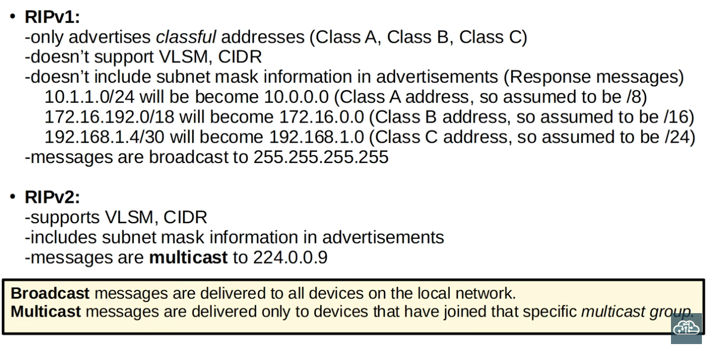

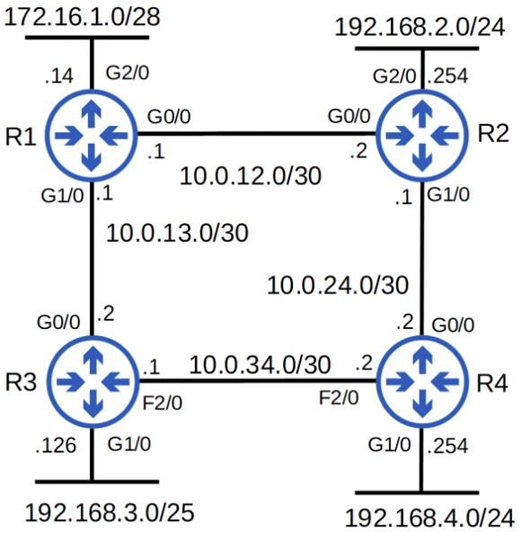

### RIP Configuration (for the topology above):
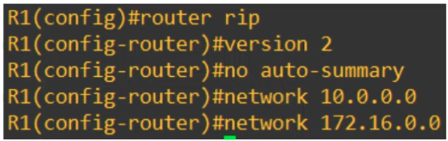

- We should always use RIPv2 by specifying "version 2"
- "no auto summary" prevents RIPv2 from catergorizing IP Addresses into classful networks, which tends to lead to wrong netmasks.

**Specifics of how the 'network' command works**

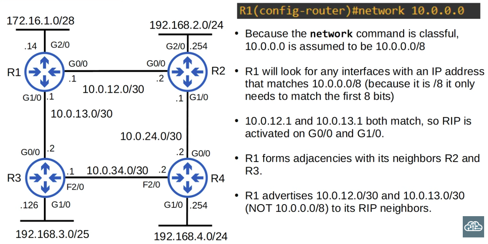

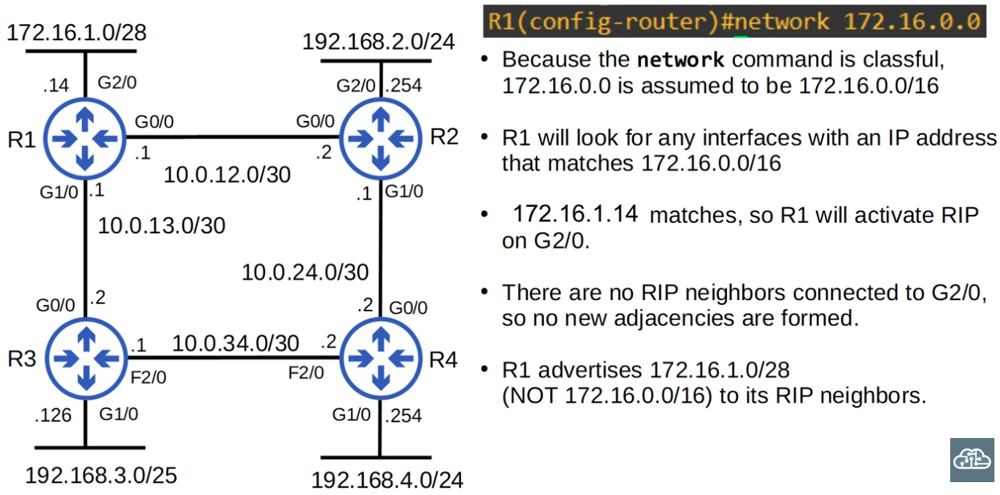

- The network command doesn't tell the router which networks to advertise.It tells the router which interfaces to activate RIP on, and then the router will advertise the network prefix of those interfaces.

**Passive Interfaces:**

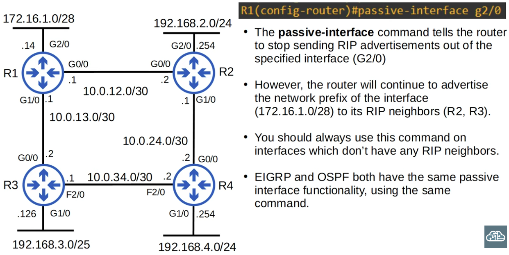

- Tells the router to stop sending RIP advertisements out of the specified interface.

**The default-information originate command:**

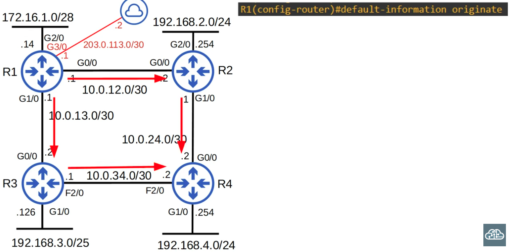

- Used to advertise a default route (gateway of last resort) across the network.

**Detailed view of the IGP protocol:**

```CLI
R1#show ip protocols
```

- Suitable for RIP, EIGRP, & OSPF

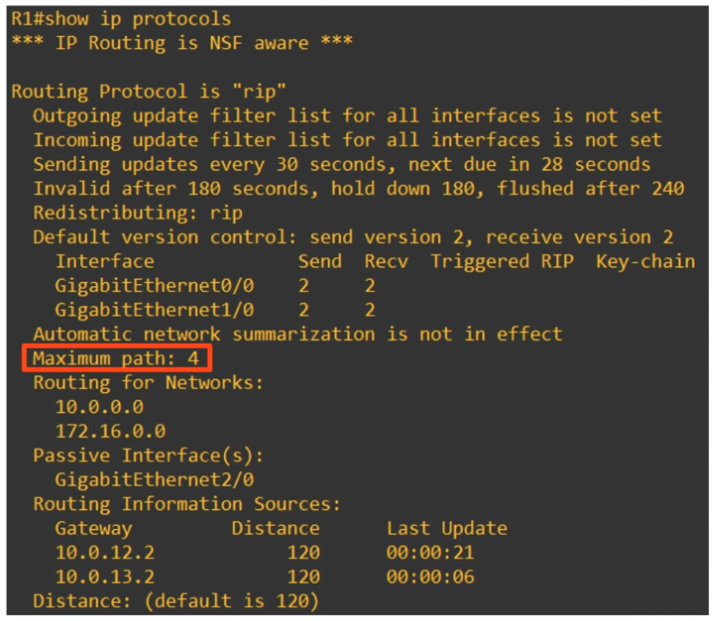

---

### EIGRP Configuration:

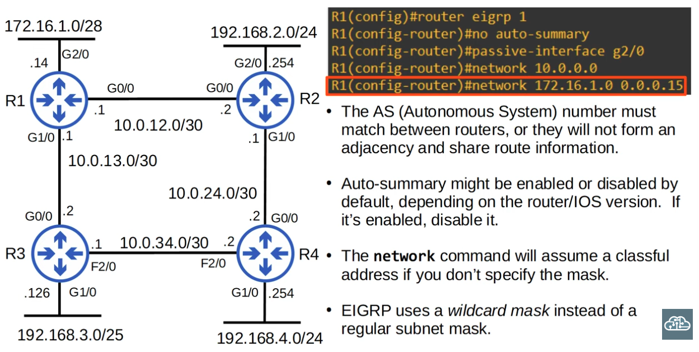

**How Wilcard masks work**

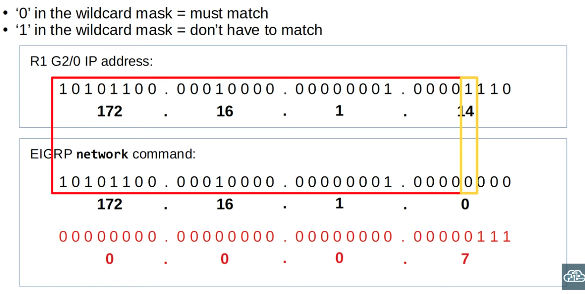

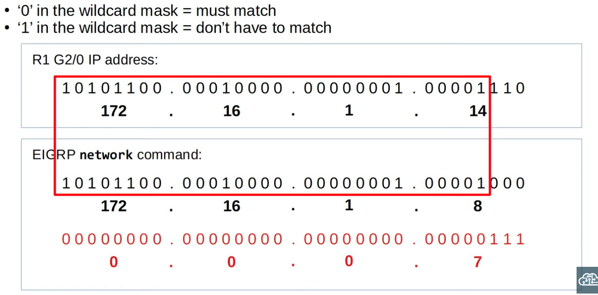

**EIGRP Terminology (Unequal-cost Load-balancing)**
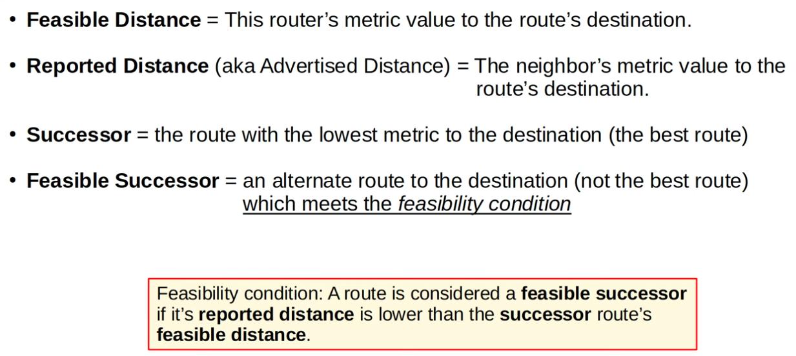
