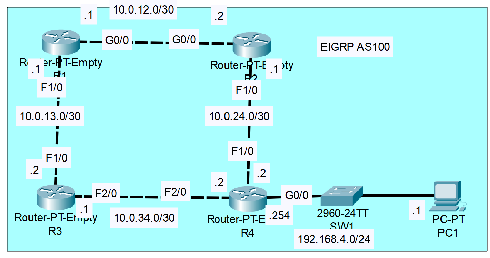
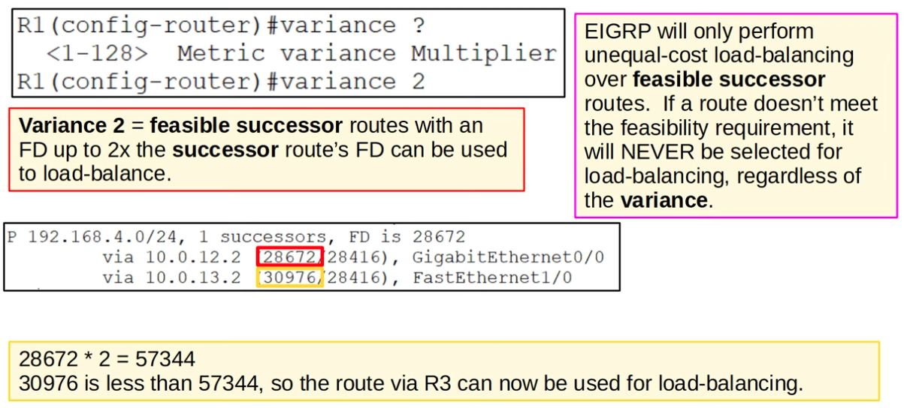

### The topology:



1. Configure the appropriate hostnames and IP addresses on each device.  Enable router interfaces.

**R1**

```CLI
Router>en
Router#conf t
Router(config)#hostname R1

R1(config)#interface f1/0
R1(config-if)#ip address 10.0.13.1 255.255.255.252
R1(config-if)#no shutdown

R1(config-if)#interface g0/0
R1(config-if)#ip address 10.0.12.1 255.255.255.252
R1(config-if)#no shutdown
```

**R2**

```CLI
Router>en
Router#conf t
Router(config)#hostname R2

R2(config)#interface g0/0
R2(config-if)#ip address 10.0.12.2 255.255.255.252
R2(config-if)#no shutdown

R2(config-if)#interface f1/0
R2(config-if)#ip address 10.0.24.1 255.255.255.252
R2(config-if)#no shutdown
```

**R3**

```CLI
Router>en
Router#conf t
Router(config)#hostname R3

R3(config)#interface f2/0
R3(config-if)#ip address 10.0.34.1 255.255.255.252
R3(config-if)#no shutdown

R3(config-if)#interface f1/0
R3(config-if)#ip address 10.0.13.2 255.255.255.252
R3(config-if)#no shutdown
```

**R4**

```CLI
Router>en
Router#conf t
Router(config)#hostname R4

R4(config)#interface g0/0
R4(config-if)#ip address 192.168.4.254 255.255.255.0
R4(config-if)#no shutdown

R4(config-if)#interface f1/0
R4(config-if)#ip address 10.0.24.2 255.255.255.252
R4(config-if)#no shutdown

R4(config-if)#interface f2/0
R4(config-if)#ip address 10.0.34.2 255.255.255.252
R4(config-if)#no shutdown
```

2. Configure a loopback interface on each router (1.1.1.1/32 for R1, 2.2.2.2/32 for R2, etc.)

**R1**

```CLI
R1(config-if)#interface Loopback 1
R1(config-if)#ip address 1.1.1.1 255.255.255.255
R1(config-if)#no shutdown
```

**R2**

```CLI
R2(config-if)#interface Loopback 1
R2(config-if)#ip address 2.2.2.2 255.255.255.255
R2(config-if)#no shutdown
```

**R3**

```CLI
R3(config-if)#interface Loopback 1
R3(config-if)#ip address 3.3.3.3 255.255.255.255
R3(config-if)#no shutdown
```

**R4**

```CLI
R4(config-if)#interface Loopback 1
R4(config-if)#ip address 4.4.4.4 255.255.255.255
R4(config-if)#no shutdown
```


3. Configure EIGRP on each router.
    - Disable auto-summary.
    - Enable EIGRP on each interface (including loopback interfaces).
    - Configure passive interfaces where appropriate (including loopback interfaces).


**R1**

```CLI
R1(config)#router eigrp 1
R1(config-router)#no auto-summary

R1(config-router)#passive-interface Lo1

R1(config-router)#network 10.0.13.0 0.0.0.3

R1(config-router)#network 10.0.12.0 0.0.0.3

R1(config-router)#network 1.1.1.1 0.0.0.0
```

**R2**

```CLI
R2(config)#router eigrp 1
R2(config-router)#no auto-summary

R2(config-router)#passive-interface Lo1

R2(config-router)#network 10.0.12.0 0.0.0.3

R2(config-router)#network 10.0.24.0 0.0.0.3

R2(config-router)#network 2.2.2.2 0.0.0.0
```

**R3**

```CLI
R3(config)#router eigrp 1
R3(config-router)#no auto-summary

R3(config-router)#passive-interface Lo1

R3(config-router)#network 10.0.34.0 0.0.0.3

R3(config-router)#network 10.0.13.0 0.0.0.3

R3(config-router)#network 3.3.3.3 0.0.0.0
```

**R4**

```CLI
R4(config)#router eigrp 1
R4(config-router)#no auto-summary

R4(config-router)#passive-interface g0/0

R4(config-router)#passive-interface Lo1

R4(config-router)#network 10.0.34.0 0.0.0.3

R4(config-router)#network 10.0.24.0 0.0.0.3

R4(config-router)#network 192.168.4.0 0.0.0.255

R4(config-router)#network 4.4.4.4 0.0.0.0
```

4. Configure R1 to perform unequal-cost load-balancing when sending network traffic to 192.168.4.0/24

```CLI
R1(config)#router eigrp 1
R1(config-router)#variance 2
```

