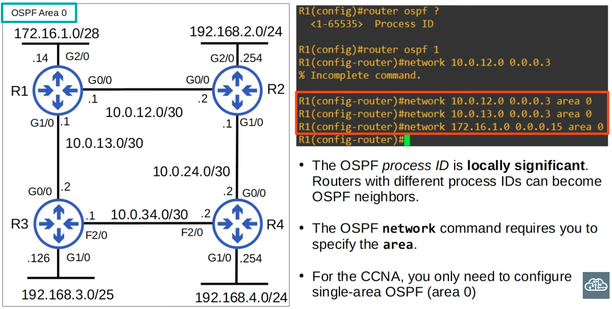
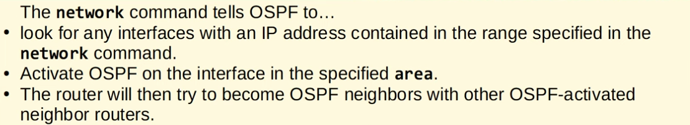
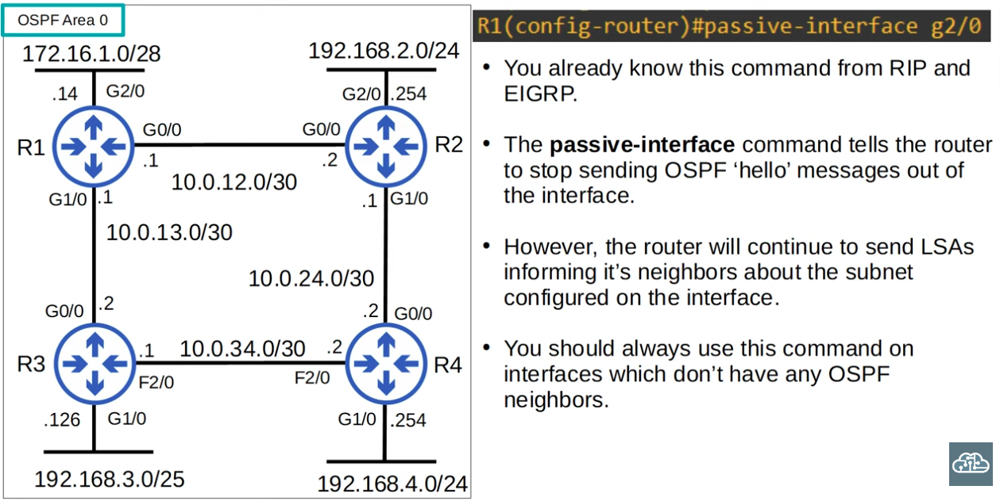
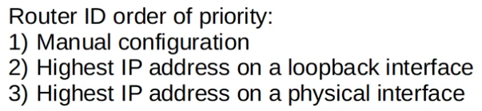

### Basic OSPF Configuration:

<kbd align="center" style="border: 1px solid #3d3c3c;">
  
</kbd>
<br>
<kbd align="center" style="border: 1px solid #3d3c3c;">
  
</kbd>

**The passive-interface command**



**Advertising a default route into OSPF**

```CLI
R1(config-router)#default-information originate
```

#### Router ID:

|  |
|-|

```CLI
R1(config-router)#router-id 1.1.1.1 
```

