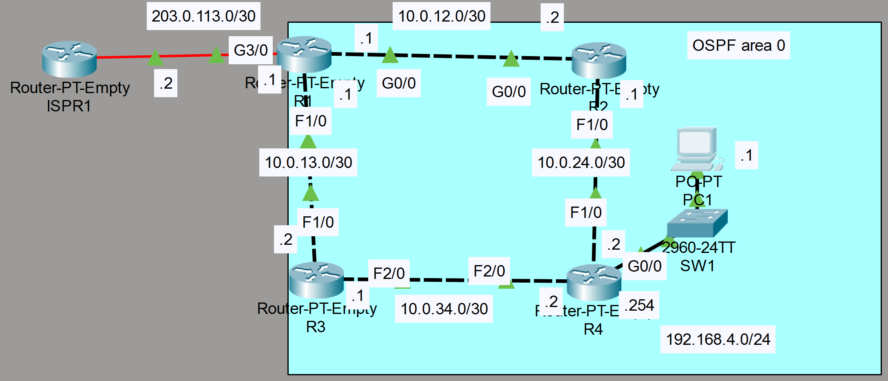

### The topology:



1. Configure the appropriate hostnames and IP addresses on each device.  Enable router interfaces.

**R1**

```CLI
Router>en
Router#conf t
Router(config)#hostname R1

R1(config)#interface g3/0
R1(config-if)#ip address 203.0.113.1 255.255.255.252
R1(config-if)#no shutdown

R1(config-if)#interface f1/0
R1(config-if)#ip address 10.0.13.1 255.255.255.252
R1(config-if)#no shutdown

R1(config-if)#interface g0/0
R1(config-if)#ip address 10.0.12.1 255.255.255.252
R1(config-if)#no shutdown
```

**R2**

```CLI
Router>en
Router#conf t
Router(config)#hostname R2

R2(config)#interface g0/0
R2(config-if)#ip address 10.0.12.2 255.255.255.252
R2(config-if)#no shutdown

R2(config-if)#interface f1/0
R2(config-if)#ip address 10.0.24.1 255.255.255.252
R2(config-if)#no shutdown
```

**R3**

```CLI
Router>en
Router#conf t
Router(config)#hostname R3

R3(config)#interface f1/0
R3(config-if)#ip address 10.0.13.2 255.255.255.252
R3(config-if)#no shutdown

R3(config-if)#interface f2/0
R3(config-if)#ip address 10.0.34.1 255.255.255.252
R3(config-if)#no shutdown
```

**R4**

```CLI
Router>en
Router#conf t
Router(config)#hostname R4

R4(config-if)#interface f2/0
R4(config-if)#ip address 10.0.34.2 255.255.255.252
R4(config-if)#no shutdown

R4(config-if)#interface f1/0
R4(config-if)#ip address 10.0.24.2 255.255.255.252
R4(config-if)#no shutdown

R4(config)#interface g0/0
R4(config-if)#ip address 192.168.4.2 255.255.255.0
R4(config-if)#no shutdown
```

2. Configure a loopback interface on each router (1.1.1.1/32 for R1, 2.2.2.2/32 for R2, etc.)

**R1**

```CLI
R1(config)#interface Loopback0
R1(config-if)#ip address 1.1.1.1 255.255.255.255
```

**R2**

```CLI
R2(config-if)#interface Loopback0
R2(config-if)#ip address 2.2.2.2 255.255.255.255
```

**R3**

```CLI
R3(config-if)#interface Loopback0
R3(config-if)#ip address 3.3.3.3 255.255.255.255
```

**R4**

```CLI
R4(config)#interface Loopback0
R4(config-if)#ip address 4.4.4.4 255.255.255.255
```

3. Configure OSPF on each router.
    - Enable OSPF on each interface (including loopback interfaces).

        **R1**

        ```CLI
        R1(config)#router ospf 1

        R1(config-router)#network 10.0.12.0 0.0.0.3 area 0
        R1(config-router)#network 10.0.13.0 0.0.0.3 area 0
        R1(config-router)#network 1.1.1.1 0.0.0.0 area 0
        ```

        **R2**

        ```CLI
        R2(config)#router ospf 1

        R2(config-router)#network 10.0.12.0 0.0.0.3 area 0
        R2(config-router)#network 10.0.24.0 0.0.0.3 area 0
        R2(config-router)#network 2.2.2.2 0.0.0.0 area 0
        ```

        **R3**

        ```CLI
        R3(config)#router ospf 1
        
        R3(config-router)#network 10.0.34.0 0.0.0.3 area 0
        R3(config-router)#network 10.0.13.0 0.0.0.3 area 0
        R3(config-router)#network 3.3.3.3 0.0.0.0 area 0
        ```

        **R4**

        ```CLI
        R4(config)#router ospf 1

        R4(config-router)#network 192.168.4.0 0.0.0.255 area 0
        R4(config-router)#network 10.0.34.0 0.0.0.3 area 0
        R4(config-router)#network 10.0.24.0 0.0.0.3 area 0
        R4(config-router)#network 4.4.4.4 0.0.0.0 area 0
        ```
    
    - Configure passive interfaces where appropriate (including loopback interfaces).

        **R1**

        ```CLI
        R1(config-router)#passive-interface Loopback0
        ```

        **R2**

        ```CLI
        R2(config-router)#passive-interface Loopback0
        ```

        **R3**

        ```CLI
        R3(config-router)#passive-interface Loopback0
        ```

        **R4**

        ```CLI
        R4(config-router)#passive-interface Loopback0
        R4(config-router)#passive-interface g0/0
        ```

4. Configure R1 as an ASBR that advertises a default route in to the OSPF domain.

**R1**

```CLI
R1(config-if)#exit
R1(config)#ip route 0.0.0.0 0.0.0.0 203.0.113.2
R1(config)#router ospf 1
R1(config-router)#default-information originate
```

5. Check the routing tables of R2, R3, and R4.  What default route(s) were added?

- Issue the show ip route command

**R2**

```CLI
E2 - OSPF external type 2

O*E2 0.0.0.0/0 [110/1] via 10.0.12.1, 00:32:22, GigabitEthernet0/0
```

**R3**

```CLI
E2 - OSPF external type 2

O*E2 0.0.0.0/0 [110/1] via 10.0.13.1, 00:33:36, FastEthernet1/0
```

**R4**

```CLI
E2 - OSPF external type 2

O*E2 0.0.0.0/0 [110/1] via 10.0.34.1, 00:34:23, FastEthernet2/0
               [110/1] via 10.0.24.1, 00:34:23, FastEthernet1/0
```