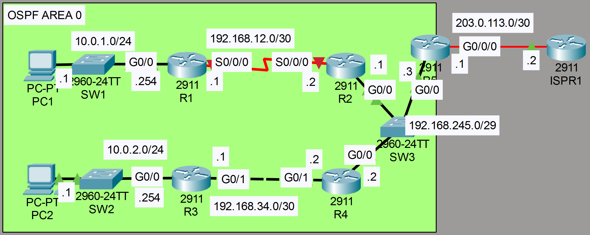

**Link to** [**Packet Tracer Solution File**](./Day%2028%20Lab%20-%20OSPF%20(Part%203).pkt)

### The topology:


|  |
|-|

1. The connection between R1 and R2 has been newly added. Configure the serial connection between R1 and R2 (clock rate of 128000). Configure OSPF on R1 and R2.

  **R1**

  ```CLI
    R1>en
    R1#conf t
    
    R1(config)#interface s0/0/0
    R1(config-if)#ip address 192.168.12.1 255.255.255.252
    R1(config-if)#no shutdown

    R1(config-if)#ip ospf 1 area 0
    R1(config-if)#end

    R1#show controllers
        Interface Serial0/0/0
        Hardware is PowerQUICC MPC860
        DCE V.35, clock rate 2000000

    R1#conf t
    R1(config)#interface s0/0/0
    R1(config-if)#clock rate 128000

    R1(config-if)#interface g0/0
    R1(config-if)#ip ospf 1 area 0
  ```

  **R2**

  ```CLI
    R2>en
    R2#conf t
    
    R2(config)#interface s0/0/0
    R2(config-if)#ip address 192.168.12.2 255.255.255.252
    R2(config-if)#no shutdown
    R2(config-if)#ip ospf 1 area 0
  ```

  


2. Only R3 has a route to 10.0.2.0/24.  Why?  Fix the problem.

**OSPF Network Type mismatch (P2P on R3, BROADCAST on R4)**

**R3**

```CLI
R3#conf t
R3(config)#interface g0/1
R3(config-if)#no ip ospf network point-to-point
```

3. R2 and R4 won't become OSPF neighbors with R5.  Why?  Fix the problem.

**Hello and Dead timers configured on R5 mismatch with the other 2**

**R5**

```CLI
R5>en
R5#show ip ospf interface

GigabitEthernet0/0 is up, line protocol is up
  Internet address is 192.168.245.3/29, Area 0
  Process ID 1, Router ID 203.0.113.1, Network Type BROADCAST, Cost: 1
  Transmit Delay is 1 sec, State DR, Priority 1
  Designated Router (ID) 203.0.113.1, Interface address 192.168.245.3
  No backup designated router on this network
  Timer intervals configured, Hello 5, Dead 20, Wait 20, Retransmit 5
    Hello due in 00:00:04
  Index 1/1, flood queue length 0
  Next 0x0(0)/0x0(0)
  Last flood scan length is 1, maximum is 1
  Last flood scan time is 0 msec, maximum is 0 msec
  Neighbor Count is 0, Adjacent neighbor count is 0
  Suppress hello for 0 neighbor(s)

R5#conf t
Enter configuration commands, one per line.  End with CNTL/Z.
R5(config)#interface g0/0
R5(config-if)#ip ospf hello-interval 10
R5(config-if)#ip ospf dead-interval 40
```

4. PC1 and PC2 can't ping the external server 8.8.8.8.  Why?  Fix the problem.

**R5**

```CLI
R5(config)#ip route 0.0.0.0 0.0.0.0 203.0.113.2
R5(config)#router ospf 1
R5(config-router)#default
R5(config-router)#default-information originate
```

5. Examine the LSDB.  What LSAs are present?

**R5**

```CLI
R5#show ip ospf database
            OSPF Router with ID (203.0.113.1) (Process ID 1)

                Router Link States (Area 0)

Link ID         ADV Router      Age         Seq#       Checksum Link count
192.168.12.1    192.168.12.1    742         0x80000003 0x002d45 3
192.168.34.1    192.168.34.1    555         0x80000007 0x00ee10 2
203.0.113.1     203.0.113.1     328         0x80000003 0x008689 1
192.168.245.2   192.168.245.2   328         0x80000007 0x00603d 2
192.168.245.1   192.168.245.1   327         0x80000006 0x004a83 3

                Net Link States (Area 0)
Link ID         ADV Router      Age         Seq#       Checksum
192.168.34.2    192.168.245.2   1127        0x80000002 0x007b23
192.168.245.3   203.0.113.1     327         0x80000002 0x008531

                Type-5 AS External Link States
Link ID         ADV Router      Age         Seq#       Checksum Tag
0.0.0.0         203.0.113.1     180         0x80000001 0x00d2c1 1
```