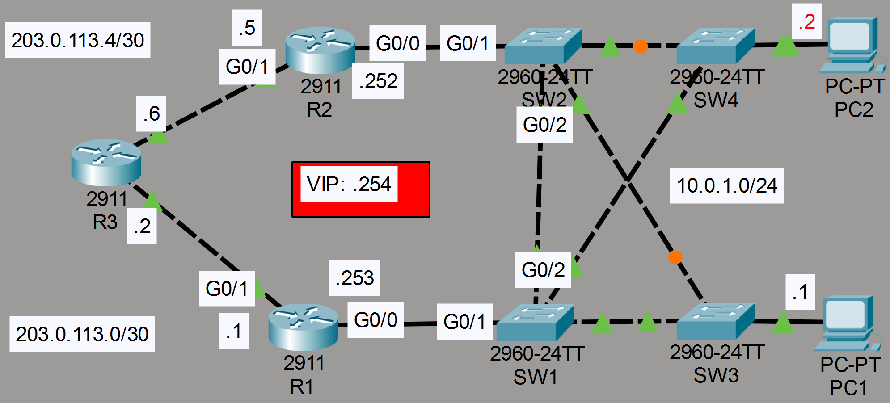
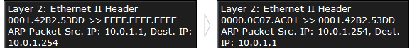

### The topology



1. Ping external server 8.8.8.8 from PC1/PC2. What is the default gateway configured as?

**R1*

2. Configure HSRPv2 on R1/R2. Raise R1's priority above the default, lower R2's priority below the default. Enable preemption.

**R1**

```CLI
R1(config)#interface g0/0
R1(config-if)#standby version 2
R1(config-if)#standby 1 priority 200
R1(config-if)#standby 1 preempt
```

**R2**

```CLI
R2(config)#interface g0/0
R2(config-if)#standby version 2
R2(config-if)#standby 1 priority 50
```

3. Configure the VIP as the default gateway of PC1/PC2. Ping 8.8.8.8 from the PCs.  Check the PCs' ARP table. What MAC address is mapped to the VIP?

**R1**

```CLI
R1(config-if)#standby 1 ip 10.0.1.254
```

**R2**

```CLI
R2(config-if)#standby 1 ip 10.0.1.254
```

**Virtual MAC:** 0000.0C07.AC01



4. Turn off R1 (save the config first!). After it restarts, ping from PC1 to 8.8.8.8 again. Is R2 used as the default gateway?

**Before switching off**

```CLI
R1#copy running-config startup-config
Destination filename [startup-config]? 
Building configuration...
[OK]

R1#show standby
GigabitEthernet0/0 - Group 1
  State is Active
    5 state changes, last state change 00:14:43
  Virtual IP address is 10.0.1.254
  Active virtual MAC address is 0000.0C07.AC01
    Local virtual MAC address is 0000.0C07.AC01 (v1 default)
  Hello time 3 sec, hold time 10 sec
    Next hello sent in 2.856 secs
  Preemption enabled
  Active router is local
  Standby router is 10.0.1.252
  Priority 200 (default 100)
  Group name is hsrp-Gig0/0-1 (default)
```

**Yes, R2 is used as the default gateway**

```CLI
HSRP-6-STATECHANGE: GigabitEthernet0/0 Grp 1 state Standby -> Active

R2#show standby
GigabitEthernet0/0 - Group 1
  State is Active
    4 state changes, last state change 00:21:04
  Virtual IP address is 10.0.1.254
  Active virtual MAC address is 0000.0C07.AC01
    Local virtual MAC address is 0000.0C07.AC01 (v1 default)
  Hello time 3 sec, hold time 10 sec
    Next hello sent in 0.184 secs
  Preemption disabled
  Active router is local
  Standby router is unknown
  Priority 50 (default 100)
  Group name is hsrp-Gig0/0-1 (default)
```

5. Turn on R1 again. Does it become the active router again?

**Yes**

```CLI
R1>en
%HSRP-6-STATECHANGE: GigabitEthernet0/0 Grp 1 state Speak -> Standby

%HSRP-6-STATECHANGE: GigabitEthernet0/0 Grp 1 state Standby -> Active

R1#show standby
GigabitEthernet0/0 - Group 1 (version 2)
  State is Active
    7 state changes, last state change 00:00:29
  Virtual IP address is 10.0.1.254
  Active virtual MAC address is 0000.0C9F.F001
    Local virtual MAC address is 0000.0C9F.F001 (v2 default)
  Hello time 3 sec, hold time 10 sec
    Next hello sent in 1.74 secs
  Preemption enabled
  Active router is local
  Standby router is unknown
  Priority 100 (default 100)
  Group name is hsrp-Gig0/0-1 (default)
```