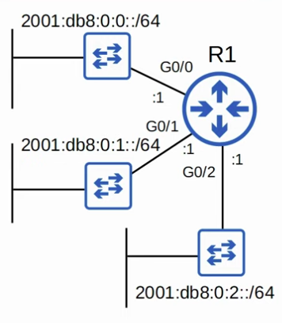
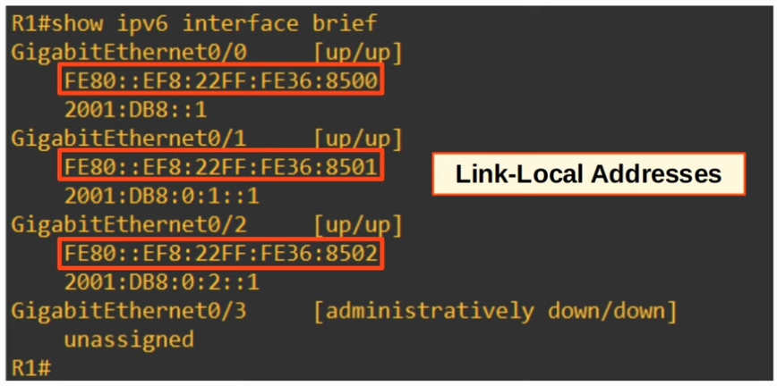

### Configuring IPv6 Addresses


|  |
|-|


**R1 above**
```CLI
R1(config)#
R1(config)#ipv6 unicast-routing
R1(config)#int g0/0
R1(config)#ipv6 address 2001:db8:0:0::1/64
R1(config)#no shutdown

R1(config)#int g0/1
R1(config)#ipv6 address 2001:db8:0:1::1/64
R1(config)#no shutdown

R1(config)#int g0/2
R1(config)#ipv6 address 2001:0db8:0000:0002:0000:0000:0000:0001/64
R1(config)#no shutdown
```

- Issue the command **show ipv6 interface brief* to confirm the configurations.

