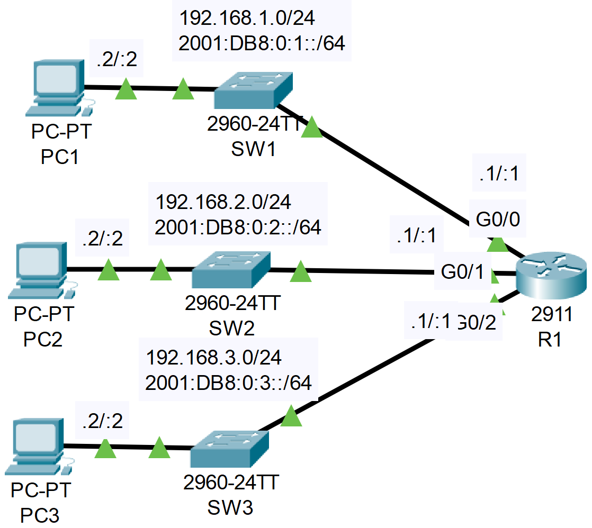

### The topology


|  |
|-|

1. Enable IPv6 routing on R1.

```CLI
R1>en
R1#conf t
R1(config)#ipv6 unicast-routing
```

2. Configure the appropriate IPv6 addresses on R1.

```CLI
R1(config)#interface g0/0
R1(config-if)#ip address 192.168.1.1 255.255.255.0
R1(config-if)#ipv6 address 2001:db8:0:1::1/64
R1(config-if)#no shutdown

R1(config-if)#
R1(config-if)#interface g0/1
R1(config-if)#ip address 192.168.2.1 255.255.255.0
R1(config-if)#ipv6 address 2001:db8:0:2::1/64
R1(config-if)#no shutdown

R1(config-if)#
R1(config-if)#interface g0/2
R1(config-if)#ip address 192.168.3.1 255.255.255.0
R1(config-if)#ipv6 address 2001:db8:0:3::1/64
R1(config-if)#
```

3. Confirm your configurations. What IPv6 addresses are present on each interface?

```CLI
R1#show ipv6 interface brief
GigabitEthernet0/0         [up/up]
    FE80::201:97FF:FE9A:AC01
    2001:DB8:0:1::1
GigabitEthernet0/1         [up/up]
    FE80::201:97FF:FE9A:AC02
    2001:DB8:0:2::1
GigabitEthernet0/2         [up/up]
    FE80::201:97FF:FE9A:AC03
    2001:DB8:0:3::1
Vlan1                      [administratively down/down]
    unassigned
```

4. Configure the appropriate IPv6 addresses on each PC. Configure the correct default gateway.

5. Attempt to ping between the PCs (IPv4 and IPv6)

**From PC3**

```CLI
C:\>ping 2001:DB8:0:1::2

Pinging 2001:DB8:0:1::2 with 32 bytes of data:

Reply from 2001:DB8:0:1::2: bytes=32 time=44ms TTL=127
Reply from 2001:DB8:0:1::2: bytes=32 time=18ms TTL=127
Reply from 2001:DB8:0:1::2: bytes=32 time=15ms TTL=127
Reply from 2001:DB8:0:1::2: bytes=32 time=13ms TTL=127

Ping statistics for 2001:DB8:0:1::2:
    Packets: Sent = 4, Received = 4, Lost = 0 (0% loss),
Approximate round trip times in milli-seconds:
    Minimum = 13ms, Maximum = 44ms, Average = 22ms

C:\>ping 2001:DB8:0:2::2

Pinging 2001:DB8:0:2::2 with 32 bytes of data:

Reply from 2001:DB8:0:2::2: bytes=32 time=24ms TTL=127
Reply from 2001:DB8:0:2::2: bytes=32 time=10ms TTL=127
Reply from 2001:DB8:0:2::2: bytes=32 time=19ms TTL=127
Reply from 2001:DB8:0:2::2: bytes=32 time<1ms TTL=127

Ping statistics for 2001:DB8:0:2::2:
    Packets: Sent = 4, Received = 4, Lost = 0 (0% loss),
Approximate round trip times in milli-seconds:
    Minimum = 0ms, Maximum = 24ms, Average = 13ms

C:\>ping 192.168.1.2

Pinging 192.168.1.2 with 32 bytes of data:

Request timed out.
Reply from 192.168.1.2: bytes=32 time=16ms TTL=127
Reply from 192.168.1.2: bytes=32 time<1ms TTL=127
Reply from 192.168.1.2: bytes=32 time=12ms TTL=127

Ping statistics for 192.168.1.2:
    Packets: Sent = 4, Received = 3, Lost = 1 (25% loss),
Approximate round trip times in milli-seconds:
    Minimum = 0ms, Maximum = 16ms, Average = 9ms

C:\>ping 192.168.2.2

Pinging 192.168.2.2 with 32 bytes of data:

Request timed out.
Reply from 192.168.2.2: bytes=32 time=12ms TTL=127
Reply from 192.168.2.2: bytes=32 time<1ms TTL=127
Reply from 192.168.2.2: bytes=32 time=2ms TTL=127

Ping statistics for 192.168.2.2:
    Packets: Sent = 4, Received = 3, Lost = 1 (25% loss),
Approximate round trip times in milli-seconds:
    Minimum = 0ms, Maximum = 12ms, Average = 4ms
```