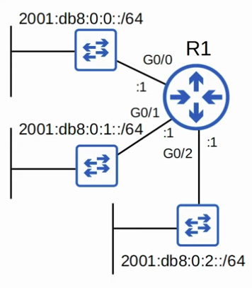
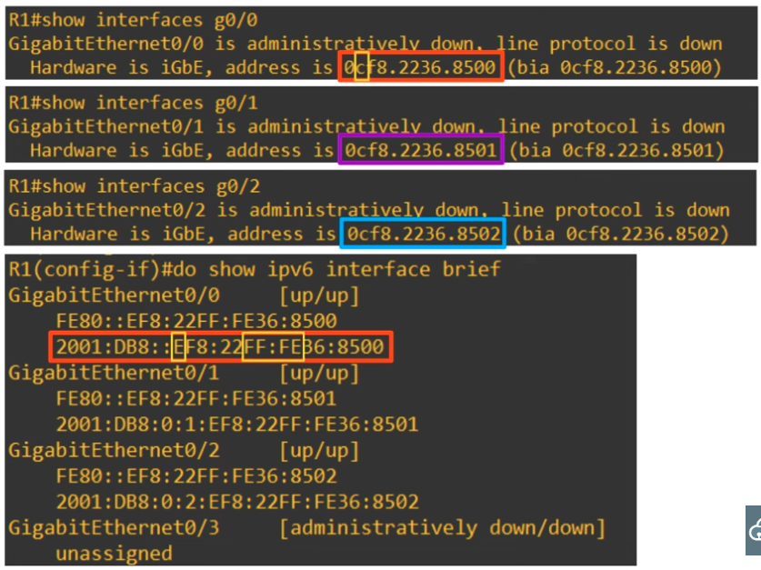
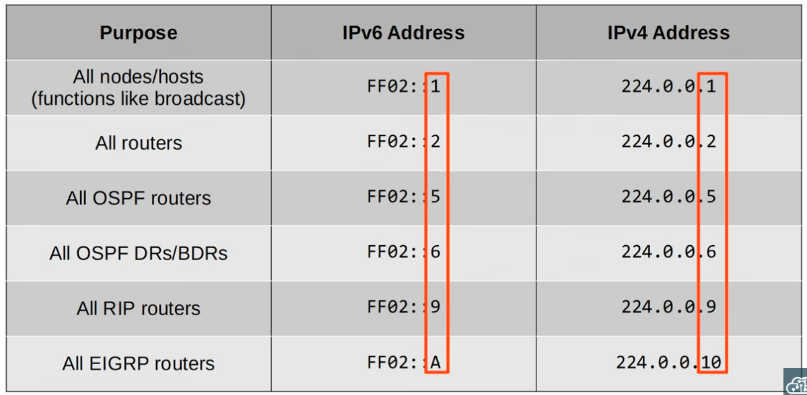
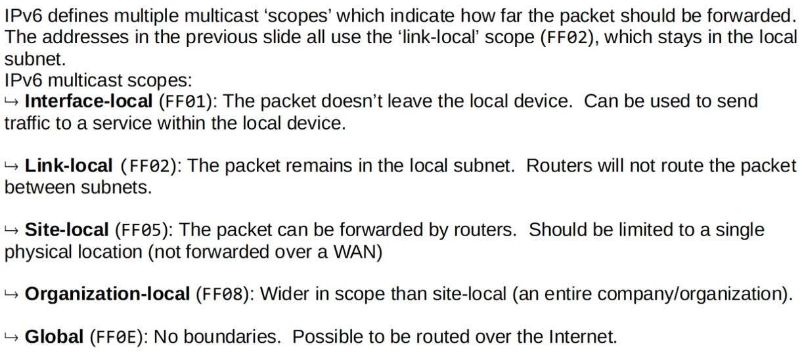
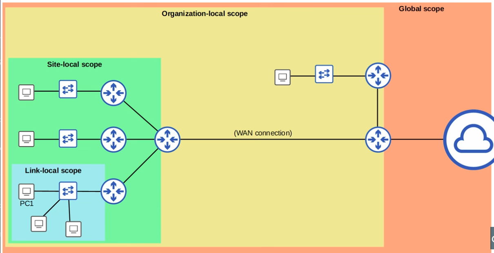

### Configuring IPv6 Addresses using EUI-64


|  |
|-|

**R1 above**
```CLI
R1(config)#
R1(config)#ipv6 unicast-routing
R1(config)#int g0/0
R1(config)#ipv6 address 2001:db8:0:0::/64 eui-64
R1(config)#no shutdown

R1(config)#int g0/1
R1(config)#ipv6 address 2001:db8:0:1::1/64 eui-64
R1(config)#no shutdown

R1(config)#int g0/2
R1(config)#ipv6 address 2001:db8:0:2::/64 eui-64 
R1(config)#no shutdown
```


|  |
|-|

### Multicast Addresses and Multicast Address scopes


|  |
|-|


|  |
|-|

