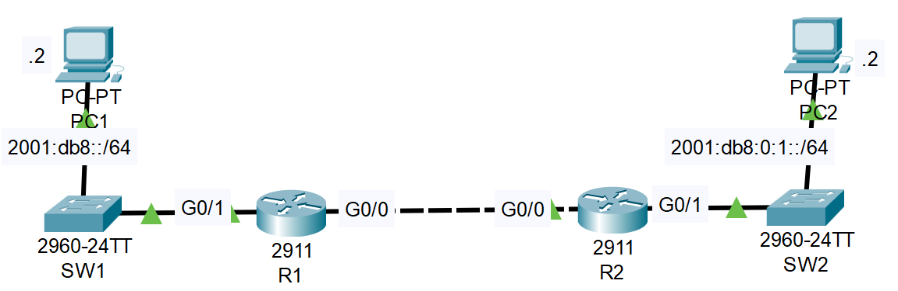
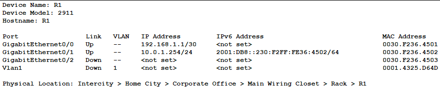
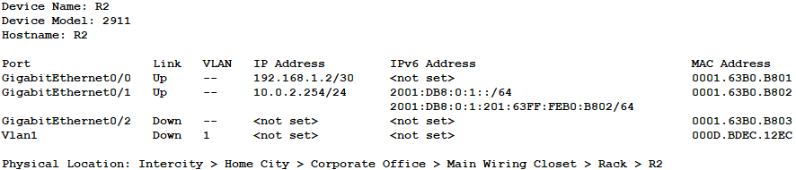

### The topology




1. Use EUI-64 to configure IPv6 addresses on G0/1 of R1/R2. *Before configuring the addresses, calculate the EUI-64 interface ID that will be generated on each interface.

**Calculating the EUI-64 interface ID**


**R1**

```CLI
R1>en
R1#conf t
R1(config)#ipv6 unicast-routing

R1(config)#interface g0/1
R1(config-if)#ipv6 address 2001:db8::/64 eui-64
R1(config-if)#no shutdown
```



**R2**

```CLI
R2>en
R2#conf t
R2(config)#ipv6 unicast-routing

R2(config)#interface g0/1
R2(config-if)#ipv6 address 2001:db8:0:1::/64 eui-64
R2(config-if)#no shutdown
```



2. Configure the appropriate IPv6 addresses/default gateways on PC1 and PC2.

3. Enable IPv6 on G0/0 of R1/R2 without explicitly configuring an IPv6 address.

4. Configure static routes on R1/R2 to enable PC1 to ping PC2. Use the 'ipv6 route' command with '?' to learn how to use the command. *We will study IPv6 static routes in depth in Day 33.