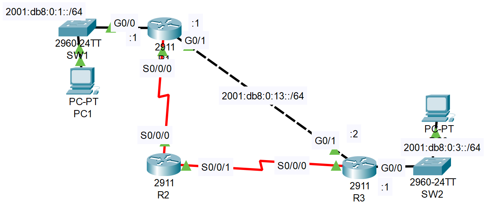

### The topology



1. Enable IPv6 routing on each router.

**R1**

```CLI
R1>en
R1#conf t
R1(config)#ipv6 unicast-routing 
R1(config)#
```

**R2**

```CLI
R2>en
R2#conf t
R2(config)#ipv6 unicast-routing 
R2(config)#
```

**R3**

```CLI
R3>en
R3#conf t
R3(config)#ipv6 unicast-routing 
R3(config)#
```

2. Use SLAAC to configure IPv6 addresses on the PCs. What IPv6 address was configured on each PC?

- On both R1'S & R2's G0/0 interfaces, in interface configuration moede, enable ipv6 using the command *ipv6 enable*.
- Go to PC1's & PC2's settings, and set the apprproiate default gateway addresses (R1's & R3's, respectively).
- Next, issue the command *ipv6 address autoconfig*, still in the g0/0 interface config mode, on R1 & R3.
- On the PCs' config tabs, on the FastEthernet sub-section, set the IPv6 Address Configuration to Automatic.

- **PC1's SLAAC-assigned IPv6 address:** 2001:db8:0:1:20a:41ff:fe4d:1bbC
- **PC2's SLAAC-assigned IPv6 address:** 2001:db8:0:3:240:bff:fe69:9b18

3. Configure static routes on the routers to allow PC1 and PC2 to ping each other. The path via R2 should be used only as a backup path.

**R1**

```CLI
R1(config)#ipv6 route 2001:DB8:0:3::/64 2001:DB8:0:13::2
```

**R3**

```CLI
R3(config)#ipv6 route 2001:DB8:0:1::/64 2001:DB8:0:13::1
```

---

#### In case the G0/1 interfaces of R1 and/or R3 are down, and the route via R2 is needed as a backup

**R1**

```CLI
R1(config)#ipv6 route 2001:DB8:0:3::/64 S0/0/0

##OR##

R1(config)#ipv6 route 2001:DB8:0:3::/64 S0/0/0 <link_local_address_of_R2s_Serial0_interface>
```

**R2**

```CLI
R2(config)#ipv6 route 2001:DB8:0:1::/64 S0/0/0
R2(config)#ipv6 route 2001:DB8:0:3::/64 S0/0/1
```

**R3**

```CLI
R3(config)#ipv6 route 2001:DB8:0:1::/64 S0/0/0

##or##

R3(config)#ipv6 route 2001:DB8:0:1::/64 S0/0/0 <link_local_address_of_R2s_Serial1_interface>
```