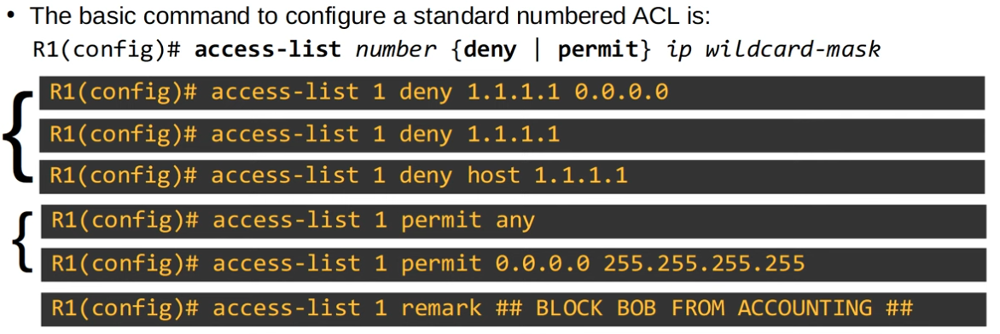
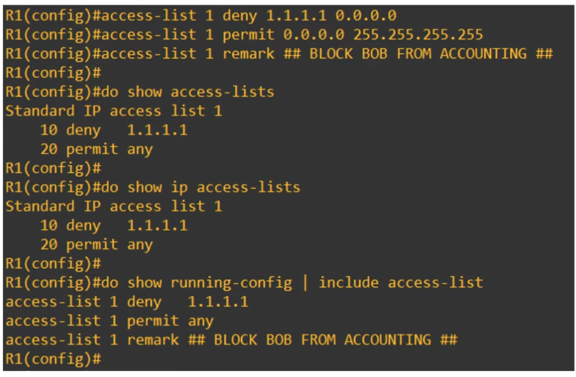
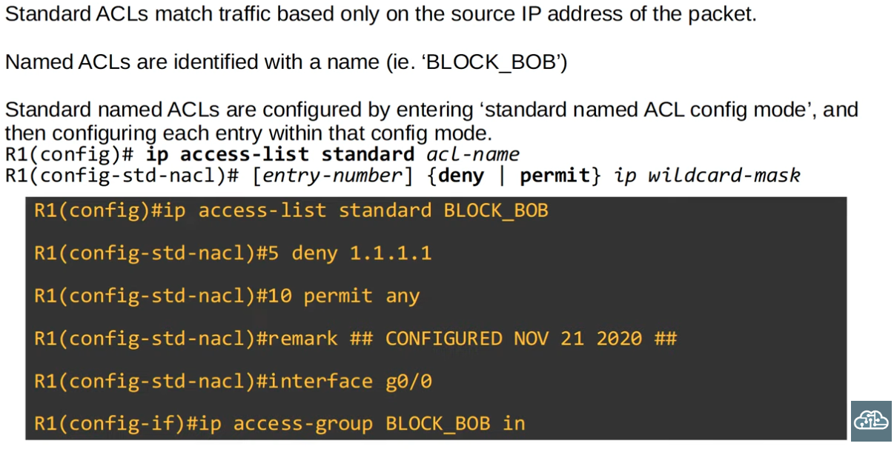
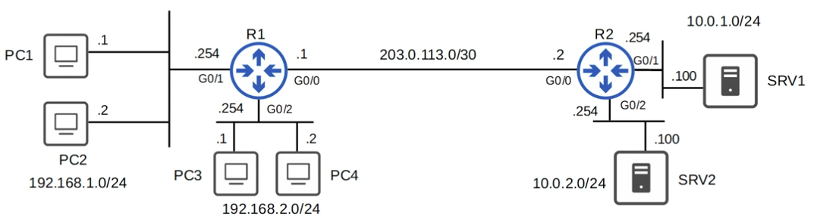
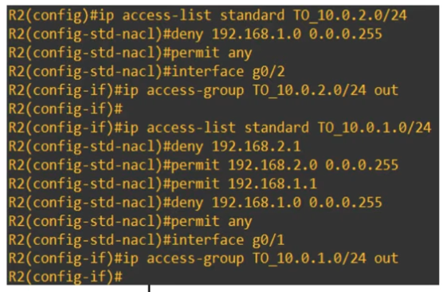

### Access Control Lists Configuration


|  |
|-|

---

**Debugging/Troubleshooting commands for ACLs:**


|  |
|-|

---

**Assigning the saved/configured Access Control List to an Interface**


|  |
|-|

---

**Standard Named ACLs**


|  |
|-|

### Configuration Exercise: Configure ACLs for the following topology based on the requirements**

- PCs in 192.168.1.0/24 can't access 10.0.2.0/24.
- PC3 can't access 10.0.1.0/24.
- Other PCs in 192.168.2.0/24 can access 10.0.1.0/24.
- PCl can access 10.0.1.0/24.
- Other PCs in 192.168.1.0/24 cant access 10.0.1.0/24.


|  |
|-|

```CLI
R2(config)#ip access-list standard BLOCK_PC1
R2(config-std-nacl)#5 deny 192.168.1.1
R2(config-std-nacl)#10 permit any

R2(config-std-nacl)#interface g0/2
R2(config-if)#ip access-group BLOCK_PC1 OUT

###

R2(config)#ip access-list standard BLOCK_PC2
R2(config-std-nacl)#5 deny 192.168.1.2
R2(config-std-nacl)#10 permit any

R2(config-std-nacl)#interface g0/0
R2(config-if)#ip access-group BLOCK_PC2 IN

###

R2(config)#ip access-list standard BLOCK_PC3
R2(config-std-nacl)#5 deny 192.168.2.1 0.0.0.255
R2(config-std-nacl)#5 permit any

R2(config-std-nacl)#interface g0/1
R2(config-if)#ip access-group BLOCK_PC3 OUT
```

### Alternative Solution:

