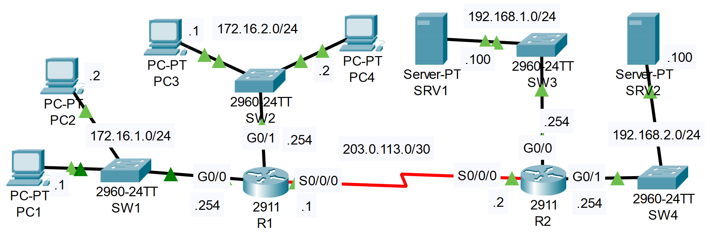

### The topology:


|  |
|-|

1. Configure OSPF on R1 and R2 to allow full connectivity between the PCs and servers.

**R1**

```CLI
R1>en
R1#conf t

R1(config)#router ospf 1
R1(config-router)#network 172.16.1.0 0.0.0.255 area 0
R1(config-router)#network 172.16.2.0 0.0.0.255 area 0
R1(config-router)#network 203.0.113.0 0.0.0.3 area 0

R1(config-router)#passive-interface g0/0
R1(config-router)#passive-interface g0/1
```

**R2**

```CLI
R2>en
R2#conf t

R2(config)#router ospf 1
R2(config-router)#network 192.168.1.0 0.0.0.255 area 0
R2(config-router)#network 192.168.2.0 0.0.0.255 area 0
R2(config-router)#network 203.0.113.0 0.0.0.3 area 0

R2(config-router)#passive-interface g0/0
R2(config-router)#passive-interface g0/1
```

2. Configure standard numbered ACLS on R1 and standard named ACLs on R2 to fulfill the following network policies:

- Only PC1 and PC3 can access 192.168.1.0/24

**On R2's G0/0 interface**

```CLI
R2(config)#ip access-list standard ONLY_PC1_PC3
R2(config-std-nacl)#permit 172.16.1.1
R2(config-std-nacl)#permit 172.16.2.1

R2(config-std-nacl)#interface g0/0
R2(config-if)#ip access-group ONLY_PC1_PC3 OUT
```

- Hosts in 172.16.2.0/24 can't access 192.168.2.0/24

**On R2's G0/1 interface**

```CLI
R2(config)#ip access-list standard BLOCK_PC3_PC4
R2(config-std-nacl)#deny 172.16.2.0 0.0.0.255
R2(config-std-nacl)#permit any

R2(config-std-nacl)#interface g0/1
R2(config-if)#ip access-group BLOCK_PC3_PC4 OUT
```

- 172.16.1.0/24 can't access 172.16.2.0/24

**On R1's G0/1 interface**

```CLI
R1(config)#access-list 1 deny 172.16.1.0 0.0.0.255
R1(config)#access-list 1 permit any
R1(config)#access-list 1 remark ## BLOCK PC1 & PC2 ##

R1(config)#interface g0/1
R1(config-if)#ip access-group 1 OUT
```

- 172.16.2.0/24 can't access 172.16.1.0/24

**On R1's G0/0 interface**

```CLI
R1(config)#access-list 2 deny 172.16.2.0 0.0.0.255
R1(config)#access-list 2 permit any
R1(config)#access-list 2 remark ## BLOCK PC3 & PC4 ##

R1(config)#interface g0/0
R1(config-if)#ip access-group 2 OUT
```