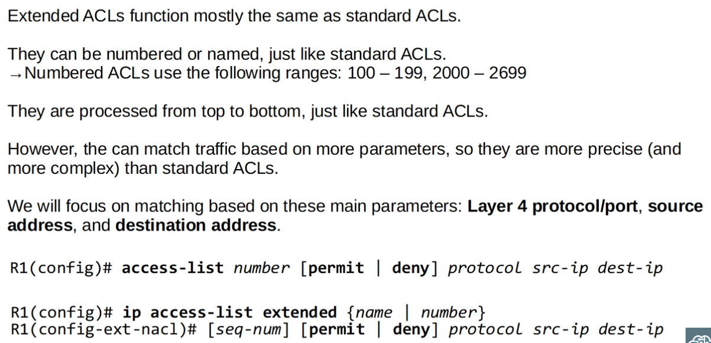
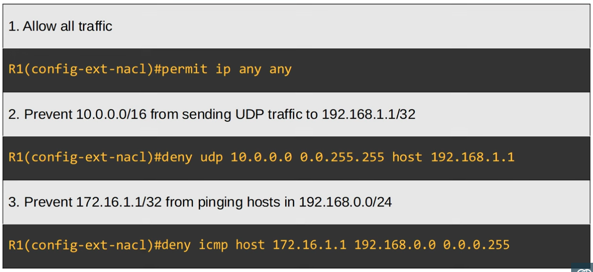
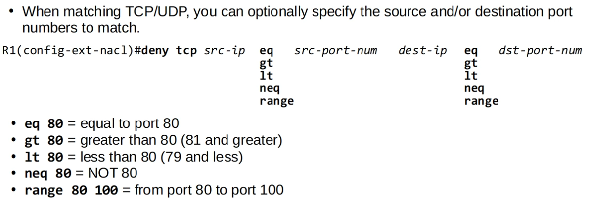
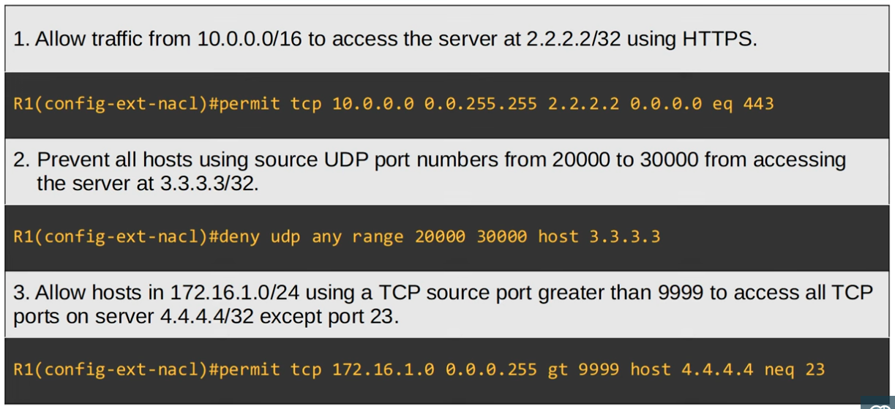
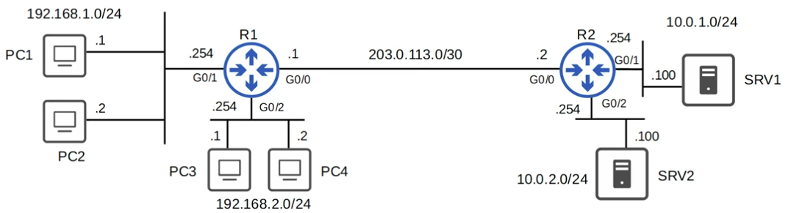

   


### Extended ACLs



#### Sample commands for configuring Extended ACLs:

- Note that the source ip and destination ip are always included
- Note how the IP protocol is always included.
- For the source ip or destination ip, the "host" keyword means that the address belongs to a single device, hence we don't need to provide a wildcard mask



#### Extended ACL commands for TCP and UDP:





---

### Configuration Exercise: Configure Extended ACLs for the following topology based on the requirements:



- Hosts in 192.168.1.0/24 can't use HTTPS to access SRVI.

```CLI
Rl(config)#ip access-list extended HTTP SRVI
Rl(config-ext-nacl)#deny tcp 192.168.1.0 0.0.0.255 host 10.0.1.100 eq 443
Rl(config-ext-nacl)#permit ip any any

Rl(config-ext-nacl)#interface g0/l
Rl(config-if)#ip access-group HTTP SRVI in
```

- Hosts in 192.168.2.0/24 access 10.0.2.0/24.

```CLI
Rl(config)#ip access-list extended BLOCK 10.0.2.0/24
Rl(config-ext-nacl)#deny ip 192.168.2.0 0.0.0.255 10.0.2.0 0.0.0.255
Rl(config-ext-nacl)#permit ip any any

Rl(config-ext-nacl)#interface g0/2
Rl(config-if)#ip access-group BLOCK_10.0.2.0/24 in
```

- None of the hosts in 192.168.1.0/24 or 192.168.2.0/24 can ping 10.0.1.0/24 or 10.0.2.0/24.

```CLI
R1(config)#ip access-list extended BLOCK_ICMP
R1(config-ext-nacl)#deny icmp 192.168.1.0 0.0.0.255 10.0.1.0 0.0.0.255
R1(config-ext-nacl)#deny icmp 192.168.1.0 0.0.0.255 10.0.2.0 0.0.0.255
R1(config-ext-nacl)#deny icmp 192.168.2.0 0.0.0.255 10.0.1.0 0.0.0.255
R1(config-ext-nacl)#permit ip any any

R1(config-ext-nacl)#interface g0/0
R1(config-if)#ip access-group BLOCK_ICMP out
```