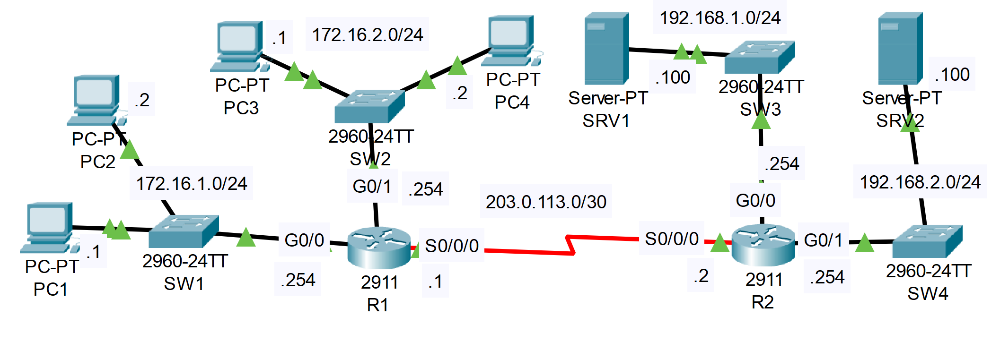

### The topology



**Configure extended ACLS to fulfill the following network policies:**

1. Hosts in 172.16.2.0/24 can't communicate with PC1.

```CLI
R1>en
R1#conf t

R1(config)#ip access-list extended BLOCK_PC3_PC4
R1(config-ext-nacl)#deny ip 172.16.2.0 0.0.0.255 host 172.16.1.1
R1(config-ext-nacl)#permit ip any any

R1(config-ext-nacl)#interface g0/1
R1(config-if)#ip access-group BLOCK_PC3_PC4 in
```

2. Hosts in 172.16.1.0/24 can't access the DNS service on SRV1.

```CLI
R1(config)#ip access-list extended GUARD_SRV1_DNS
R1(config-ext-nacl)#deny tcp 172.16.1.0 0.0.0.255 host 192.168.1.100 eq 53
R1(config-ext-nacl)#deny udp 172.16.1.0 0.0.0.255 host 192.168.1.100 eq 53
R1(config-ext-nacl)#permit ip any any

R1(config-ext-nacl)#interface g0/0
R1(config-if)#ip access-group GUARD_SRV1_DNS in
```

3. Hosts in 172.16.2.0/24 can't access the HTTP or HTTPS services on SRV2.

```CLI
R1(config)#ip access-list extended GUARD_SRV2_HTTP_HTTPS
R1(config-ext-nacl)#deny tcp 172.16.2.0 0.0.0.255 host 192.168.2.100 eq 80
R1(config-ext-nacl)#deny tcp 172.16.2.0 0.0.0.255 host 192.168.2.100 eq 443
R1(config-ext-nacl)#permit ip any any

R1(config-ext-nacl)#interface g0/1
R1(config-if)#ip access-group GUARD_SRV2_HTTP_HTTPS in
```