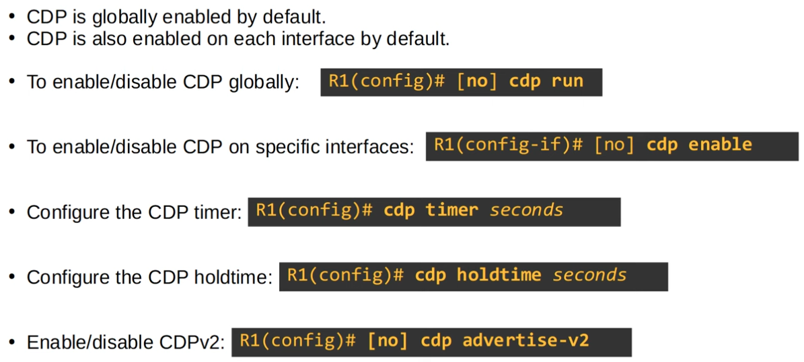
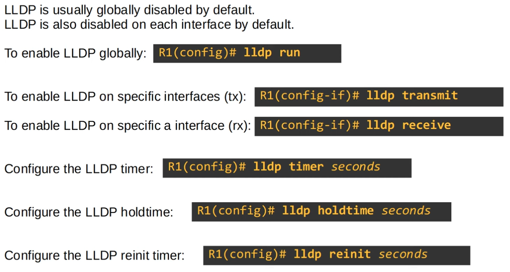

### CDP and LLDP:

**CDP Configuration commands**


|  |
|-|

**debugging/troubleshooting commands for CDP (CISCO Proprietary)**

```CLI
Router#show cdp

Router#show cdp traffic

Router#show cdp interface

Router#show cdp neighbors

Router#show cdp neighbors detail

Router#show cdp entry <neighbor_hostname>
```

**LLDP Configuration commands**


|  |
|-|

**debugging/troubleshooting commands for LLDP**

```CLI
Router#show lldp

Router#show lldp traffic

Router#show lldp interface

Router#show lldp neighbors

Router#show lldp neighbors detail

Router#show lldp entry <neighbor_hostname>
```