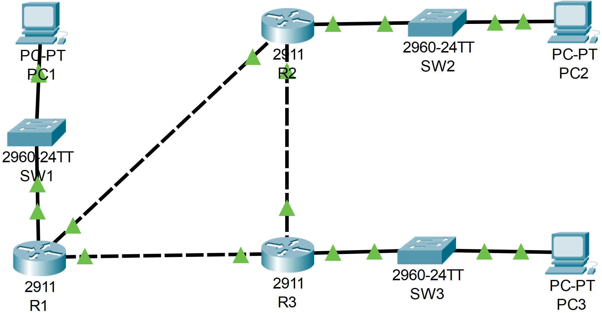

### The topology:



1. Use CDP (and other commands) to identify and label the missing IP addresses and interface IDs of the devices in the network.

**R2**

```CLI
R2#show cdp neighbors
Capability Codes: R - Router, T - Trans Bridge, B - Source Route Bridge
                  S - Switch, H - Host, I - IGMP, r - Repeater, P - Phone
Device ID    Local Intrfce   Holdtme    Capability   Platform    Port ID
SW2          Gig 0/1          156            S       2960        Gig 0/2
R1           Gig 0/0          156            R       C2900       Gig 0/1
R3           Gig 0/2          157            R       C2900       Gig 0/2
```

```CLI
R2#show cdp neighbors detail

Device ID: SW2
Entry address(es): 
Platform: cisco 2960, Capabilities: Switch
Interface: GigabitEthernet0/1, Port ID (outgoing port): GigabitEthernet0/2
Holdtime: 170

Version :
Cisco IOS Software, C2960 Software (C2960-LANBASE-M), Version 12.2(25)FX, RELEASE SOFTWARE (fc1)
Copyright (c) 1986-2005 by Cisco Systems, Inc.
Compiled Wed 12-Oct-05 22:05 by pt_team

advertisement version: 2
Duplex: full
---------------------------

Device ID: R1
Entry address(es): 
  IP address : 10.0.12.1
Platform: cisco C2900, Capabilities: Router
Interface: GigabitEthernet0/0, Port ID (outgoing port): GigabitEthernet0/1
Holdtime: 170

Version :
Cisco IOS Software, C2900 Software (C2900-UNIVERSALK9-M), Version 15.1(4)M4, RELEASE SOFTWARE (fc2)
Technical Support: http://www.cisco.com/techsupport
Copyright (c) 1986-2012 by Cisco Systems, Inc.
Compiled Thurs 5-Jan-12 15:41 by pt_team

advertisement version: 2
Duplex: full
---------------------------

Device ID: R3
Entry address(es): 
  IP address : 10.0.23.2
Platform: cisco C2900, Capabilities: Router
Interface: GigabitEthernet0/2, Port ID (outgoing port): GigabitEthernet0/2
Holdtime: 171

Version :
Cisco IOS Software, C2900 Software (C2900-UNIVERSALK9-M), Version 15.1(4)M4, RELEASE SOFTWARE (fc2)
Technical Support: http://www.cisco.com/techsupport
Copyright (c) 1986-2012 by Cisco Systems, Inc.
Compiled Thurs 5-Jan-12 15:41 by pt_team

advertisement version: 2
Duplex: full
```

```CLI
R2#show running-config

interface GigabitEthernet0/1
 ip address 192.168.2.254 255.255.255.0
```

**R1**

```CLI
R1#show cdp neighbors
Capability Codes: R - Router, T - Trans Bridge, B - Source Route Bridge
                  S - Switch, H - Host, I - IGMP, r - Repeater, P - Phone
Device ID    Local Intrfce   Holdtme    Capability   Platform    Port ID
SW1          Gig 0/2          167            S       2960        Gig 0/1
R3           Gig 0/0          168            R       C2900       Gig 0/1
R2           Gig 0/1          167            R       C2900       Gig 0/0
```

```CLI
R1#show cdp neighbors detail

Device ID: SW1
Entry address(es): 
Platform: cisco 2960, Capabilities: Switch
Interface: GigabitEthernet0/2, Port ID (outgoing port): GigabitEthernet0/1
Holdtime: 128

Version :
Cisco IOS Software, C2960 Software (C2960-LANBASE-M), Version 12.2(25)FX, RELEASE SOFTWARE (fc1)
Copyright (c) 1986-2005 by Cisco Systems, Inc.
Compiled Wed 12-Oct-05 22:05 by pt_team

advertisement version: 2
Duplex: full
---------------------------

Device ID: R3
Entry address(es): 
  IP address : 10.0.13.2
Platform: cisco C2900, Capabilities: Router
Interface: GigabitEthernet0/0, Port ID (outgoing port): GigabitEthernet0/1
Holdtime: 129

Version :
Cisco IOS Software, C2900 Software (C2900-UNIVERSALK9-M), Version 15.1(4)M4, RELEASE SOFTWARE (fc2)
Technical Support: http://www.cisco.com/techsupport
Copyright (c) 1986-2012 by Cisco Systems, Inc.
Compiled Thurs 5-Jan-12 15:41 by pt_team

advertisement version: 2
Duplex: full
---------------------------

Device ID: R2
Entry address(es): 
  IP address : 10.0.12.2
Platform: cisco C2900, Capabilities: Router
Interface: GigabitEthernet0/1, Port ID (outgoing port): GigabitEthernet0/0
Holdtime: 129

Version :
Cisco IOS Software, C2900 Software (C2900-UNIVERSALK9-M), Version 15.1(4)M4, RELEASE SOFTWARE (fc2)
Technical Support: http://www.cisco.com/techsupport
Copyright (c) 1986-2012 by Cisco Systems, Inc.
Compiled Thurs 5-Jan-12 15:41 by pt_team

advertisement version: 2
Duplex: full
```

```CLI
R1#show running-config

interface GigabitEthernet0/2
 ip address 192.168.1.254 255.255.255.0
```

**R3**

```CLI
R3>en
R3#show cdp neighbors
Capability Codes: R - Router, T - Trans Bridge, B - Source Route Bridge
                  S - Switch, H - Host, I - IGMP, r - Repeater, P - Phone
Device ID    Local Intrfce   Holdtme    Capability   Platform    Port ID
SW3          Gig 0/0          132            S       2960        Gig 0/1
R1           Gig 0/1          132            R       C2900       Gig 0/0
R2           Gig 0/2          132            R       C2900       Gig 0/2
```

```CLI
R3#show cdp neighbors detail

Device ID: SW3
Entry address(es): 
Platform: cisco 2960, Capabilities: Switch
Interface: GigabitEthernet0/0, Port ID (outgoing port): GigabitEthernet0/1
Holdtime: 148

Version :
Cisco IOS Software, C2960 Software (C2960-LANBASE-M), Version 12.2(25)FX, RELEASE SOFTWARE (fc1)
Copyright (c) 1986-2005 by Cisco Systems, Inc.
Compiled Wed 12-Oct-05 22:05 by pt_team

advertisement version: 2
Duplex: full
---------------------------

Device ID: R1
Entry address(es): 
  IP address : 10.0.13.1
Platform: cisco C2900, Capabilities: Router
Interface: GigabitEthernet0/1, Port ID (outgoing port): GigabitEthernet0/0
Holdtime: 148

Version :
Cisco IOS Software, C2900 Software (C2900-UNIVERSALK9-M), Version 15.1(4)M4, RELEASE SOFTWARE (fc2)
Technical Support: http://www.cisco.com/techsupport
Copyright (c) 1986-2012 by Cisco Systems, Inc.
Compiled Thurs 5-Jan-12 15:41 by pt_team

advertisement version: 2
Duplex: full
---------------------------

Device ID: R2
Entry address(es): 
  IP address : 10.0.23.1
Platform: cisco C2900, Capabilities: Router
Interface: GigabitEthernet0/2, Port ID (outgoing port): GigabitEthernet0/2
Holdtime: 148

Version :
Cisco IOS Software, C2900 Software (C2900-UNIVERSALK9-M), Version 15.1(4)M4, RELEASE SOFTWARE (fc2)
Technical Support: http://www.cisco.com/techsupport
Copyright (c) 1986-2012 by Cisco Systems, Inc.
Compiled Thurs 5-Jan-12 15:41 by pt_team

advertisement version: 2
Duplex: full
```

```CLI
R3#show running-config

interface GigabitEthernet0/0
 ip address 192.168.3.254 255.255.255.0
```

---

**PC1**

```CLI
C:\>ipconfig

FastEthernet0 Connection:(default port)

   Connection-specific DNS Suffix..: 
   Link-local IPv6 Address.........: FE80::201:63FF:FE8A:B6E0
   IPv6 Address....................: ::
   IPv4 Address....................: 192.168.1.1
   Subnet Mask.....................: 255.255.255.0
   Default Gateway.................: ::
                                     192.168.1.254
```

**PC2**

```CLI
C:\>ipconfig

FastEthernet0 Connection:(default port)

   Connection-specific DNS Suffix..: 
   Link-local IPv6 Address.........: FE80::230:F2FF:FE2E:293D
   IPv6 Address....................: ::
   IPv4 Address....................: 192.168.2.1
   Subnet Mask.....................: 255.255.255.0
   Default Gateway.................: ::
                                     192.168.2.254
```


**PC3**

```CLI
C:\>ipconfig

FastEthernet0 Connection:(default port)

   Connection-specific DNS Suffix..: 
   Link-local IPv6 Address.........: FE80::240:BFF:FE3A:CA62
   IPv6 Address....................: ::
   IPv4 Address....................: 192.168.3.1
   Subnet Mask.....................: 255.255.255.0
   Default Gateway.................: ::
                                     192.168.3.254
```
2. Disable CDP on the switch interfaces currently connected to PCs.

**SW1**

```CLI
SW1#conf t
SW1(config)#int f0/10
SW1(config-if)#no cdp enable
```

**SW2**

```CLI
SW2#conf t
SW2(config)#interface f0/1
SW2(config-if)#no cdp enable
```

**SW3**

```CLI
SW3#conf t
SW3(config)#interface f0/24
SW3(config-if)#no cdp enable
```

3. Disable CDP globally on each network device.

**R1**

```CLI
R1(config)#no cdp run
```

**R2**

```CLI
R2(config)#no cdp run
```

**R3**

```CLI
R3(config)#no cdp run
```

**SW1**

```CLI
SW1(config)#no cdp run
```

**SW2**

```CLI
SW2(config)#no cdp run
```

**SW3**

```CLI
SW3(config)#no cdp run
```

4. Enable LLDP globally on each network device, and enable Tx/Rx on the interfaces connected to other network devices (*Tx/Rx are currently disabled on all interfaces)


**SW1**

```CLI
SW1(config)#lldp run
SW1(config)#interface g0/1

SW1(config-if)#lldp transmit
SW1(config-if)#lldp receive
```

**R1**

```CLI
R1(config)#lldp run
R1(config)#interface g0/2

R1(config-if)#lldp transmit
R1(config-if)#lldp receive

R1(config-if)#interface g0/1

R1(config-if)#lldp transmit
R1(config-if)#lldp receive

R1(config-if)#interface g0/0

R1(config-if)#lldp transmit
R1(config-if)#lldp receive
```

**R2**

```CLI
R2(config)#lldp run
R2(config)#interface g0/0

R2(config-if)#lldp transmit
R2(config-if)#lldp receive

R2(config-if)#interface g0/1

R2(config-if)#lldp transmit
R2(config-if)#lldp receive

R2(config-if)#interface g0/2

R2(config-if)#lldp transmit
R2(config-if)#lldp receive
```

**SW2**

```CLI
SW2(config)#lldp run
SW2(config)#interface g0/2

SW2(config-if)#lldp transmit
SW2(config-if)#lldp receive
```

**R3**

```CLI
R3(config)#lldp run
R3(config)#interface g0/1

R3(config-if)#lldp transmit
R3(config-if)#lldp receive

R3(config-if)#interface g0/2

R3(config-if)#lldp transmit
R3(config-if)#lldp receive

R3(config-if)#interface g0/0

R3(config-if)#lldp transmit
R3(config-if)#lldp receive
```

**SW3**

```CLI
SW3(config)#lldp run
SW3(config)#interface g0/1

SW3(config-if)#lldp transmit
SW3(config-if)#lldp receive
```