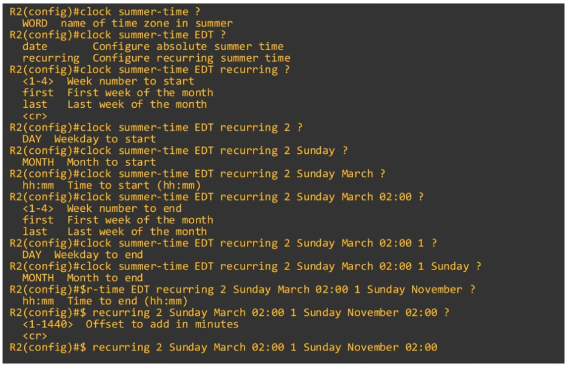
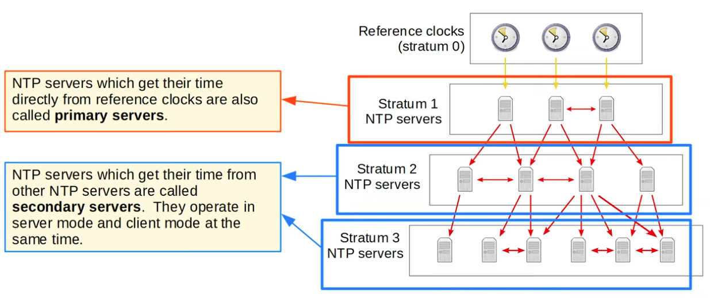
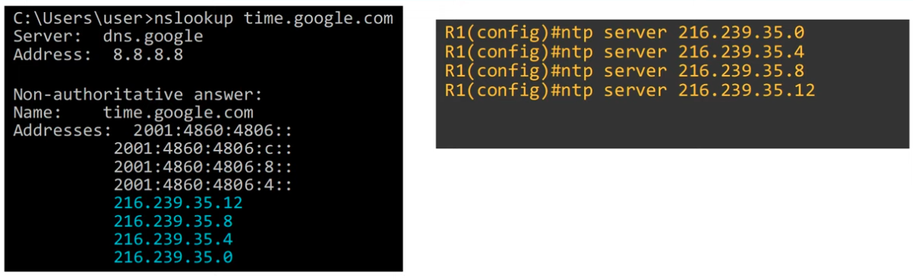
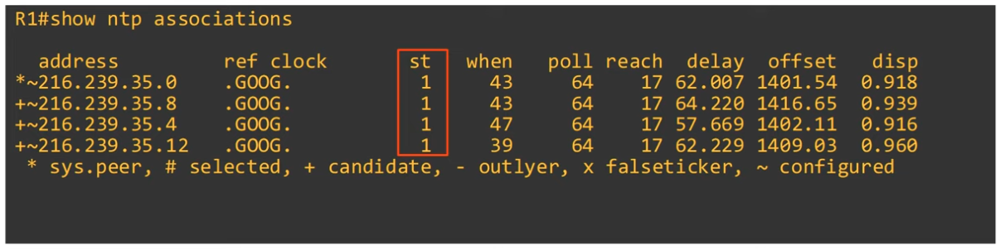
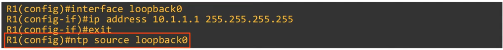
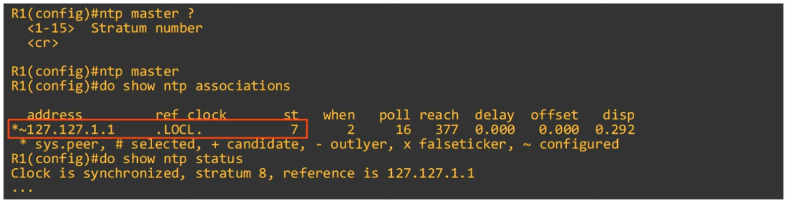
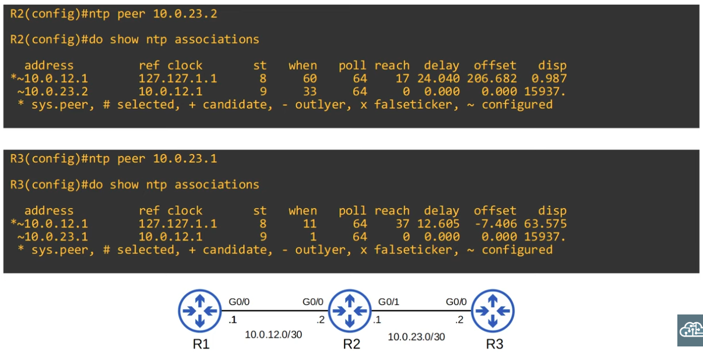
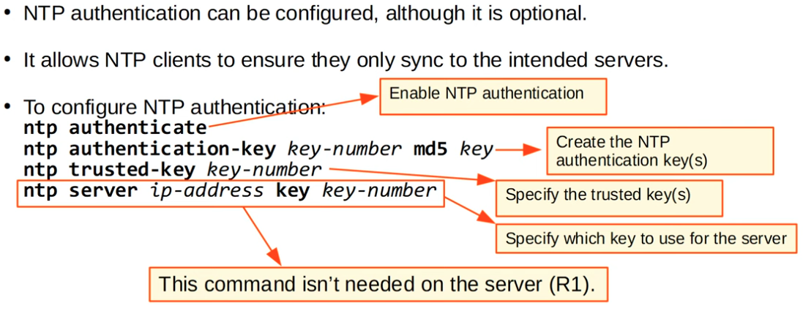

### Manual Time Configuration:

```CLI
Router#clock set <hh:mm:ss> <1-31> <MONTH> <YEAR>

Router#show clock detail
```

**Hardware Clock Configuration**

```CLI
Router#calendar set <hh:mm:ss> <1-31> <MONTH> <YEAR>

## TO SYNC THE HARDWARE CLOCK WITH THE SOFTWARE CLOCK ##

Router#clock update-calendar

## TO SYNC THE SOFTWARE CLOCK WITH THE HARDWARE CLOCK ##

Router#clock read-calendar
```

**Time Zone Configuration**

```CLI
Router(config)#clock timezone <timezone_name> <hr_offset_from_UTC> <minute_offset_from_UTC>

Router#show clock
```

**Daylight Saving Time Configuration**




### NTP Hierarchy



### NTP Configuration





### Configuring NTP on a Router Interface




### Configuring a network device as an NTP server, even if it's not synced with a real NTP server



### Configuring NTP Symmetric Active Mode



### Configuring NTP Authentication



