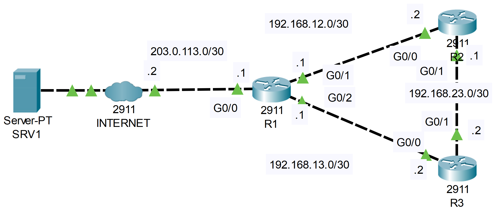

**Link to** [**Packet Tracer Solution File**](./Day%2037%20Lab%20-%20NTP.pkt)

### The topology


|  |
|-|

1. Configure the software clock on R1, R2, and R3 to 12:00:00 Dec 30 2020 (UTC).

**R1**

```CLI
R1>en
R1#clock set 12:00:00 30 DEC 2020
```

**R2**

```CLI
R2>en
R2#clock set 12:00:00 30 DEC 2020
```

**R3**

```CLI
R3>en
R3#clock set 12:00:00 30 DEC 2020
```

2. Configure the time zone of R1, R2, and R3 to match your own.

**R1**

```CLI
R1#conf t
R1(config)#clock timezone CET 2
```

**R2**

```CLI
R2#conf t
R2(config)#clock timezone CET 2
```

**R3**

```CLI
R3#conf t
R3(config)#clock timezone CET 2
```

3. Configure R1 to synchronize to NTP server 1.1.1.1 over the Internet. What stratum is 1.1.1.1?  What stratum is R1?

```CLI
R1(config)#do show ntp associations

address         ref clock       st   when     poll    reach  delay          offset            disp
 ~1.1.1.1       127.127.1.1     1    11       16      3      15.00          -21122609.00      0.12
 * sys.peer, # selected, + candidate, - outlyer, x falseticker, ~ configured
```

**R2 is stratum 2**

4. Configure R1 as a stratum 8 NTP master. Synchronize R2 and R3 to R1 with authentication (the 'ntp source' command is not available in Packet Tracer, so just use the physical interface IP addresses of R1)

**R1**

```CLI
R1(config)#ntp master 8

R1(config)#ntp authenticate
R1(config)#ntp authentication-key 1 md5 wooltrod
R1(config)#ntp trusted-key 1
```

**R2**

```CLI
R2#conf t
R2(config)#ntp authenticate
R2(config)#ntp authentication-key 1 md5 wooltrod
R2(config)#ntp trusted-key 1
R2(config)#ntp server 192.168.12.1 key 1
```

**R3**

```CLI
R3#conf t
R3(config)#ntp authenticate
R3(config)#ntp authentication-key 1 md5 wooltrod
R3(config)#ntp trusted-key 1
R3(config)#ntp server 192.168.13.1 key 1
```

5. Configure NTP to update the hardware calendars of R1, R2, and R3 (*you can't view the calendar in Packet Tracer)

```CLI
R1(config)#ntp update-calendar
```

**R2**

```CLI
R2(config)#ntp update-calendar
```

**R3**

```CLI
R3(config)#ntp update-calendar
```