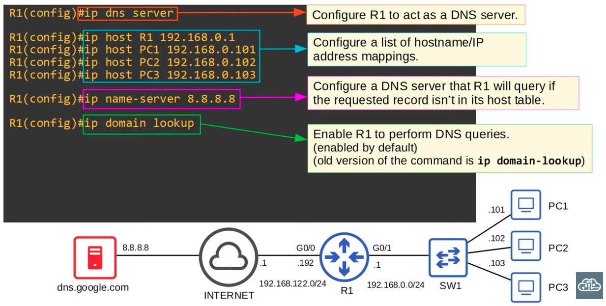
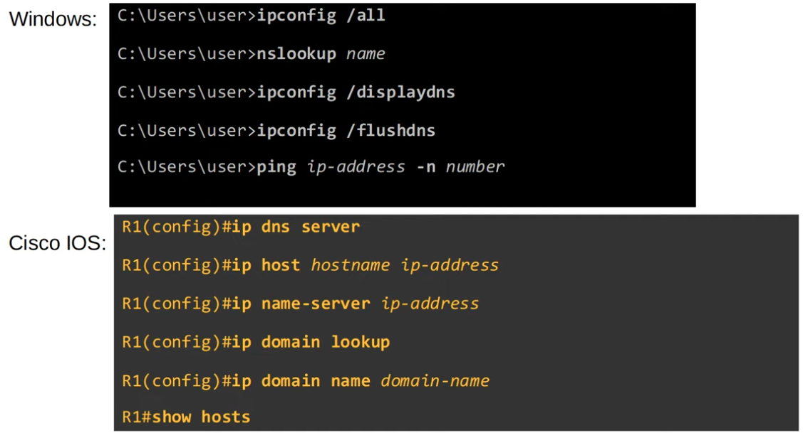

### Domain Name System

- DNS is used to resolve/convert human-readable names to IP addresses

**Viewing Cached DNS Server Responses on PC**

```CLI
C:\Users\user>ipconfig /displaydns
```

**Clearing cached DNS Server Responses**

```CLI
C: \Users\user>ipconfig /flushdns
```

### Configuring a Router as a DNS Server


|  |
|-|

### Summary of DNS-related commands


|  |
|-|

