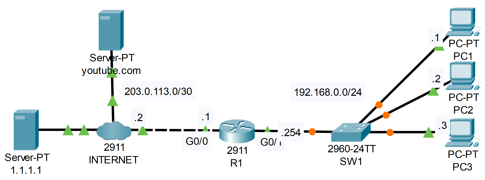

### The topology


|  |
|-|

1. Configure a default route to the Internet on R1.

**R1**

```CLI
R1>en
R1#conf t
R1(config)#ip route 0.0.0.0 0.0.0.0 203.0.113.2
```

2. Configure PC1, PC2, and PC3 to use 1.1.1.1 as their DNS server.

**This can be done on the 'Config' tab of the PCs**

3. Configure R1 to use 1.1.1.1 as its DNS server. Configure host entries on R1 for R1, PC1, PC2, and PC3. Ping PC1 by name from R1.

```CLI
R1(config)#ip name-server 1.1.1.1
R1(config)#ip domain lookup

R1(config)#ip host R1 192.168.0.254
R1(config)#ip host PC1 192.168.0.1
R1(config)#ip host PC2 192.168.0.2
R1(config)#ip host PC3 192.168.0.3
```

4. #USE SIMULATION MODE FOR THIS STEP# From PC1, ping youtube.com by name.  Analyze the messages being sent.

```CLI

C:\>ping youtube.com

Pinging 172.217.6.78 with 32 bytes of data:

Request timed out.
Reply from 172.217.6.78: bytes=32 time<1ms TTL=126
Reply from 172.217.6.78: bytes=32 time=10ms TTL=126
Reply from 172.217.6.78: bytes=32 time=10ms TTL=126

Ping statistics for 172.217.6.78:
    Packets: Sent = 4, Received = 3, Lost = 1 (25% loss),
Approximate round trip times in milli-seconds:
    Minimum = 0ms, Maximum = 10ms, Average = 6ms
```