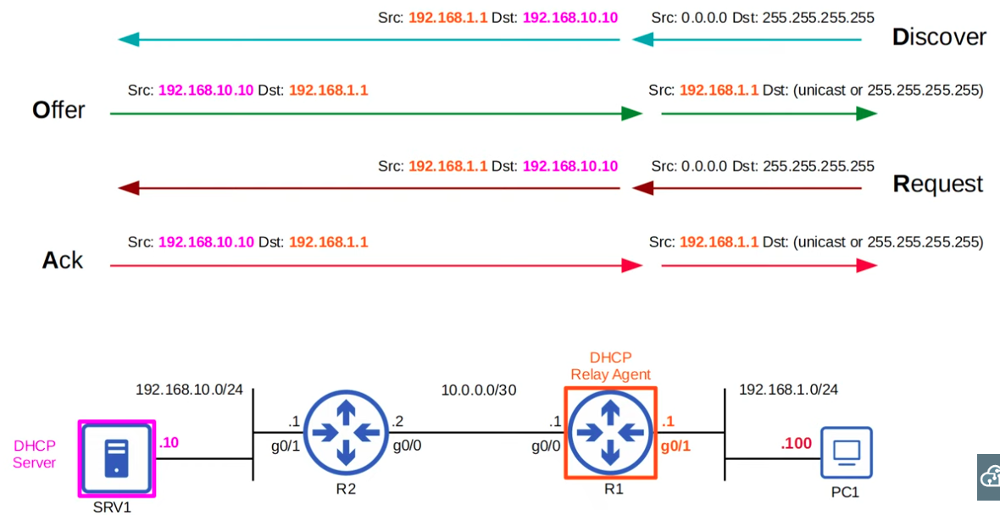
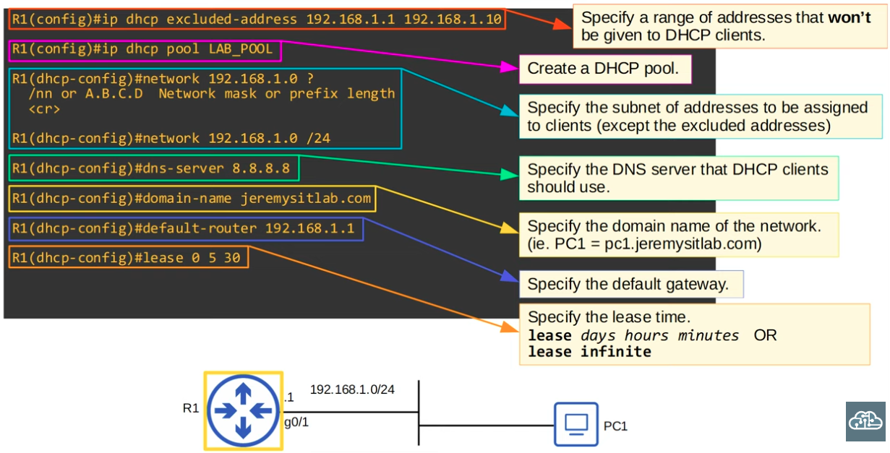
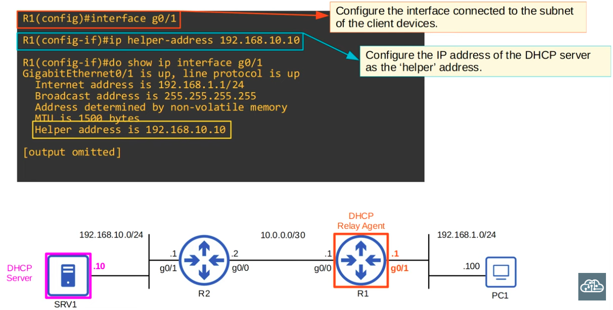
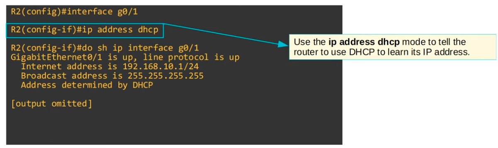

 
|  |
|-|

 ### DHCP Release & Renew

 ```cli
ipconfig /release <--- issued on the client to drop its DHCP-assigned IP Address

ipconfig /renew <--- issued on the client to obtain a new DHCP IP address
 ```

 
|  |
|-|

 ---

 ### The 4-way handshake of DHCP

 
|  |
|-|

 
|  |
|-|


### DHCP Relay


|  |
|-|

### DHCP Server Configuration


|  |
|-|

**To inspect DHCP config settings on Router**

```CLI
R1#show ip dhcp binding
```

### DHCP Relay Agent Configuration


|  |
|-|

**Configuring a Router (Interface) as a DHCP Client**

