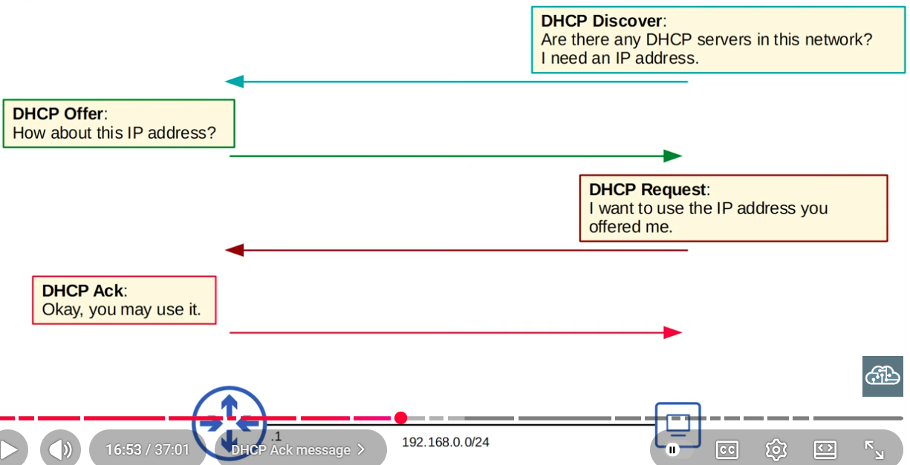
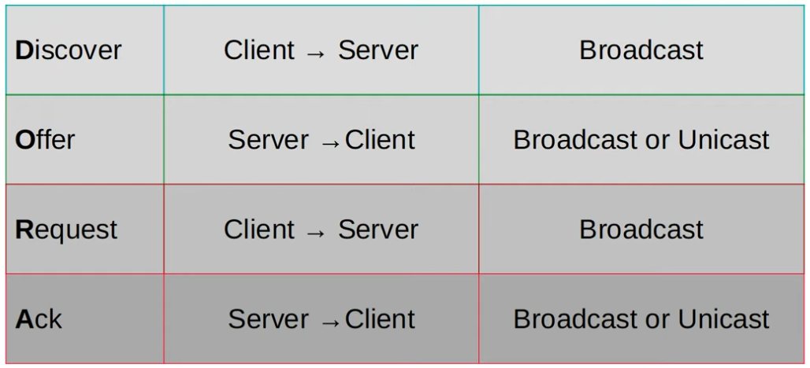

 

 ### DHCP Release & Renew

 ```cli
ipconfig /release <--- issued on the client to drop its DHCP-assigned IP Address

ipconfig /renew <--- issued on the client to obtain a new DHCP IP address
 ```

 

 ---

 ### The 4-way handshake of DHCP

 

 