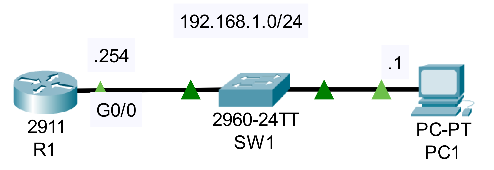

### The topology:



1. Configure the following SNMP communities on R1:
read-only: Cisco1
read/write: Cisco2

```CLI
R1>en
R1#conf t

R1(config)#snmp-server community Cisco1 ro
%SNMP-5-WARMSTART: SNMP agent on host R1 is undergoing a warm start

R1(config)#snmp-server community Cisco2 rw
```

2. Use SNMP 'Get' messages via the MIB browser on PC1 to check the following:
-How long has R1 been running? (system uptime)
-What is the currently configured hostname on R1?
-How many interfaces does R1 have?
-What are those interfaces?

+check what other information you can learn about R1 via SNMP Get messages.
 
3. Use an SNMP 'Set' message from PC1 to change the hostname of R1.