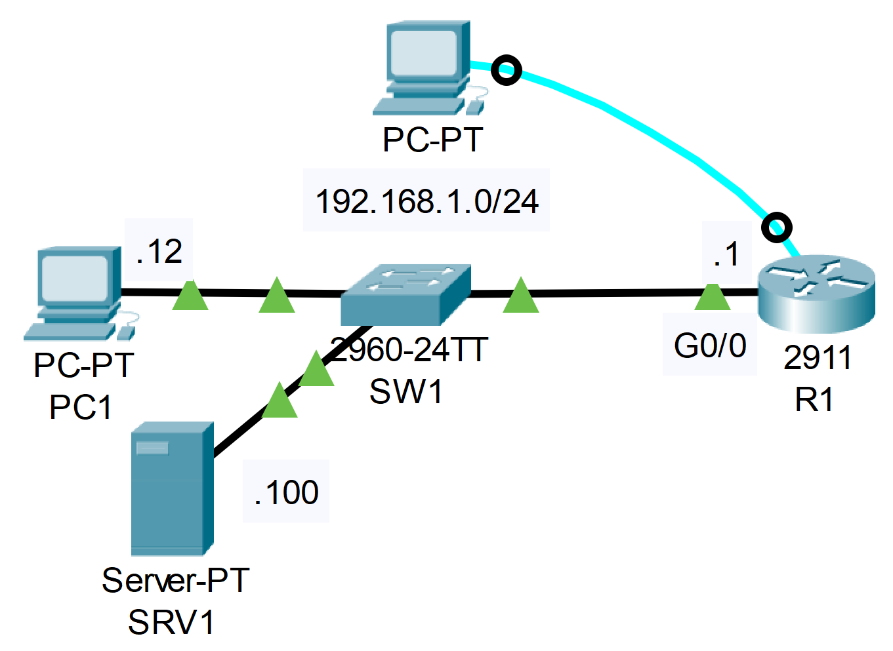

### The topology


|  |
|-|

R1 username: jeremy, PW: ccna, enable PW: ccna
1. Connect to R1's console port using PC2:
     -Shut down the G0/0 interface
     -After you receive a syslog message, re-enable the interface.
     -What is the severity level of the syslog messages?
     -Enable timestamps for logging messages

**PC2 -> 'Desktop' tab -> Terminal**

```CLI
User Access Verification

Username: jeremy
Password: 

R1>en
Password: 
R1#conf t
Enter configuration commands, one per line.  End with CNTL/Z.
R1(config)#interface g0/0
R1(config-if)#shutdown

R1(config-if)#
%LINK-5-CHANGED: Interface GigabitEthernet0/0, changed state to administratively down

%LINEPROTO-5-UPDOWN: Line protocol on Interface GigabitEthernet0/0, changed state to down

R1(config-if)#no shutdown

R1(config-if)#
%LINK-5-CHANGED: Interface GigabitEthernet0/0, changed state to up

%LINEPROTO-5-UPDOWN: Line protocol on Interface GigabitEthernet0/0, changed state to up

R1(config-if)#exit
R1(config)#service timestamps log datetime msec
```

2. Telnet from PC1 to R1's G0/0 interface (watch the video to learn how!)
     -Enable the unused G0/1 interface
     -Why does no syslog message appear?
     -Enable logging to the VTY lines for the current session.
  *there is no 'logging monitor' command in packet tracer, 
    but it's enabled by default

**PC1 -> 'Desktop' tab -> Telnet/SSH Client -> Connection Type: Telnet -> IP Address: 192.168.1.1**

```CLI
Trying 192.168.1.1 ...Open


User Access Verification

Username: jeremy
Password: 
R1>en 
Password: 
R1#conf t

R1(config)#interface g0/1
R1(config-if)#no shutdown

R1(config-if)#end

R1#terminal monitor
R1#conf t

R1(config)#interface g0/1
R1(config-if)#shutdown

R1(config-if)#
*Feb 28, 18:19:42.1919: %LINK-5-CHANGED: Interface GigabitEthernet0/1, changed state to administratively down

R1(config-if)#no shutdown

R1(config-if)#
*Feb 28, 18:19:48.1919: %LINK-5-CHANGED: Interface GigabitEthernet0/1, changed state to up
```

3. Enable logging to the buffer, and configure the buffer size to 8192 bytes.

```CLI	
R1(config)#logging buffered 8192
```

4. Enable logging to the syslog server SRV1 with a level of 'debugging'.

```CLI	
R1(config)#logging 192.168.1.100

!OR
	
R1(config)#logging host 192.168.1.100

R1(config)#logging trap debugging
```
 