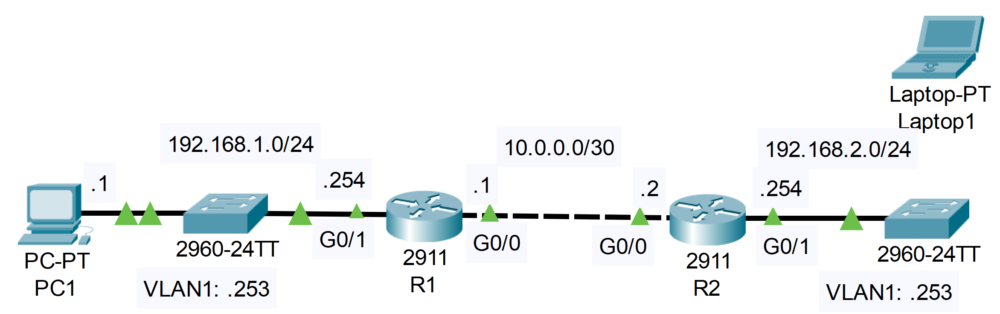

**Link to** [**Packet Tracer Solution File**](./Day%2042%20Lab%20-%20SSH.pkt)

### The topology


|  |
|-|

*SW2 has been newly added to the network, but has not yet been configured.  
1.Connect Laptop1 to SW2's console port to perform the following configurations:
Host name: SW2
Enable secret: ccna
Username/PW: jeremy/ccna
VLAN1 SVI: 192.168.2.253/24
Default gateway: R2

**Laptop1 -> 'Desktop' Tab -> Terminal**

```CLI
Switch>en
Switch#conf t

Switch(config)#hostname SW2
SW2(config)#interface vlan1
SW2(config-if)#ip address 192.168.2.253 255.255.255.0
SW2(config-if)#no shutdown

SW2(config-if)#ip default-gateway 192.168.2.254

SW2(config)#enable secret ccna
SW2(config)#username jeremy secret ccna
SW2(config)#
```

2. Configure the following console line security settings on SW2:
Authentication: Local user
Exec timeout: 5 minutes

```CLI
SW2(config)#line console 0
SW2(config-line)#login local
SW2(config-line)#exec-timeout 5 0
```

3. Configure SW2 for remote access via SSH:
Domain name: jeremysitlab.com
RSA key size: 2048 bits
Authentication: Local user
Exec timeout: 5 minutes
Protocols: SSH only
+Limit access to PC1 ONLY

```CLI
SW2(config)#ip domain name jeremysitlab.com
	
SW2(config)#crypto key generate rsa

The name for the keys will be: SW2.jeremysitlab.com
Choose the size of the key modulus in the range of 360 to 4096 for your
  General Purpose Keys. Choosing a key modulus greater than 512 may take
  a few minutes.

How many bits in the modulus [512]: 2048
% Generating 2048 bit RSA keys, keys will be non-exportable...[OK]

SW2(config)#access-list 1 permit host 192.168.1.1

SW2(config)#ip ssh version 2

SW2(config)#line vty 0 15

SW2(config-line)#login local

SW2(config-line)#exec-timeout 5 0

SW2(config-line)#transport input ssh

SW2(config-line)#access-class 1 in
```