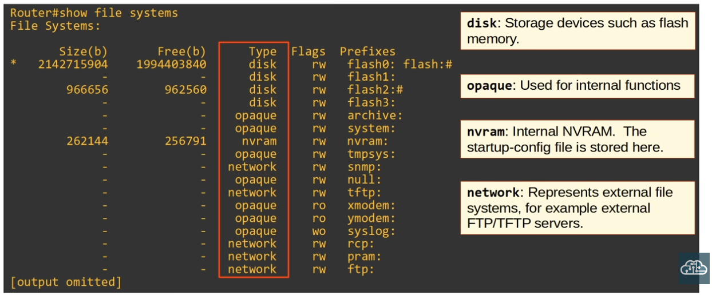

- **How to view the file systems of a CISCO IOS device:**

```CLI
Router#show file systems

!TO VIEW THE CURRENT VERSION OF IOS
Router#show version

!TO VIEW THE CONTENTS OF FLASH MEMORY
Router#show flash
```


|  |
|-|

- **How to copy over files with TFTP**

```CLI
Router#copy tftp: flash

## prompts to follow ##

Address or name of remote host []? <tftp_srv_address>
Source filename []? <exact_filename_of desired_file>
Destination filename [...]? <desired_filename>
```

- **How to Upgrade CISCO IOS**

```CLI
Router(config)#boot system flash:<.bin_filename>
Router#reload
```

- **Configuring FTP credential for access to an FTP Server**

```CLI
!THE USERNAME AND PASSWORD BELOW MUST BE THE SAME ONES CONFIGURED ON THE FTP SERVER
Router(config)#ip ftp username cisco

Router(config)#ip ftp password cisco

!COPYING OVER THE FILE
Router#copy ftp: flash

## prompts to follow ##

Address or name of remote host []? <ftp_srv_address>
Source filename []? <exact_filename_of desired_file>
Destination filename [...]? <desired_filename>
```